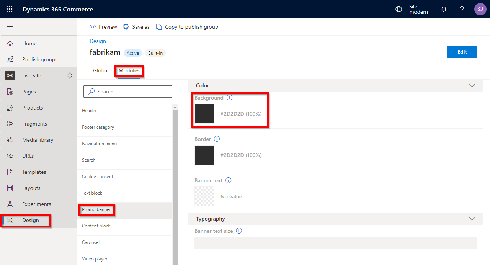
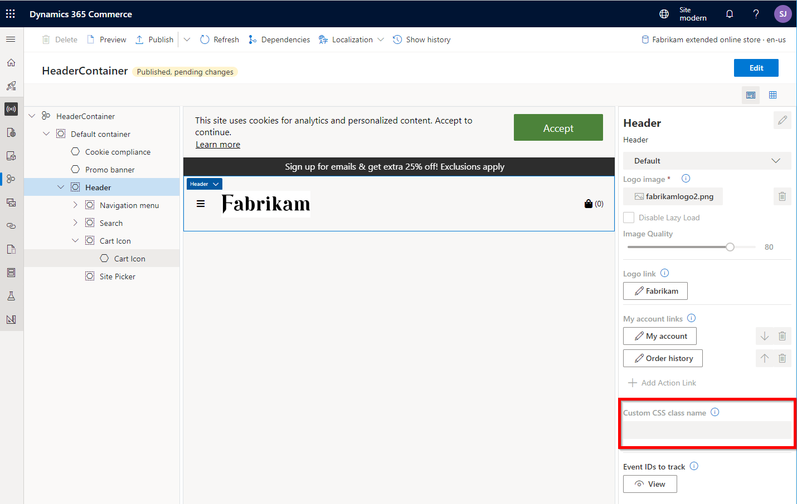

# Modules overview

[!include [banner](../includes/banner.md)]

This article provides an overview of module development in Microsoft Dynamics 365 Commerce, and includes best practices about when and how to extend a module's style or features.

## Modules in Dynamics 365 Commerce

In Dynamics 365 Commerce, modules represent the core building blocks that make up an online Commerce page.

Here are some examples of modules that are used on Commerce site pages:

- A content block module that is featured on a page, and that shows a product image and description, together with a "call-to-action" button that can be used to purchase the product or get more information about it
- A promo banner module that highlights a promotion as a banner on a page
- A header module that consists of smaller module components, such as a search module, a sign-in module, and a navigation module
- A script module that injects JavaScript into the HTML on a page

## Anatomy of a module

Modules are built by using React components, and they consist of various files. For an overview of each file type, see the following articles:

- [Module definition file](module-definition-file.md)
- [Module React component file](module-react-file.md)
- [Module view file](module-view-file.md)
- [Module data file](module-data-file.md)
- [Module mock file](module-mock-file.md)
- [Module test file](module-test-file.md)
- [Module props.autogenerated.ts file](module-props-autogenerated-ts-file.md)

For more information about how and when to use modules in Dynamics 365 Commerce, see [Work with modules](../work-with-modules.md).

## Get started with module development

The Commerce module library provides a broad set of modules that you can use on your online Commerce site. However, to meet your business requirements, you might have to do some customization of modules or themes. To customize modules and themes, you use the Dynamics 365 Commerce online software development kit (SDK) in a development environment.

To get started, you must install a set of tools and the online SDK. For step-by-step instructions that show how to set up a develop environment and create your first custom module, see [Set up a development environment](setup-dev-environment.md).

## Module library modules

Dynamics 365 Commerce provides a library of modules that you can use when you build your online Commerce pages. These modules can be customized in various ways. For example, you can make code-free style changes, you can make configuration changes through code in the online SDK. For more information about the module library, see [Module library overview](../starter-kit-overview.md).

### Code-free style changes

By using Commerce site builder, you can make the following code-free style changes:

- [Style presets](../style-presets.md) allow for a limited set of style changes for each module.
- [CSS overrides](../css-override-files.md) are used to override any module's Cascading Style Sheets (CSS).

### Configuration changes through the online SDK

By using the online SDK, you can make custom theme changes to achieve the following results:

- [Modify the module CSS](theming.md) to change any of a module's styling.
- [Extend a module's view](theme-module-extensions.md) to change the rendered HTML layout.
- [Extend a module's definition file](theme-module-extensions.md) to add or remove configuration fields, slots, data actions, or resources.
- [Override a module library component](override-theme-component.md) to change the component behavior.

Here are some additional customization options:

- [Data action overrides](data-action-overrides.md) allow for the customization of any built-in data action.
- [Clone a module library kit module](clone-starter-module.md) to create a new copy of a module in the module library and change any part of it. This option is used for changes that can't be made through any of the other methods.
- [Create a custom module](create-new-module.md) when you require a custom solution that the modules in the module library don't provide.

The following section provides more details about the best option for various needs.

## Choose the correct customization option for module library modules

As you saw earlier, many options are available for customizing a module library module. It's important that you choose the correct option for your needs.

For example, if you choose to clone a module library module, you will make a brand-new copy of the module. However, if the module library module that the cloned module is based on is updated in a future module library release, you won't receive updates to the code and must manually update the cloned module. Therefore, cloning should be used only when it's absolutely necessary.

The following information should help you choose the correct solution for your needs.

### Style changes

If you have a scenario where a module library module does everything that you need it to do, but you want to change the module's look and feel, you can usually achieve this goal through CSS changes. For example, CSS changes let you hide unwanted elements in a module. A site's [theme](theming.md) contains the CSS for all modules in Sassy Cascading Style Sheets (SCSS) files. In some cases, if the CSS changes don't require any module or theme customizations, you can make them directly in Commerce site builder. Both of the following options don't require that you use the online SDK. They are the easiest and fastest ways to make CSS changes to a module.

#### Style presets

A [style preset](../style-presets.md) is a stored set of all authorable style values across a site's theme. It can be used in Commerce site builder to immediately change the look of a site. In site builder, you can access style presets on the **Design** tab. Both global styles and module-specific styles can be modified.

When you make CSS changes to a module, you should first determine whether the changes can be implemented by using a custom [style preset](../style-presets.md) in site builder. Each module has style options that can be changed in the **Style presets** section on the **Design** tab in site builder. This functionality allows for simple changes of some CSS in a module, such as the CSS for the background color, text color, and text size.

> [NOTE]
> The style preset option in site builder is available in the 10.0.12 release of the module library and later. It's limited to a specific set of options for each module library module.

One limitation of style presets is that style changes to a module type are global. In other words, any module changes that you make will appear on all pages that use the edited module type. For example, if you change the background color of a module, the new color will be shown on all site pages that use that module. If you must change the style of a module that is used only on a single site page, consider using CSS overrides, or use module definition extensions to add new custom configurations to an existing module.

If you're building custom modules, you can expose style presets so that site authors can use them. For more information, see [Configure theme style presets](theme-style-presets.md).

The following illustration shows the style presets that are available for the promo banner module. If the background color is changed, the new color will be used for all instances of the module on the site after the change is published.



#### CSS override file

A [CSS override file](../css-override-files.md) can be uploaded by using Commerce site builder. This file contains additional CSS code to change any style on a page as required. When an Commerce page is rendered, the CSS for the theme module is applied first, and then the CSS overrides file is applied to override the CSS of the specific theme for that module. Because styles can easily be removed if they aren't required, this option is great for fast experimentation against the live site.

In general, if you can use tools such as a modern browser's HTML/CSS debugging tools to modify CSS as you want, you can then copy those changes into a single CSS override file. For example, if you want to hide the wishlist icon in the header module, you should use a CSS override to hide the element, because the module doesn't have a configuration setting that lets you show or hide the wishlist icon. By using F12 web browser tools, you can find the CSS class name to use, and then experiment with the formatting until you get the look that you want. The following example shows CSS code that hides the wishlist icon in a header module.

```CSS
a.msc-wishlist-icon.ms-header__wishlist-desktop.msc-btn {
    visibility: hidden;
}
```

You can save this CSS code in a text file and upload it by using site builder. For more information, see [Work with CSS override files](../css-override-files.md).

If you must target a change to one or a few instances of module, but not all of them, you can add a custom CSS class name to the instance of the module in site builder. After you publish the change, if you examine the HTML that is generated for the page instance, you will see that the new class name has been added to the HTML on the page.

The following illustration shows a header module in site builder after publication. The **Custom CSS class name** setting is highlighted.



### Theme changes

If your CSS changes are more complex, or if you want to make the changes permanent, the next level of customization involves using the online SDK to change the site theme. A site theme uses SCSS files to hold all the CSS code that modules require. The **fabrikam** starter theme is provided as a default theme that you can use on your online site. However, in general, we recommend that you create a new custom theme for your site. The process of creating a custom theme is easy, and you can even clone the default **fabrikam** theme and use the copy as the basis for your own theme.

If you're hosting multiple sites in a single instance of Dynamics 365 Commerce, you can create as many themes as you require. You can even create a base theme that other themes inherit from. In this way, you can minimize common changes across themes. For more information, see [Extend a theme from a base theme](extend-theme.md).

A theme not only lets you customize the module CSS, but it also supports extension of module views and definitions, and overrides of module library components.

#### Create a new theme

By creating a new theme for your site from scratch, you will get an empty boilerplate theme that has no SCSS files for the module library module. For information about how to create a new theme, see [Create a new theme](create-theme.md). If you want to create a new theme that uses module library styles as a starter, see the next section.

#### Clone the fabrikam theme

To clone the **fabrikam** theme as a starter for your own theme, follow these steps.

1. Use the [clone](cli-command-reference.md) command-line interface (CLI) command to create a copy of the **fabrikam** theme. For example, use **yarn msdyn365 clone fabrikam MY\_NEW\_THEME**, where **MY\_NEW\_THEME** is the name of the new theme.

    The **clone** command makes a copy of a module and puts it under the **/src/modules** directory. A theme is just a special module that is stored under the **/src/themes** directory.

1. Manually copy the new theme from the **src/modules** into the **src/themes** directory. If no **/themes** directory exists, you can manually create it first.
1. In the theme directory, find the file that is named **MY\_NEW\_THEME.definition.json**, where **MY\_NEW\_THEME** is the name that you provided in the **clone** command in step 1. This file lists the metadata that is used in site builder, such as the friendly name and description of the theme.

#### Modify module CSS in a theme

After you've created a custom theme, you can modify the SCSS as you require. The SCSS file for each module library module is stored under a theme's **/styles/04-modules** directory. There are many other SCSS files that you can also change as you require. For example, under the **//styles/00-settings** directory, you will find a **colors.scss** file that contains common color definitions.

After you create or modify a theme by using the online SDK, you can build a configuration package and upload it via Microsoft Dynamics Lifecycle Services (LCS). For more information, see [Package configurations and deploy them to an online environment](package-deploy.md). After a theme is deployed, it can be set for a site in site builder. For more information, see [Select a site theme](../select-site-theme.md).

#### Extend a module's view in a theme

You might have a requirement that involves more than just CSS changes. You might have to change the HTML in a module library module. Module library modules have been built in such a way that there is a separation between the React view file and the main component. Therefore, the view file can be overridden inside a theme.

For example, you want to reorder the HTML of the buy box module on the product details page (PDP), so that the product details appear above the price. You might be able to achieve this result through CSS changes alone. However, if you extend the module view, the changes to the page's HTML might also make the layout design more performant and responsive.

To extend a module view, you can override a module's view inside a theme. These changes are scoped to a site theme. Therefore, by changing a site's theme, you can change the whole look and feel of a module. One advantage of changing a module view instead of cloning a module is that updates to module library modules will still be applied. For example, if a module library module's business logic is improved and updated, the view override will continue to work on the code of the updated module library module.

You can find examples of module theme extensions in the starter **fabrikam** theme. For more information about how to extend modules, see [Extend a theme to add module extensions](theme-module-extensions.md).

#### Extend a module definition extension

In addition to extending a module's view, you can extend a module library module definition to add or remove module configurations, slots, data actions, or resources. You can then access the new configurations from a module's view extension. Therefore, in general, when you add a theme definition extension, you also extend the module's view. For more information, see [Theme definitions extensions](theme-module-extensions.md).

For example, if a module library module has a configuration for a title string, you can add a configuration for a subtitle string configuration to the module definition extension. This additional configuration can be set in site builder and rendered in the module's extended view.

### Override a module library component

The module library contains a set of helper component files. These files contain APIs that some modules use to render HTML or to handle events that call server APIs. The components can be overridden and changed as required. One example of this type of component is the **price** component that renders the appropriate price. This component includes the markup for a price strikethrough, if a strikethrough is applicable. If you require a change to the rendering of the price, you can override the **price** component. For more information, see [Override a module library component](override-theme-component.md).

## Data action overrides

[Data action overrides](data-action-overrides.md) allow for the customization of any core data action. Data actions generally call server-side APIs. They can also apply any additional business logic that is required on the return data before a module uses that data. When you override a data action, a copy is added to the **/src/action** directory. There, you can modify the code as you want. After a data action is overridden, all modules that called the original data action will now call the new one. Note that data action overrides are global. They aren't limited to a theme.

## Clone a module library module

If you can't achieve the desired changes to a module library module, but you want to use that module as a starter, you can [clone](clone-starter-module.md) it. You might have to use this approach in scenarios where you must change module business logic that isn't exposed in the module's view, and a view override won't do what you require. When you clone a module library module, you create a new module that has a copy of the code from the original module. You can then change the new module as required.

You should clone modules only as a last resort, because future updates to module library modules won't automatically be picked up by the cloned module. In this case, you must decide whether module library updates are required in the cloned module. If they are required, you must manually add them. To manually add updates after a module library module is updated, you can create a new clone and then compare the code with your cloned module.

For more information about how to get module library updates, see [SDK and module library updates](sdk-updates.md).

## Create a custom module

If you require a feature that isn't available in the set of modules in the module library, you can [create a custom module](create-new-module.md). The process of creating a custom module is easy and can be done by using the [add-module](cli-command-reference.md) CLI command. As for module library modules, SCSS files can be added to the site theme, and different themes can optionally change the module's view through [module view extensions](theme-module-extensions.md). Alternatively, the module definition can be extended as required.

## Additional resources

[SDK and module library kit updates](sdk-updates.md)

[Set up a development environment](setup-dev-environment.md)

[Module library overview](../starter-kit-overview.md)

[CLI command reference](cli-command-reference.md)

[Work with style presets](../style-presets.md)

[Work with CSS override files](../css-override-files.md)

[Override a module library component in a theme](override-theme-component.md)

[Theming overview](theming.md)

[Create a new module](create-new-module.md)

[Data action overrides](data-action-overrides.md)


[!INCLUDE[footer-include](../../includes/footer-banner.md)]
