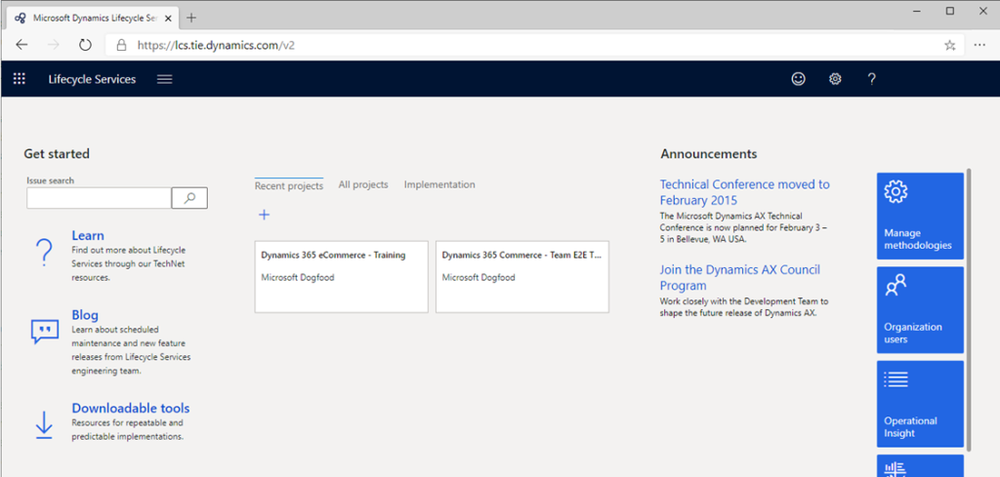
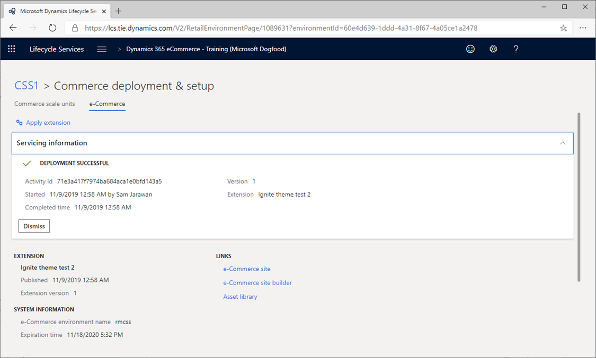

---
# required metadata

title: Package and deploy to a Dynamics 365 Commerce online environment
description: When your configurations (modules, data actions and themes) are ready to be deployed to your online environment, they need to be packaged up and deployed via Microsoft Dynamics Lifecycle Services (LCS).
author: SamJarawan
manager: annbe
ms.date: 08/30/2019
ms.topic: article
ms.prod: 
ms.service: Dynamics365Operations
ms.technology: 

# optional metadata

# ms.search.form: 
audience: Developer
# ms.devlang: 
ms.reviewer: josaw
ms.search.scope: Retail, Core, Operations
# ms.tgt_pltfrm: 
ms.custom: 
ms.assetid: 
ms.search.region: Global
# ms.search.industry: 
ms.author: SamJar
ms.search.validFrom: 2019-08-30
ms.dyn365.ops.version: 

---
# Package and deploy to a Dynamics 365 Commerce online environment
When your configurations (modules, data actions and themes) are ready to be deployed to your online environment, they need to be packaged up and deployed via Microsoft Dynamics Lifecycle Services (LCS).

## Packaging
The **yarn msdyn365 pack** command will create a package of the local site configurations (modules, data actions, themes, ...) which will be used to upload via LCS to an online environment.  This command should be run from the root directory of your local online SDK files and will output a new zip file in the same directory.

Example:

``` bash
c:\repos\D365.Commerce.Fabrikam>yarn d365 pack
```

## Uploading via LCS
Navigate to LCS using https://lcs.dynamics.com (or if you’re using the test integration LCS server use https://lcs.tie.dynamics.com). You should see a page similar to below:


Click on the “Sign in” button and sign in with your LCS provided account credentials.



Select the e-commerce project you'll be using, which will bring you to a page similar to below screen shot:


Sliding the scroll bar over will reveal more options:


To upload the package, select the "Asset Library" under "More tools" and on the next page select "e-Commerce package" tab on the left.  If you don’t see "e-Commerce package" here, you will need a code to enable e-Commerce features (not covered here - please contact your Microsoft Retail representative).


Hitting the "+", which will bring up a panel on the right, where you can provide a name and description for the package.  Fill in a name and description then select "Add a file" button:


Press the "Browse" button and select the package zip file (previously created), followed by the "Upload" button:


When the upload is complete select the "Confirm" button:


While the upload is processing, you may need to refresh to get updated status.  When complete you’ll get a success or fail message.


It can take between 45-50 minutes to complete.  Once complete should see a check mark under the "Valid" column:


## Deploying a package

Navigate back to the project home and select the environment you would like to publish to such as the "RushE2E-TIE-SB3" PPE environment in the example screen capture.


In the "Manage Environment" section select the "Manage" link under the "Environment Features" header:


Select the "E-COMMERCE (PREVIEW)" tab:


Now select "Apply extension" to select the package to deploy:


Select the package you previously uploaded and select the "Update" button:


You can now track the deployment status under the "Details" section:



Once complete you should see your changes in the authoring tools or in rendering pages (ex: new module/themes will be available to page authors and rendering changes should take effect on that environment).
