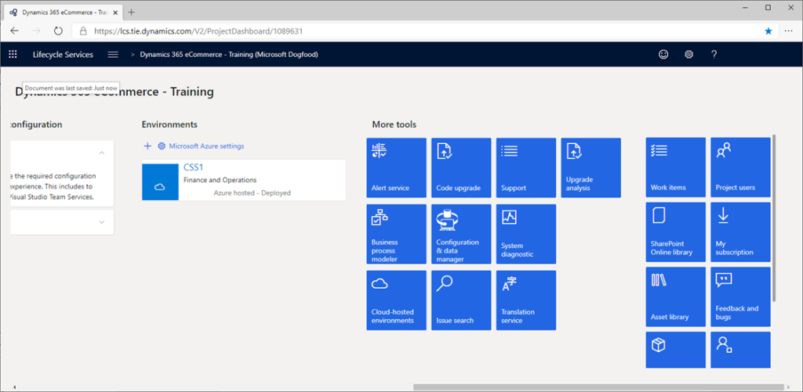

---
# required metadata

title: Package and deploy configurations to your online environment
description: This topic describes how to package and deploy configurations to your Dynamics 365 Commerce online environment.
author: samjarawan
manager: annbe
ms.date: 10/01/2019
ms.topic: article
ms.prod: 
ms.service: dynamics-ax-retail
ms.technology: 

# optional metadata

# ms.search.form: 
audience: Application user
# ms.devlang: 
ms.reviewer: v-chgri
ms.search.scope: Retail, Core, Operations
# ms.tgt_pltfrm: 
ms.custom: 
ms.assetid: 
ms.search.region: Global
# ms.search.industry: 
ms.author: samjar
ms.search.validFrom: 2019-10-31
ms.dyn365.ops.version: Release 10.0.5

---

# Package and deploy configurations to your online environment

[!include [banner](../includes/preview-banner.md)]
[!include [banner](../includes/banner.md)]

This topic describes how to package and deploy configurations to your Dynamics 365 Commerce online environment.

## Overview

When your site configurations (modules, data actions, and themes) are ready to be deployed to your online environment, they need to be packaged and deployed using Microsoft Lifecycle Services (LCS).

## Package the local site configurations for upload

The **yarn msdyn365 pack** command will create a package of the local site configurations (modules, data actions, themes, etc.) that will be used to upload via LCS to an online environment. This command should be run from the root directory of your local online software development kit (SDK) files and will output a new zip file in the same directory.

Example:

``` bash
c:\repos\D365.Commerce.Fabrikam>yarn d365 pack
```

## Upload package using LCS

To upload a site configuration package using LCS, do the following.

Go to https://lcs.dynamics.com (or if you're using the test integration LCS server, use https://lcs.tie.dynamics.com). You should see a page similar to the following screenshot.


Click **Sign in** and enter your LCS-provided account credentials.


Select the e-commerce project you'll be using, which will bring you to a project dashboard page similar to the following screenshot.


Sliding the scroll bar over will reveal more options.



To upload the package, select the **Asset Library** under **More tools**. On the next page, select the **e-Commerce package** tab on the left.  If you don't see **e-Commerce package** here, you will need a code to enable e-Commerce features. Please contact your Microsoft Retail representative to obtain this code.


Select the Plus sign (+), which will bring up a panel on the right where you can provide a name and description for the package. Fill in a name and description then click **Add a file**.


Click **Browse** to navigate to where the previously created package is. Select the package zip file, then click **Upload**.


When the upload is complete, **Confirm** to start processing the upload.


While the upload is processing, you may need to refresh the page to get status updates. When processing is complete, you'll see a success or fail message.


The upload process can take between 45-50 minutes to complete. Once completed, you should see a check mark under the **Valid** column.


## Deploy a package

To deploy a package, do the following.

Go to the project dashboard and select the environment you would like to publish to, such as the "RushE2E-TIE-SB3" PPE environment in the following screenshot example.


On the right side of the page, click the **Manage** link under the **Environment Features** heading.


Select the **E-COMMERCE (PREVIEW)** tab.


Click **Apply extension** to select the package to deploy.


Select the package you uploaded previously and then click **Update**.


You can now track the deployment status under the **Details** heading.


Once deployment is complete, you should see your changes in the authoring tools or on rendering pages (for example, new modules or themes will be available to page authors or rendering changes will appear in the online environment).
