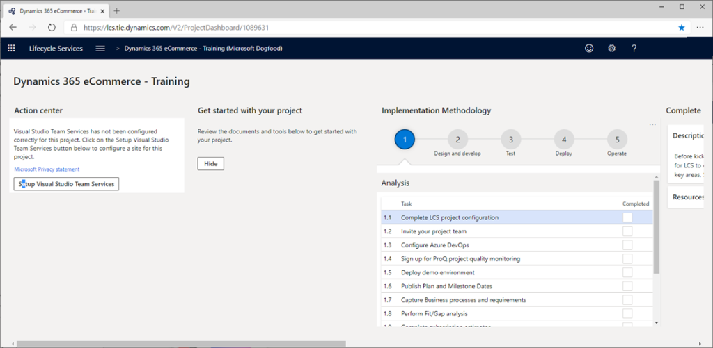
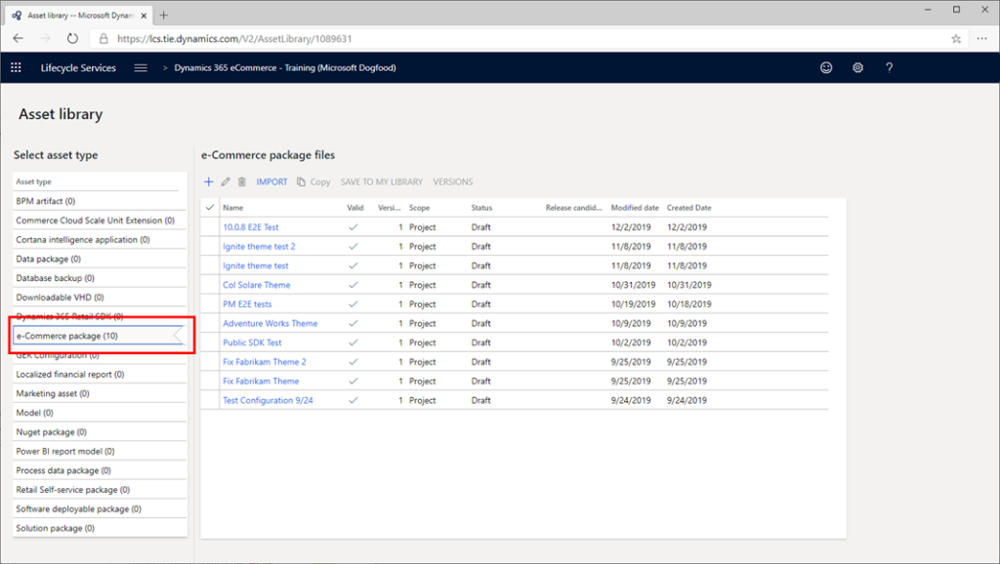
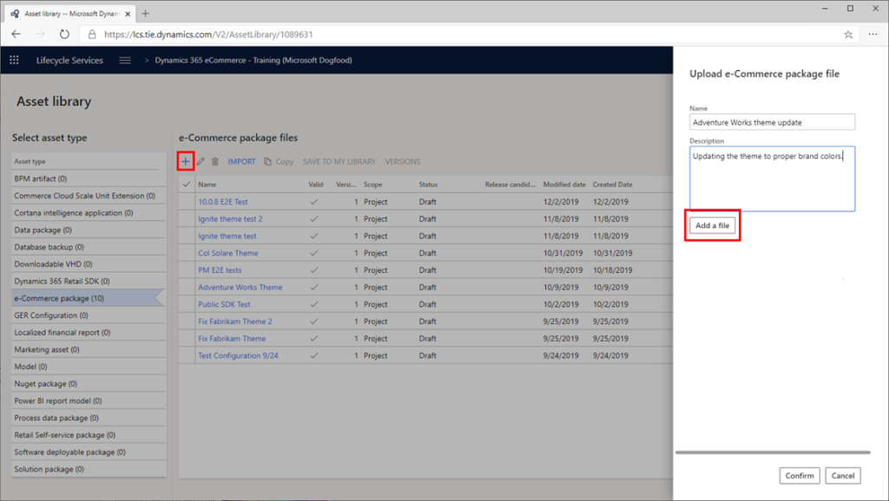
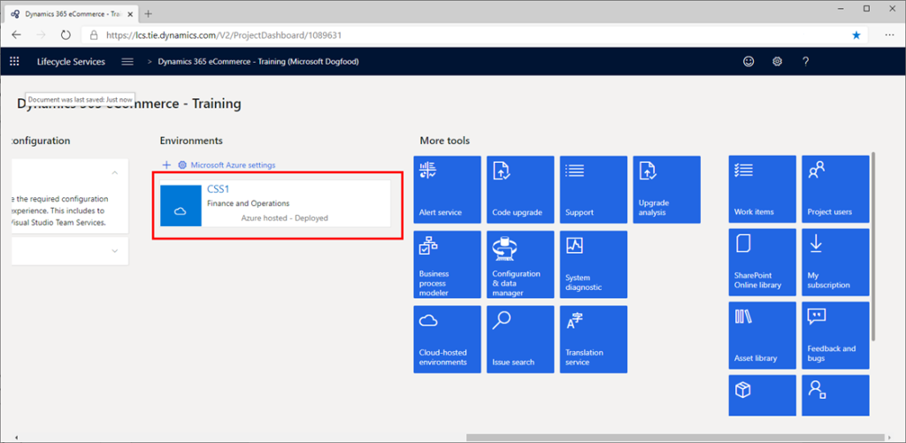
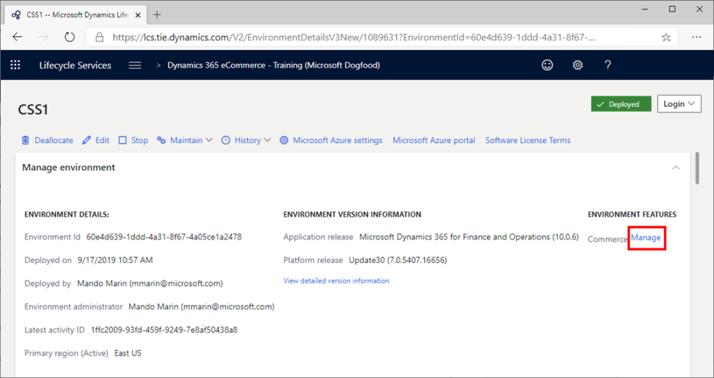
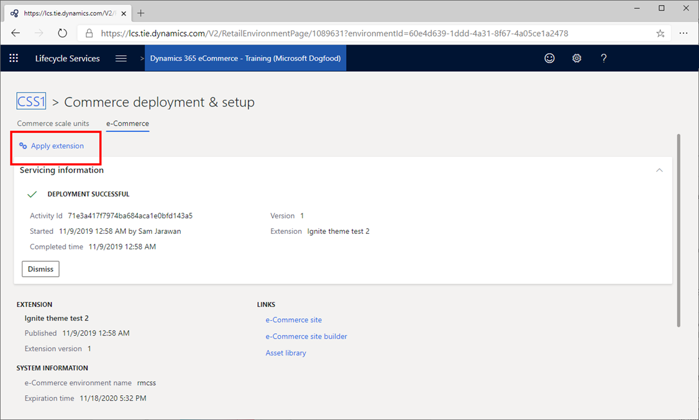
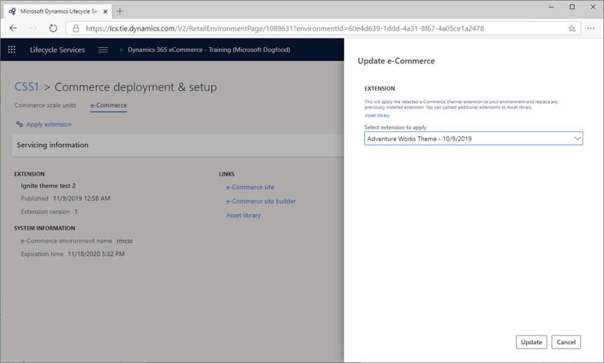

---
# required metadata

title: Package configurations and deploy them to an online environment
description: This topic describes how to package configurations and deploy them to your Microsoft Dynamics 365 Commerce online environment.
author: samjarawan
manager: annbe
ms.date: 10/01/2019
ms.topic: article
ms.prod: 
ms.service: dynamics-ax-retail
ms.technology: 

# optional metadata

# ms.search.form: 
audience: Application user
# ms.devlang: 
ms.reviewer: v-chgri
ms.search.scope: Retail, Core, Operations
# ms.tgt_pltfrm: 
ms.custom: 
ms.assetid: 
ms.search.region: Global
# ms.search.industry: 
ms.author: samjar
ms.search.validFrom: 2019-10-31
ms.dyn365.ops.version: Release 10.0.5

---

# Package configurations and deploy them to an online environment

[!include [banner](../includes/preview-banner.md)]
[!include [banner](../includes/banner.md)]

This topic describes how to package configurations and deploy them to your Microsoft Dynamics 365 Commerce online environment.

## Overview

When your local site configurations (modules, data actions, and themes) are ready to be deployed to your online environment, you must package and deploy them by using Microsoft Dynamics Lifecycle Services (LCS).

## Package the local site configurations for upload

The **yarn msdyn365 pack** command creates a package of the local site configurations. You can then use the package to upload the configurations to an online environment via LCS.

The command should be run from the root directory of your local online software development kit (SDK) files. The output of the command is a new zip file in the same directory.

Here is an example.

``` bash
c:\repos\D365.Commerce.Fabrikam>yarn d365 pack
```

## Upload a package by using LCS

To upload a site configuration package by using LCS, follow these steps.

1. Go to <https://lcs.dynamics.com>. (Alternatively, if you're using the test integration LCS server, go to <https://lcs.tie.dynamics.com>). You should see a sign-in page that resembles the following illustration.

    

2. Select **Sign in**, and enter your LCS-provided account credentials. The main dashboard appears.

    

3. Select the e-Commerce project that you will be using. The project dashboard appears.

    

4. Scroll to the right to see more options.

    

5. To upload the package, in the **More tools** section, select the **Asset Library** tile.
6. On the **Asset library** page, in the left pane, select the **e-Commerce package** tab. If you don't see the **e-Commerce package** tab, you must enable e-Commerce features. Contact your Microsoft Retail representative to obtain the required code.

    

7. Select the plus sign (+).
8. In the **Upload e-Commerce package file** dialog box, enter a name and description for the package, and then select **Add a file**.

    

9. In the **Upload file asset** dialog box, select **Browse**, and browse to the location of the package zip file that you created earlier. Select the file, and then select **Upload**.

    

10. When the upload is completed, you're returned to the **Upload e-Commerce package file** dialog box. Select **Confirm** to process the upload.

    

While the upload is being processed, you might have to refresh the page to see status updates. The processing can take between 45 and 50 minutes. When it's completed, a success or failure message is shown.


If the processing was successfully completed, a check mark appears in the **Valid** column.


## Deploy a package

To deploy a package, follow these steps.

1. In LCS, go to the project dashboard, and select the environment that you want to deploy a package to. For example, in the following illustration, the **RushE2E-TIE-SB3** pre-production environment is selected.

    

2. In the **Environment features** section on the right side of the page, select **Manage**.

    

3. Select the **E-Commerce (Preview)** tab.

    

4. Select **Apply extension** to select the package to deploy.

    

5. In the **Update e-Commerce** dialog box, select the package that you uploaded earlier, and then select **Update**.

    

You can now track the deployment status in the **Details** section.


After the deployment is completed, you should see your changes in the authoring tools or on pages that are rendered. For example, new modules or themes will be available to page authors, or changes are rendered and will appear in the online environment.
