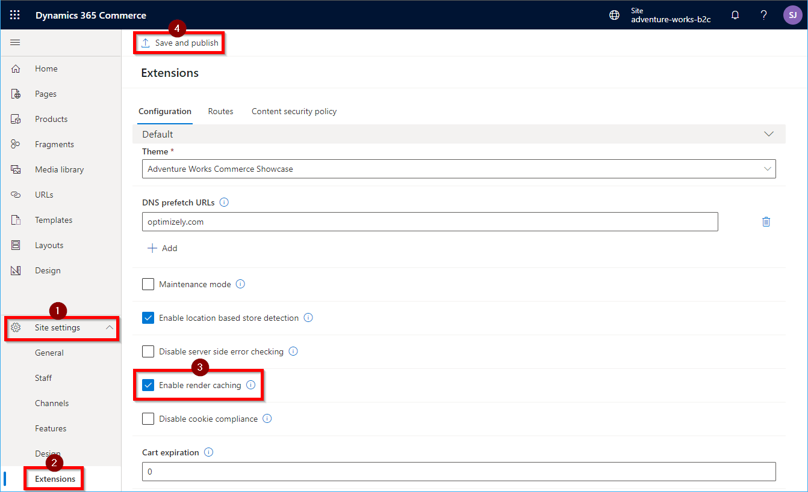

---
# required metadata

title: Page caching
description: This topic describes how to configure pages to be cached. 
author: samjarawan
ms.date: 07/29/2021
ms.topic: article
ms.prod: 
ms.technology: 

# optional metadata

# ms.search.form: 
audience: Developer
# ms.devlang: 
ms.reviewer: v-chgri
# ms.tgt_pltfrm: 
ms.custom: 
ms.assetid: 
ms.search.region: Global
# ms.search.industry: 
ms.author: samjar
ms.search.validFrom: 2019-10-31
ms.dyn365.ops.version: Release 10.0.5

---
# Page Caching

[!include [banner](../includes/banner.md)]

This topic describes how to configure pages to be cached to improve performance of e-commerce pages sent back to customers.

Page caching (available in release 10.0.21 (Online SDK version 1.31.3 or greater)) allows e-commerce pages to be cached on the server.  Cached pages can then be served to web site customers, signficantly increasing performance time. You can choose which pages to cache and how long to cache them in the site builder tool on a [page](../modify-existing-page.md) or by configuring a [template](../templates-layouts-overview.md) that enables page caching and applying that template across multiple different pages.
 
The page cache works by generating the entire page content and saving the content for a particular route for a set time. When another user accesses the same page, instead of computing the page and returning the response, the cached page is immediately returned to the user.  Cached pages can become stale, so it is important to understand when and where to use page caching.
 
Some pages need to ensure they stay as fresh as possible with dynamic data such as product prices, and may call many [data actions](data-actions.md) when constructing the page. Page caching can still be leveraged for these pages by setting a lower cache timeout to ensure the page is frequently refreshed to serve the most accurate content to your e-commerce customers.

## Enable page caching

Enabling page caching first involved enabling the feature at the site level, then configuring it on each page that you would like cached.

### Enable site wide caching feature

To enable the feature for your site within site builder, select **Site settings**, then the **Extensions** tab. Find the **Enable render caching** feature and enable it followed by selecting **Save and publish**.  Page caching can then be disabled at any time by disabling the **Enable render caching** feature. When disabled, any pages that were configured to use the page cache will skip the cache and compute the page for every request.

### Configure page caching on a page
Any page that uses the default-page module will automatically have caching controls available in the Site Builder panel. To get started for a particular page, click on the default page module in the page editor and in the right panel you will see caching controls pop up

## Add new module configuration fields
