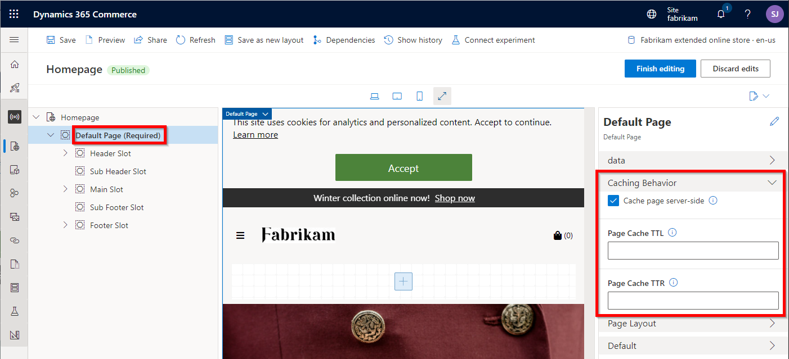
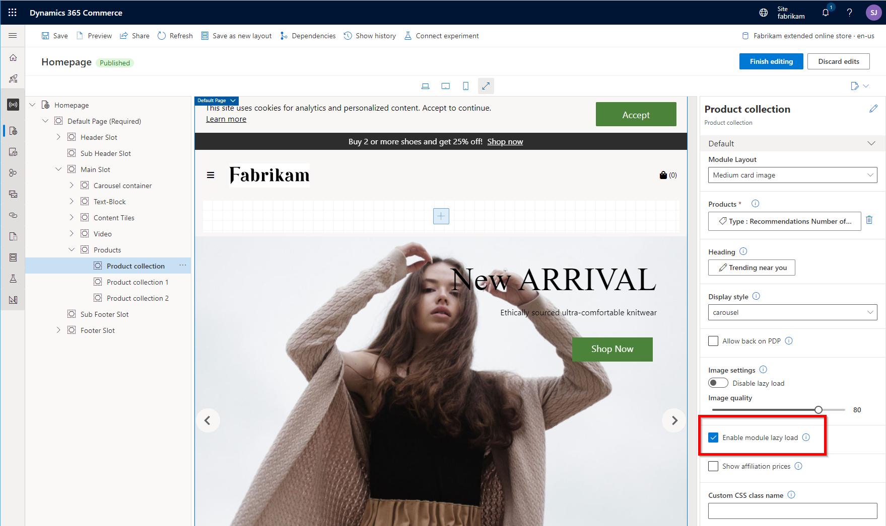

# Configure page caching

[!include [banner](../includes/banner.md)]

This article describes how to configure page caching in Microsoft Dynamics 365 Commerce, to help improve the performance of e-commerce pages that sent back to customers.

Page caching enables e-commerce pages to be cached on the server from which they can then be served to site users. Therefore, performance time is significantly improved. Page caching and caching duration can be enabled and configured in Commerce site builder for [site pages](../modify-existing-page.md). Alternatively, you can configure a [template](../templates-layouts-overview.md) that enables page caching and then apply that template across multiple pages. Page caching is available as of the Commerce version 10.0.21 release (online software development kit \[SDK\] version 1.31.3 or later).

Page caching works by generating all the content of a page and saving that content for a specific route for a set period. When another user accesses the same page, instead of calling for the page and returning the response, the cached page is immediately returned to the user. Because cached pages can become stale, it's important that you understand when and where you should use page caching.

Some pages that include dynamic data, such as product prices, must stay as fresh as possible. Multiple [data actions](data-actions.md) might be called when these pages are constructed. You can still use page caching for these pages. However, you should set a lower time-out for the cache. In that way, you ensure that the pages are frequently refreshed, and that they therefore serve the most accurate content to your e-commerce customers.

## Enable page caching

To enable page caching, you must first enable the page caching feature at the site level. You then configure the feature either on each page that should be cached or on a template that is applied to multiple pages.

### Enable the page caching feature in Commerce site builder

To enable the page caching feature for your site in Commerce site builder, follow these steps.

1. Go to **Site settings \> Extensions**.
1. Select the **Enable render caching** checkbox.
1. Select **Save and publish**.

You can disable page caching at any time by clearing the **Enable render caching** checkbox. In that case, any pages that were previously configured to use page caching will skip the caching and render the page for every request.

### Configure page caching on a page

Caching configurations are automatically available in Commerce site builder for any page that uses the default page module. To configure page caching for a specific page, select the page in site builder, and then select the **Default Page** module in the module hierarchy to open the module properties pane on the right. Then make sure that the **Cache page server-side** checkbox is selected in the properties pane.

The following illustration shows the **Cache page server-side** checkbox selected in the properties pane for the default page module in Commerce site builder.

After you enable page caching for a page, it's turned on for that page. The following two additional properties that appear below the **Cache page server-side** checkbox in the properties pane let you configure the cache times:

- **Page Cache TTL** – This required property describes the absolute time, in seconds, that a page should live in the cache before it's removed. (TTL stands for "time to live.") For example, the **Page Cache TTL** property is set to **300**. In this case, after a page is computed and saved in the cache, any request to the same page that occurs after 300 seconds should not use the cached result. Instead, the page should be recomputed. If no value is set, caching won't be enabled. A value of **3600** is a good value to start with.
- **Page Cache TTR** – This required property describes the amount of time, in seconds, that an entry should live in the cache before it's refreshed. (TTR stands for "time to refresh.") When a page's TTR expires, the page will still be served to the next request. However, in the background, a new page for the same route will be computed with updated content and saved back into the cache. If no value is set, caching won't be enabled. A value of **300** is a good default value to start with.

## Make content changes to pages

Whenever you work with a page in editor mode in Commerce site builder, page caching is disabled. Therefore, any changes that you make are immediately shown on the canvas. After you've finished editing a page and publish it, Commerce discards the old cached entry of the page and saves a new entry for the page that has the updated content.

## Debug page caching

If you notice any strange behavior and suspect that it might be caused by page caching, you can invoke the same request for the page by using the **debug=true** query parameter (for example, `https://www.adventure-works.com/termsandconditions?debug=true`). By setting this query parameter, you disable page caching for the request. You can then compare any differences between what is cached and what is being rendered.

## Use page caching when data should not be stale

Page caching can still be used on pages that should not render stale data, such as pricing or inventory checks. (Example of these pages include pages that call the **GetActivePrice** API.) To ensure that data is fetched after the page is served from the cache, verify that the [data actions](data-actions.md) that get the data are run on the client side. For more information about client-side loading data actions, see [Page load data actions](page-load-data-action.md#client-side-rendering).

## Best practices

Some modules, such as the [product collection](../product-collection-module-overview.md) module, support a configuration setting that ensures that the module is loaded on the client side. The product collection module uses user context to support queries such as "best picks for you." However, because this data will be different for every user, you don't want it to be cached. In this case, if the page is cached, you should enable the **Enable module lazy load** property to ensure that the module is loaded on the client side.

The following illustration shows the checkbox for the **Enable module lazy load** property in Commerce site builder.

