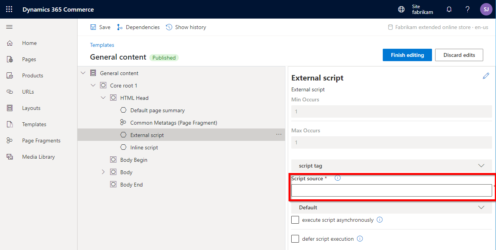
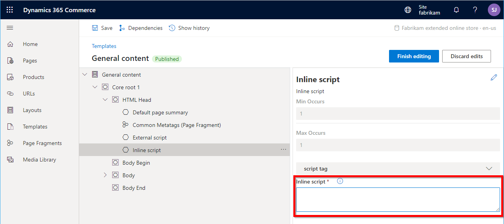

# Script injectors

[!include [banner](../includes/banner.md)]

This article covers script injectors that can be used to add scripts to online pages in Microsoft Dynamics 365 Commerce.

The Dynamics 365 Commerce module library provides two prebuilt script injector modules: **external script** and **inline script**. You can add these modules to a page or page template to inject inline or external scripts into the HTML head, body begin, or body end of a page as needed. For example, you can add a script for integration with third-party analytics, or other service scripts.

## External script module

The external script module allows you to add JavaScript from external sources by providing a URL that points to a valid JavaScript file. After the module is added using Commerce site builder, the script URL can be added to the **Script source** property.

The external script module includes the **execute script asynchronously** and **defer script execution** configuration properties. The **execute script asynchronously** property specifies whether the script should be executed asynchronously. The **defer script execution** property specifies whether the script should be executed when the page has finished parsing configuration properties.

The following illustration shows an external script injector module that is being configured on a page template. The **Script source** property box is where you add the URL that points to the script source code that will be injected into the HTML for the rendered page.



## Inline script module

The inline script module allows you to add inline JavaScript code directly to a page template or page. After the module is added using Commerce site builder, the script can be pasted into the **Inline script** property box, as highlighted in the following illustration. 



> [!NOTE]
> When adding script to the **Inline script** property box, you do not need to add the outer **\<script\>** tags, just the inline JavaScript code.

## Custom script injector modules

In some cases, you might have to inject scripts into your site or site pages, but the prebuilt script injector modules from the module library aren't flexible as you require. For example, you might want additional configuration fields to be exposed in the authoring tools. In these cases, you can extend the prebuilt script injector modules into new custom script injector modules. You can put a custom script injector module on a page, in a shared template, or in a master template.

### Create a custom script injector

To create a custom script injector, use the following command to create a new module. 

```Console
C:\repos\MySite>yarn msdyn365 add-module my-script-injector
```

Next, open the **my-script-injector.definition.json** file and change the **"$type"** property to **"scriptModule"**. After providing a friendly name and description, add the **"Script"** and **"HTML head"** categories, and **"script"** to the **"tags"** property. These categories and tags will allow the script injector to access the applicable page slots already defined inside a page template.

Script modules contain a special **"attributes"** section that defines where the module can be placed. The attributes include **"allowInBodyBegin"**, **"allowInBodyEnd"**, and **"allInHead"**, and the attribute values can be **true** or **false**. The default values for all three attributes are **false**, so it's important to specify where the module can be loaded.

Configurations can also be added to allow the script to be added from within Commerce site builder.  

The following example shows a configured custom script injector definition file.

```json
{
    "$type": "scriptModule",
    "friendlyName": "My Script Injector",
    "name": "my-script-injector",
    "description": "Used to add custom script to a page.",
    "categories": [
        "Script",
        "HTML head"],
    "tags": ["script"],
    "attributes": {
        "allowInBodyBegin": true,
        "allowInBodyEnd": true,
        "allowInHead": true
    },
    "dataActions": {        
    },    
    "config": {
        "scriptSource": {
            "friendlyName": "Script source",
            "description": "The script source. Can be an external URL or a relative URL. Relative URLs are resolved from the public folder",
            "type": "string",
            "group": "script tag",
            "required": true
        },
        "async": {
            "friendlyName": "execute script asynchronously",
            "description": "specifies that the script is executed asynchronously",
            "type": "boolean",
            "default": false
        },
        "defer": {
            "friendlyName": "defer script execution",
            "description": "Specifies that the script is executed when the page has finished parsing",
            "type": "boolean",
            "default": false
        }
    }
}
```

#### Modify the script injector view file

You can modify the **my-script-injector.tsx** React file and the **my-script-injector.view.tsxAnalytics.tsx** view file, if needed. 

To create a custom script injector you can use **HtmlHeadInclude**, which is a React [Higher-Order Component](https://reactjs.org/docs/higher-order-components.html) that allows you to insert elements into the head of the page. It is simple to use, and you can add any elements you want in your view file between the **\<HtmlHeadInclude\>** tags, as shown in the following example.

```typescript
import { HtmlHeadInclude } from '@msdyn365-commerce/core-internal';
import * as React from 'react';
import { IMyScriptInjectorViewProps } from './my-script-injector';

export default (props: IMyScriptInjectorViewProps) => {
    const scriptContents = `window.ga=window.ga||function(){(ga.q=ga.q||[]).push(arguments)};ga.l=+new Date;ga('create', 'UA-XXXXX-Y', 'auto');ga('send', 'pageview')`;
    return (
        <HtmlHeadInclude>
            <script data-load-point='headStart' dangerouslySetInnerHTML={{ __html: scriptContents}} />
            <script data-load-point='headStart' async src={props.config.scriptSource} />
        </HtmlHeadInclude>
    );
};
```

> [!NOTE]
> Inline script content should be saved as a string and then inserted into the script using the React **dangerouslySetInnerHTML** attribute (to avoid escaping special characters), and the **data-load-point** attribute must be specified on script tags. This attribute controls where the script tag should be placed. Possible values include **headStart**, **headEnd**, **bodyStart**, and **bodyEnd**.

The **HtmlHeadInclude** component can also be used to insert **\<title\>**, **\<meta\>**, **\<link\>**, and **\<style\>** tags into the head of an HTML document. Unlike scripts, these elements do not need a **data-load-point** attribute as they will always be placed in the head.

After a custom script injector module is deployed to a Dynamics 365 Commerce environment, it will appear in site builder.

## Additional resources

[Online channel extensibility overview](overview.md)


[!INCLUDE[footer-include](../../includes/footer-banner.md)]
