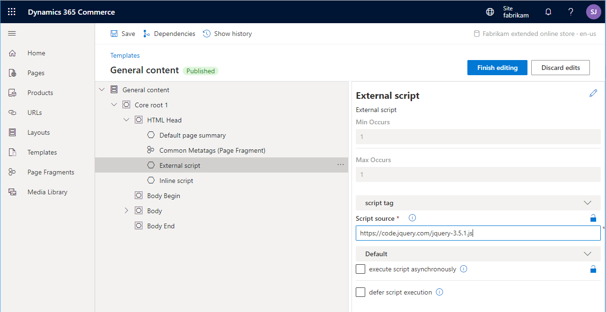

---
# required metadata

title: Script injectors
description: This topic covers script injectors that can be used to add scripts to online pages in Dynamics 365 Commerce.
author: samjarawan
manager: annbe
ms.date: 10/01/2019
ms.topic: article
ms.prod: 
ms.service: dynamics-ax-retail
ms.technology: 

# optional metadata

# ms.search.form: 
audience: Application user
# ms.devlang: 
ms.reviewer: v-chgri
ms.search.scope: Retail, Core, Operations
# ms.tgt_pltfrm: 
ms.custom: 
ms.assetid: 
ms.search.region: Global
# ms.search.industry: 
ms.author: samjar
ms.search.validFrom: 2019-10-31
ms.dyn365.ops.version: Release 10.0.5

---
# Script injectors

[!include [banner](../includes/preview-banner.md)]
[!include [banner](../includes/banner.md)]

This topic covers script injectors that can be used to add scripts to online pages in Dynamics 365 Commerce.

## Overview

The Commerce online starter kit provides several pre-built script injector modules that can be added to a master page to inject inline or external script into the HTML head, body begin, or body end parts of a page as required. Examples of this include adding script for third-party analytics integration or other service scripts.

The following screenshot shows a script injector module being configured on a master page.



## Custom script injector modules

There may be scenarios where you need to inject script into your site or site pages and the built-in script injector modules are not as flexible as needed. For example, you may need additional configuration fields exposed in the authoring tools. In these cases, starter kit script injector modules can be extended into new custom script injector modules. A custom script injector module can then be placed on a page, in a shared template, or in a master template.

### Create a custom script injector

To create a custom script injector, use the following command to create a new module. 

```
C:\repos\MySite>yarn msdyn365 add-module myAnalytics
```

The myAnalytics.definition.json file can then reference a starter kit script injector base definition file.

```json
{
    "$ref": "@msdyn365-commerce-modules/core-components/dist/lib/modules/script-injector/script-injector.definition.json",
    "friendlyName": "My Analytics",
    "name": "my-analytics"
}
```

If you open the script injector base definition file, you can see the preconfigured attributes and configuration fields.

```json
{
  "$type": "scriptModule",
  "friendlyName": "External Script",
  "name": "script-injector",
  "description": "External script tag to be rendered on the page",
  "categories": [
    "script-injector"
  ],
  "tags": [
    "script",
    "sdk-modules"
  ],
  "attributes": {
    "private": true,
    "allowInBodyBegin": true,
    "allowInBodyEnd": true,
    "allowInHead": true
  },
  "module": {
    "view": "./script-injector"
  },
  "config": {
    "scriptSource": {
      "friendlyName": "Script tags",
      "description": "script source or inline script",
      "type": "string",
      "group": "script tag"
    },
    "async": {
      "friendlyName": "execute script asynchronously",
      "description": "specifies that the script is executed asynchronously",
      "type": "boolean",
      "default": false
    },
    "defer": {
      "friendlyName": "defer script execution",
      "description": "Specifies that the script is executed when the page has finished parsing",
      "type": "boolean",
      "default": false
    },
    "loadPoint": {
      "friendlyName": "script load point",
      "description": "load point in the html document where script tag should be loaded",
      "type": "string",
      "enum": {
        "headStart": "headStart",
        "headEnd": "headEnd",
        "bodyStart": "bodyStart",
        "bodyEnd": "bodyEnd"
      }
    }
  }
}
```
The myAnalytics.tsx file can now be modified as needed, for example by adding additional config fields.

Once the custom script injector module is deployed to a Commerce environment, it will appear in the authoring tools.
