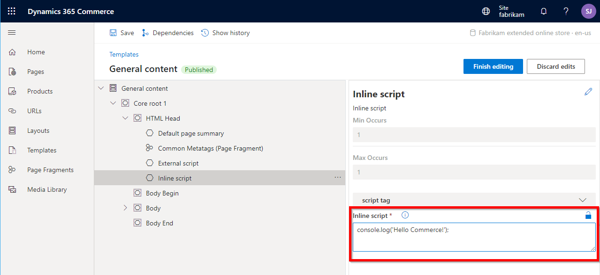

---
# required metadata

title: Script injectors
description: This topic covers script injectors that can be used to add scripts to online pages in Microsoft Dynamics 365 Commerce.
author: samjarawan
manager: annbe
ms.date: 08/18/2020
ms.topic: article
ms.prod: 
ms.service: dynamics-365-commerce
ms.technology: 

# optional metadata

# ms.search.form: 
audience: Developer
# ms.devlang: 
ms.reviewer: v-chgri
ms.search.scope: Retail, Core, Operations
# ms.tgt_pltfrm: 
ms.custom: 
ms.assetid: 
ms.search.region: Global
# ms.search.industry: 
ms.author: samjar
ms.search.validFrom: 2019-10-31
ms.dyn365.ops.version: Release 10.0.5

---
# Script injectors

[!include [banner](../includes/banner.md)]

This topic covers script injectors that can be used to add scripts to online pages in Microsoft Dynamics 365 Commerce.

## Overview

The Dynamics 365 Commerce online starter kit provides two prebuilt script injector modules: **external script** and **inline script**. You can add these modules to a page or page template to inject inline or external scripts into the HTML head, body begin, or body end of a page as needed. For example, you can add a script for integration with third-party analytics, or other service scripts.

## External script module

The external script module allows you to add Javascript from external sources by providing a URL that points to a valid Javascript file. Once the module is added using Commerce site builder, the script URL can be added to the **Script source** property.

The external script module includes the **execute script asynchronously** and **defer script execution** configuration properties. The **execute script asynchronously** property specifies whether the script should be executed asynchronously. The **defer script execution** property specifies whether the script should be executed when the page has finished parsing configuration properties.

The following illustration shows an external script injector module that is being configured on a page template. The **Script source** property box is where you add the URL that points to the script source code that will be injected into the HTML for the rendered page.


## Inline script module

The inline script module allows you to add inline JavaScript code directly to a page template or page. After the module is added using Commerce site builder, the script can be pasted into the **Inline script** property box, as highlighted in the following illustration. 



> [!NOTE]
> When adding script to the **Inline script** property box, you do not need to add the outer **\<script\>** tags, just the inline JavaScript code.

## Custom script injector modules

In some cases, you might have to inject scripts into your site or site pages, but the prebuilt script injector modules from the starter kit aren't flexible as you require. For example, you might want additional configuration fields to be exposed in the authoring tools. In these cases, you can extend the prebuilt script injector modules into new custom script injector modules. You can put a custom script injector module on a page, in a shared template, or in a master template.

### Create a custom script injector

To create a custom script injector, use the following command to create a new module. 

```Console
C:\repos\MySite>yarn msdyn365 add-module myAnalytics
```

The myAnalytics.definition.json file can then reference the base definition file for a starter kit script injector module.

```json
{
    "$ref": "@msdyn365-commerce-modules/core-components/dist/lib/modules/script-injector/script-injector.definition.json",
    "friendlyName": "My Analytics",
    "name": "my-analytics"
}
```

If you open the base definition file for the script injector module, you can see the preconfigured attributes and configuration fields.

```json
{
    "$type": "scriptModule",
    "friendlyName": "External Script",
    "name": "script-injector",
    "description": "External script tag to be rendered on the page",
    "categories": ["script-injector"],
    "tags": [
        "script",
        "sdk-modules"
    ],
    "attributes": {
        "private": true,
        "allowInBodyBegin": true,
        "allowInBodyEnd": true,
        "allowInHead": true
    },
    "config": {
        "scriptSource": {
            "friendlyName": "Script tags",
            "description": "script source or inline script",
            "type": "string",
            "group": "script tag"
        },
        "async": {
            "friendlyName": "execute script asynchronously",
            "description": "specifies that the script is executed asynchronously",
            "type": "boolean",
            "default": false
        },
        "defer": {
            "friendlyName": "defer script execution",
            "description": "Specifies that the script is executed when the page has finished parsing",
            "type": "boolean",
            "default": false
        },
        "loadPoint": {
            "friendlyName": "script load point",
            "description": "load point in the html document where script tag should be loaded",
            "type": "string",
            "enum": {
                "headStart": "headStart",
                "headEnd": "headEnd",
                "bodyStart": "bodyStart",
                "bodyEnd": "bodyEnd"
            }
        }
    }
}
```

You can now change the myAnalytics.tsx file as you require. For example, you can add more configuration fields.

After the custom script injector module is deployed to a Dynamics 365 Commerce environment, it appears in the authoring tools.

## Additional resources

[Online channel extensibility overview](overview.md)
