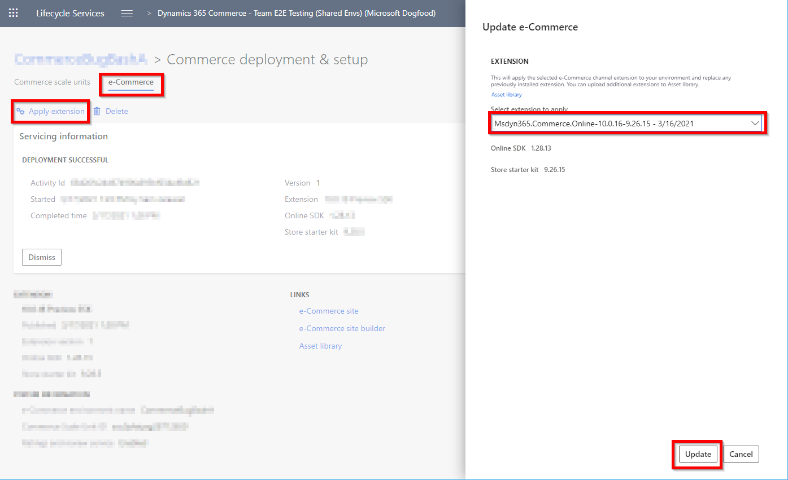

# SDK and module library updates

[!include [banner](../includes/banner.md)]

This article covers regular updates that will be released as part of the Microsoft Dynamics 365 Commerce online software development kit (SDK).

Regular updates will be released as part of the Dynamics 365 Commerce online SDK and module library. These updates might include new features or product fixes. Product release notes will be provided for all changes.

## Dependency versions in the package.json file

The SDK package.json file that is included in the SDK root directory controls which versions of the SDK, module library, Fabrikam design kit, and Retail Server proxy are downloaded. The specific entries can be found in the **"dependencies"** section, as shown in the following example. Note that the version numbers might differ, depending on when the SDK was acquired.

```json
"dependencies": {
    "@msdyn365-commerce-modules/starter-pack": "9.43",
    "@msdyn365-commerce-modules/fabrikam-design-kit": "9.43",
    "@msdyn365-commerce/bootloader": "^1.0.0",
    "@msdyn365-commerce/retail-proxy": "9.43",
}
```

- **\@msdyn365-commerce-modules/starter-pack** – This entry represents the module library, which includes the set of starter modules and data actions. The preceding example is configured to pull down only the specified version.
- **\@msdyn365-commerce-modules/fabrikam-design-kit** – This entry represents the Fabrikam design kit, which includes the Fabrikam theme. The Fabrikam theme defines specific Cascading Style Sheets (CSS) and module view overrides for the set of modules in the module library. The preceding example is configured to pull down only the specified version.
- **\@msdyn365-commerce/retail-proxy** – This entry represents the Retail Server proxy, which is used to access the set of APIs for the Commerce Scale Unit. The preceding example is configured to pull down only the specified version.
- **\@msdyn365-commerce/bootloader** – This entry represents the SDK. The caret (\^) symbol ensures that the **yarn** command always pulls down the latest released version.

The version numbers that are used in the preceding example are in the format *X.Y.Z*, where *X* is the major version, *Y* is the minor version, and *Z* is the patch version.

SDK dependencies are backward-compatible and can be pulled down at any time. The module library minor versions are dependent on the Commerce Scale Unit. Therefore, they can't be higher than the versions that are shown in the table that follows.

Patch versions don't change dependencies on the Commerce Scale Unit and can be updated at any time. Since the patch version number is not included for some of the packages in the package.json file such as **starter-pack**, **fabrikam-design-kit**, and **retail-proxy**, running the **yarn** command will pick up any patch releases newer than the current downloaded package.

### Module library versions mapped to Commerce Scale Unit versions 

The following table maps module library versions to Commerce Scale Unit versions. The same module library versions that are mapped to the Commerce Scale Unit should be used for the Retail Server proxy and Fabrikam design kit. The table lists current supported versions as of **April 14, 2023**.

| Commerce Scale Unit version | Maximum module library version |
| --------------- | --------------- |
| 10.0.13 | 9.23.x |
| 10.0.14 | 9.24.x |
| 10.0.15 | 9.25.x |
| 10.0.16 | 9.26.x |
| 10.0.17 | 9.27.x |
| 10.0.18 | 9.28.x |
| 10.0.19 | 9.29.x |
| 10.0.20 | 9.30.x |
| 10.0.21 | 9.31.x |
| 10.0.22 | 9.32.x |
| 10.0.23 | 9.33.x |
| 10.0.24 | 9.34.x |
| 10.0.25 | 9.35.x |
| 10.0.26 | 9.36.x |
| 10.0.27 | 9.37.x |
| 10.0.28 | 9.38.x |
| 10.0.29 | 9.39.x |
| 10.0.30 | 9.40.x |
| 10.0.31 | 9.41.x |
| 10.0.32 | 9.42.x |
| 10.0.32 | 9.43.x |

## Pull updates

The SDK, module library, and other dependency updates are optional and can be pulled down to a local development environment by using the **yarn** command in the SDK source code. When this command is run, the latest dependencies are pulled down, based on the versions that are specified in the package.json file. Before you run the **yarn** command, you should delete the yarn.lock file from the root directory. Optionally, you can also delete the /node\_modules folder to get a clean set of dependency files.

After the latest dependencies are pulled down, you can run **yarn start** to run the Node server on your development environment and test the new SDK and module library components.

When a configuration package is created by using the **yarn msdyn365 pack** command-line interface (CLI) tool, all dependencies are updated to their local versions during the packaging process. The package that is created can then be uploaded to an online site by using Microsoft Dynamics Lifecycle Services (LCS).

### Update SDK with CLI command

We recommend that you keep the online SDK updated to the latest version, regardless of the versions of Commerce Scale Unit and the module library, because the online SDK is backward compatible with all versions. To update to the latest SDK, run the **[yarn msdyn365 update-versions sdk](cli-command-reference.md#update-versions)** CLI command to ensure that the yarn.lock file is deleted before you run yarn to pull down the latest version of the online SDK.

## Determine the latest released versions of the dependency packages

To determine the latest released versions of the dependency packages, follow these feed links:

- [Module library feed](https://dev.azure.com/commerce-partner/Registry/_artifacts/feed/dynamics365-commerce/Npm/@msdyn365-commerce-modules%2Fstarter-pack/9.36.11-preview.0/overview)
- [SDK feed](https://dev.azure.com/commerce-partner/Registry/_artifacts/feed/dynamics365-commerce/Npm/@msdyn365-commerce%2Fbootloader/1.36.8/overview)
- [Retail Server proxy feed](https://dev.azure.com/commerce-partner/Registry/_artifacts/feed/dynamics365-commerce/Npm/@msdyn365-commerce%2Fretail-proxy/9.36.2/overview)

## Determine the versions deployed on an e-Commerce site

To determine the deployed versions of the SDK, module library, and Retail Server proxy that are used on an e-Commerce site, right-click a site page, select **View page source**, and then search for the following strings to find the version number:

- **commerceSDKVersion** – The SDK version.
- **commerceSSKVersion** – The module library version.
- **retailServerProxyVersion** – The Retail Server proxy version.

## Update the app.settings.json file

In the SDK **/src/settings** directory, there's a file called **app.settings.json**. This file surfaces global settings to Commerce site builder that are used by the module library set of modules and can contain additional settings for custom modules. The settings are located in site builder at **Site Settings \> Extensions**. 

When upgrading the module library, there may be new settings that are applicable and need to be added manually. The latest app.settings.json file can be found in the [online SDK GitHub settings directory](https://github.com/microsoft/Msdyn365.Commerce.Online/tree/master/src/settings). This file contains settings for the latest available module library. If you haven't made any additions to the app.settings.json file, you can copy the contents of this file to your version or do a diff and merge the new settings manually. If you're updating to an older module library, you can find the specific app.settings.json file under the specific build branch located on the [GitHub branches page](https://github.com/microsoft/Msdyn365.Commerce.Online/branches). You'll need to manually merge the contents to your app.settings.json file.

When a local configuration package is created by using the **yarn msdyn365 pack** command-line interface (CLI) tool, the local app.settings.json file updates will be included. The package that is created can then be uploaded to an online site by using Microsoft Dynamics Lifecycle Services (LCS). You will then see the new settings in the site builder tool.

## Update module library using a global module library extension

> [!NOTE] 
> Only update the module library using a global module library extension if you have no e-commerce extension customizations.

If you have an environment that has no e-commerce extension customizations (in other words, no modules, data actions, or themes) such as a newly deployed environment, you can update the module library using a preconfigured e-commerce global extension within LCS. Deploying with one of the globally available customizations will overwrite the deployed e-commerce extension package, so it is important to ensure that you do not have any customizations already uploaded. You must also ensure that you are not upgrading to a module library version later than that associated with the deployed Commerce Scale Unit version, as shown in the [Module library versions mapped to Commerce Scale Unit versions](#module-library-versions-mapped-to-commerce-scale-unit-versions) section above.

### Deploy a global e-commerce extension

To deploy a global e-commerce extension, follow these steps.

1. From within your LCS project, select **Asset library**.

    

1. On the **Asset library** page, select the **e-Commerce package** tab, and then select **Import**.

    

1. In the **Pick a e-Commerce package** dialog box, select the package to import, and then select **Pick**. It may take 15-30 minutes for the package to be available. 

    The naming convention for the global e-commerce extension file has the Commerce release version and the module library release version to help you pick the correct version. In the following example image, the file name is for Commerce release 10.0.16 and includes module library version 9.26.15. Only general availability versions will be made available.
    
    

1. After the package has been imported, it can be deployed into an e-commerce environment. Select the environment to be updated, and then select **Manage**.  
1. Select the **e-Commerce** tab, and then select **Apply extension** to display the **Update e-Commerce** dialog box. Select the extension you want to deploy, and then select **Update**. The deployment may take from 15-30 minutes to complete.

    

For more information about how to upload an extension package, see [Package configurations and deploy them to an online environment](package-deploy.md).

## Additional resources

[Package configurations and deploy them to an online environment](package-deploy.md)


[!INCLUDE[footer-include](../../includes/footer-banner.md)]
