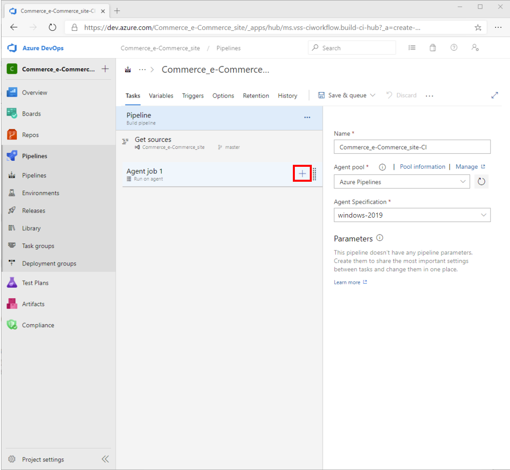
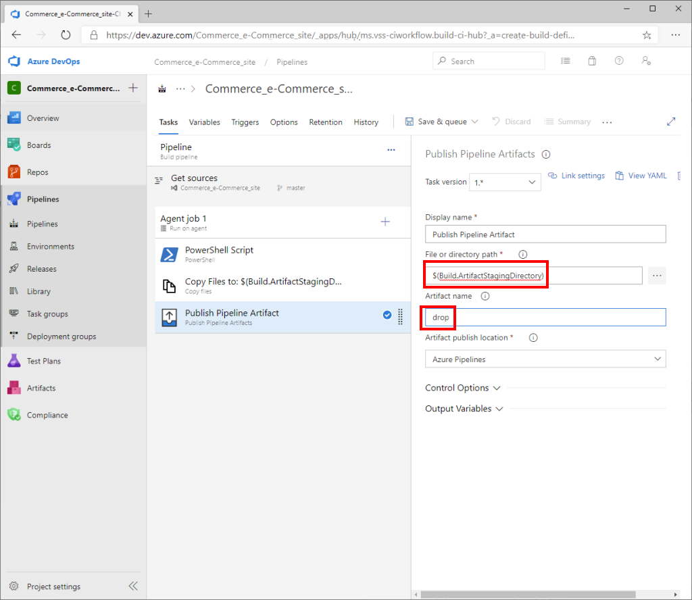
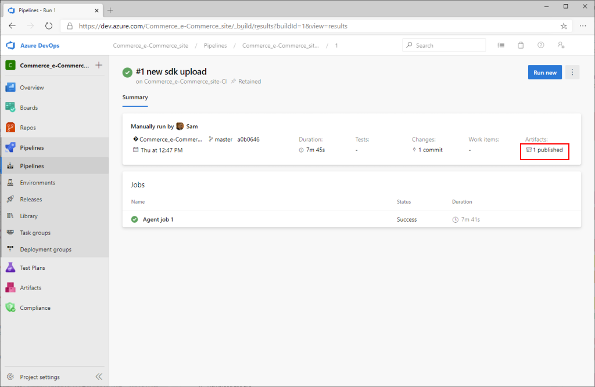

---
# required metadata

title: Set up Azure DevOps code sharing and create a build pipeline
description: This topic describes how to set up code sharing with Microsoft Azure DevOps and create a build pipeline for your Dynamics 365 Commerce online extensibility code. 
author: samjarawan
manager: annbe
ms.date: 03/05/2020
ms.topic: article
ms.prod: 
ms.service: dynamics-365-commerce
ms.technology: 

# optional metadata

# ms.search.form: 
audience: Developer
# ms.devlang: 
ms.reviewer: v-chgri
ms.search.scope: Retail, Core, Operations
# ms.tgt_pltfrm: 
ms.custom: 
ms.assetid: 
ms.search.region: Global
# ms.search.industry: 
ms.author: samjar
ms.search.validFrom: 2019-10-31
ms.dyn365.ops.version: Release 10.0.5

---
# Set up Azure DevOps code sharing and create a build pipeline

[!include [banner](../includes/banner.md)]

This topic describes how to set up code sharing with Microsoft Azure DevOps and create a build pipeline for your Dynamics 365 Commerce online extensibility code. 

## Overview

By taking advantage of the capabilities of [Azure DevOps](https://docs.microsoft.com/azure/devops/user-guide/what-is-azure-devops?view=azure-devops), you can help your team plan work, collaborate on code development, and automate the building of deployment packages for Dynamics 365 Commerce e-Commerce.

This topic guides you through the steps that are required to complete the following tasks:

* Create a GitHub repository (repo) for the Commerce online software development kit (SDK).
* Create and configure a build pipeline to generate a Commerce online deployable package.

## Create an Azure DevOps GitHub repo

You can create an Azure DevOps GitHub repo project from a new or existing Azure DevOps service subscription. For more information, see [Azure DevOps Service](https://azure.microsoft.com/pricing/details/devops/azure-devops-services/). To get started with a free trial account, see the [Get started with Azure DevOps](https://docs.microsoft.com/azure/devops/user-guide/sign-up-invite-teammates?view=azure-devops) quickstart guide.

To create an Azure DevOps GitHub repo, follow these steps.

1. After the Azure DevOps service is set up for your organization, create a new Azure DevOps project.

    

1. Enter a project name and a description. Select **Private** or **Enterprise** visibility, so that the project is accessible to your organization and developers.

    

1. For this example, you will use Git to clone the SDK code. Git is a free, open-source distributed version control system. Go to <https://git-scm.com/downloads> to download and install the latest build. You should be able to accept all the default installation values.

1. Install Visual Studio Code. Visual Studio Code is a lightweight source code editor that runs on your desktop, and is available for Windows, macOS, and Linux. It includes built-in support for JavaScript, TypeScript, and Node.js. Go to <https://code.visualstudio.com> to download the latest stable build. Then open the installer, and accept the user license agreement. You should be able accept all the default installation values.

1. Clone the Commerce online SDK. The SDK provides everything that you need to extend your e-Commerce site. For example, you can use it to create new modules, data actions, and themes. The SDK configuration package is available through the following GitHub repo: <https://github.com/microsoft/Msdyn365.Commerce.Online>.

    There are two ways to get the SDK configuration packages to your development computer. You can either download the packages directly from the GitHub repo, or you can clone the repo. 

    To clone the repo, follow these steps:

    1. Open a Command Prompt window as an admin, and create a directory to hold your e-Commerce site code (for example, **c:\\repos**).
    1. From the new directory, enter **git clone \<YOUR\_GIT\_REPO\>**, where \<YOUR\_GIT\_REPO\> is your GitHub repo. Because you're pulling from the GitHub repo only one time, you can remove the .git folder, which is a hidden directory under the root.

    Here is an example.

    ```console
    md c:\repos
    cd c:\repos
    git clone https://github.com/microsoft/Msdyn365.Commerce.Online.git
    cd Msdyn365.Commerce.Online
    ```

1. Clone the Azure DevOps GitHub project repo:

    1. In the left navigation pane, under **Repos**, select **Files**.
    1. Select the **Copy** button to copy the URL.

        

    1. Open a Command Prompt window as an admin, and create a directory to hold your e-Commerce site code (for example, **c:\\repos**).
    1. From the new directory, enter **git clone \<AZURE\_DEVOPS\_GIT\_REPO\>**, where \<AZURE\_DEVOPS\_GIT\_REPO\> is the Azure DevOps GitHub project repo. A new, empty folder that has the name of the Azure DevOps project will be created.

        ```console
        cd c:\repos
        git clone https://xxxxxx.dev.azure.com/<DevOpsProjectName>/_git/<DevOpsProjectName>
        ```

1. Copy all the contents of C:\\repos\\Msdyn365.Commerce.Online to C:\\repos\\\<DevOpsProjectName\>. Don't copy the hidden .git folder.

1. In Visual Studio Code, open the **c:\\repos\\\<DevOpsProjectName\>** folder. When you select the **Source Control** button on the left, Visual Studio Code shows the new changes that must be committed.

1. To commit all the changes to Git, enter a description in the field at the top of the **Source Control: Git** pane, and then select the check mark symbol above it. When you're prompted to stage all your changes and commit them directly, select **Yes**.

    

1. Select the ellipsis (**...**) to the right of the check mark symbol, and then, on the menu that appears, select **Push** to push the changes to the repo.

    

In Azure DevOps, you should now see the new files.


## Create and configure a new build pipeline in Azure DevOps

To create and configure a new build pipeline in Azure DevOps, follow these steps.

1. In the left navigation pane, under **Pipelines**, select **Pipelines**, and then select **Create Pipeline** in the main part of the page.

    

1. Select **Use the classic editor**.

    

1. In the **Repository** field, select your Azure DevOps GitHub repo project, and then select **Continue**.

    

1. Under **Select a template**, select **Empty job**.

    

1. Next to **Agent job**, select the plus sign (**+**) to add a new agent job.

    

1. In the **Add tasks** pane on the right, search for "PowerShell," and then, in the **PowerShell** task, select **Add**.

    

1. In the main part of the page, select **PowerShell Script**. Then, in the **PowerShell** pane on the right, under **Type**, select **Inline**. Copy the following script into the **Script** field.

    ```console
    yarn
    yarn msdyn365 pack
    ```

    

1. In the right pane, on the **Advanced** FastTab, in the **Working Directory** field, enter **$(Build.SourcesDirectory)**.

    

1. In the main part of the page, next to **Agent job**, select the plus sign (**+**) to add a new agent job.

1. In the **Add tasks** pane on the right, search for "copy," and then, in the **Copy files** task, select **Add**.

    

1. In the main part of the page, select the **Copy files** task, and then, in the **Copy files** pane on the right, follow these steps:

    1. In the **Source Folder** field, enter **$(Build.SourcesDirectory)**.
    1. In the **Contents** field, enter **\*.zip**.
    1. In the **Target Folder** field, enter **$(Build.ArtifactStagingDirectory)**.

    

1. In the main part of the page, next to **Agent job**, select the plus sign (**+**) to add a new agent job.

1. In the **Add tasks** pane on the right, search for "publish," and then, in the **Publish Pipeline Artifacts** task, select **Add**.

    

1. In the main part of the page, select the **Publish Pipeline Artifacts** task. Then, in the **Publish Pipeline Artifacts** pane on the right, follow these steps:

    1. In the **File or directory path** field, enter **$(Build.ArtifactStagingDirectory)**.
    1. In the **Artifact name** field, enter **drop**.

    

1. On the toolbar, select **Save & queue**.

    

1. In the **Run pipeline** dialog box, make sure that the **Agent Specification** field is set to **vs2017-win2016**, and then select **Save and run**.

    

    Tools that you typically use to build, test, and run JavaScript apps (such as npm, Node, Yarn, and Gulp) are preinstalled on Microsoft-hosted agents in Azure Pipelines. For the exact versions of Node.js and npm that are preinstalled, see the Microsoft-hosted agents. To install a specific version of these tools on Microsoft-hosted agents, add the **Node Tool Installer** task to the beginning of your process. Yarn is preinstalled on VS2017-win2016.

1. Monitor the agent job logs to learn when the job is completed.

    

1. After the job is completed, in the left navigation pane, under **Pipelines**, select **Pipelines**. Then, on the **Runs** tab, under **All pipeline runs**, select the pipeline run to download the deployable package.

    

1. Under **Summary**, under **Artifacts**, select **1 published**.

    

1. Select the **drop** folder to expand it and see the zip file that was created as part of the pipeline run. Select the **Download** button to download the file.

    

## Additional resources

[System requirements for a Dynamics 365 Commerce online extensibility development environment](system-requirements.md)

[Set up a development environment](setup-dev-environment.md)

[Configure a development environment (.env) file](configure-env-file.md)
