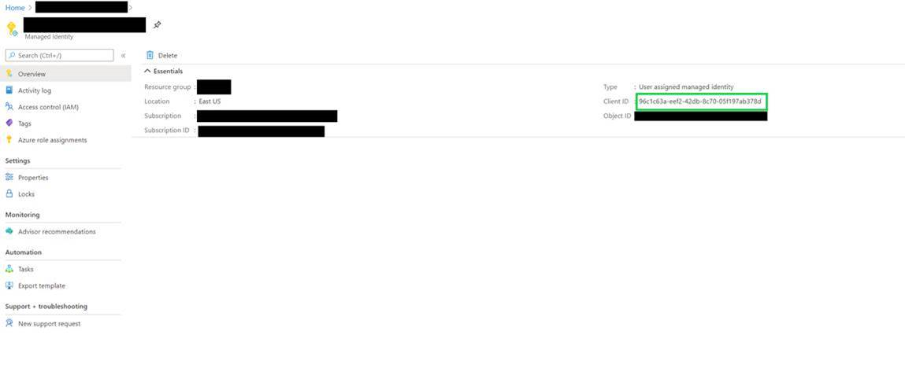
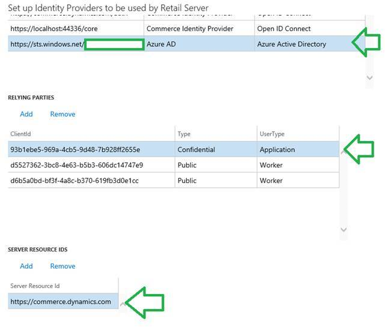
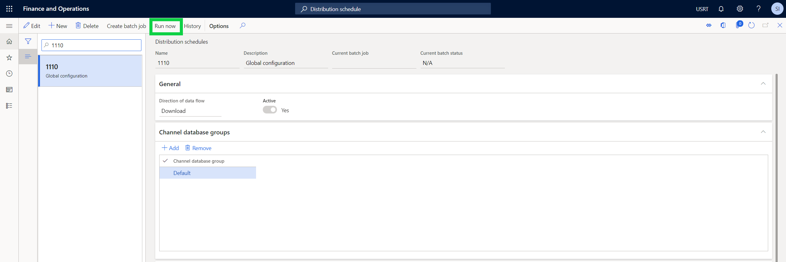
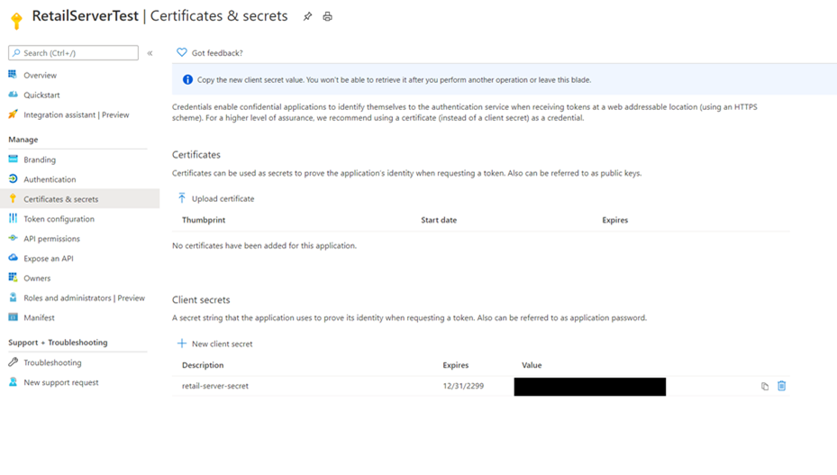
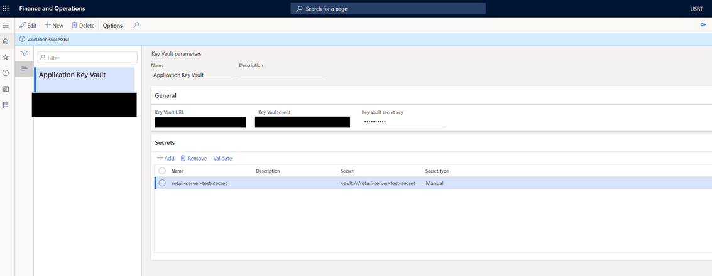

---
# required metadata

title: Set up Azure Key Vault for secure key management
description: This topic describes how to set up Azure Key Vault to provide secure key management in Dynamics 365 Commerce.  
author: samjarawan
manager: annbe
ms.date: 10/22/2020
ms.topic: article
ms.prod: 
ms.service: dynamics-365-commerce
ms.technology: 

# optional metadata

# ms.search.form: 
audience: Developer
# ms.devlang: 
ms.reviewer: v-chgri
ms.search.scope: Retail, Core, Operations
# ms.tgt_pltfrm: 
ms.custom: 
ms.assetid: 
ms.search.region: Global
# ms.search.industry: 
ms.author: samjar
ms.search.validFrom: 2019-10-31
ms.dyn365.ops.version: Release 10.0.5

---
# Set up Azure Key Vault for secure key management

[!include [banner](../includes/banner.md)]

This topic describes how to set up Azure Key Vault to provide secure key management in Dynamics 365 Commerce.

## Overview

Some Dynamics 365 Commerce e-Commerce development scenarios require business-sensitive data such as credentials or access tokens that must be stored securely. [Azure Key Vault](https://azure.microsoft.com/services/key-vault/) provides the capability to import, store, and manage cryptographic keys and certificates that can be securely accessed as needed. 

This topic shows how to do the following: 

- Create a Key Vault to securely store sensitive information.
- Configure your e-Commerce site to securely communicate with Retail Server.
- Set up Retail Server to securely communicate with your Key Vault.
- Access secret values from within your e-Commerce components.

## Create a Key Vault to store application secrets

The first step is to create a new Key Vault to store application secrets. You will need an Azure account to access Azure Key Vault.

To create a new Key Vault, follow these steps.

1.	Navigate to your [Azure Portal homepage](https://ms.portal.azure.com/).
1.	Select **Create a resource**.
1.	Search for **Key Vault**, and then select **Create**.
1.	Select the subscription and resource group you would like this Key Vault to be a part of.
1.	Enter a name, region, and pricing tier for your Key Vault.
1.	Select **Next**, and then create access policies and assign permissions to users. Leave all other settings as is.
1.	Select **Review + create**.
1.	After you have reviewed the configuration, select **Create** and then wait for the deployment to complete.
1.	After the Key Vault has successfully been deployed, you can add any secrets under **Secrets**.

## Configure server-to-server authentication between the e-Commerce Node application and Retail Server

Next, the e-Commerce Node application needs to be configured to securely communicate with Retail Server.

For the following steps, you will need to have the tenant ID of the Azure App Service hosting your Node application, as well as the client ID of the managed identity tied to your Azure App Service. If you do not have access to Azure App Service, work with your service integrator or support team to obtain the required information.

### Find and copy your tenant ID

To find your tenant ID, follow these steps.

1.	Navigate to your [Azure Portal homepage](https://ms.portal.azure.com/).
1. Go to the directory containing the Azure App Service hosting your Node application.
1.	Go to **Azure Active Directory**.
1.	In the left navigation pane, select **Properties**.
1.	Find and copy the **Tenant ID**.

### Find and copy the client ID of the managed identity for your Node application

To find the client ID of the managed identity for your Node application, follow these steps.

1.	Navigate to your [Azure Portal homepage](https://ms.portal.azure.com/).
1. Go to the directory containing the Azure App Service hosting your Node application.
1.	In the left navigation pane, select **Identity**.
1.	Select the **User assigned** tab.
1.	Select the managed identity resource for your Node application.
1. In the left navigation pane, select **Overview**, and then copy the **Client ID** value.

The following example image highlights the **Client ID** value on the Azure Portal **Overview** page.



### Add your Node application details into Retail Server’s authentication allow list

To add your Node application details into Retail Server's authentication allow list, follow these steps.

1. In Commerce headquarters, go to **Commerce Shared Parameters**.
1.	Select the **Identity Providers** tab.
1.	In the first section named **IDENTITY PROVIDERS**, select **Add**.
1. For **Issuer Value**, enter `https://sts.windows.net/<TENANT_ID>/`, where **\<TENANT_ID>** is your tenant ID.
1. For **Name**, enter "Azure AD".
1. For **Type**, enter "Active Directory".
1.	In the second section named **RELYING PARTIES**, add an entry with the client ID of your managed identity. 
1. For **Type**, select **Confidential**.
1. For **UserType**, select **Application**.
1. Provide a name for your Node application.
1.	In the third section named **SERVER RESOURCE IDS**, add an entry with the server resource ID of `https://commerce.dynamics.com`, and then select **Save**.

You should now have a configuration similar to the one in the following example.


To synchronize the changes into the channel database, in Commerce headquarters go to **Distribution schedule** and execute job 1110 (Global configuration), as shown in the following image. 


 
Your Node application will now be able to securely communicate and request Key Vault secrets from Retail Server.

## Add Key Vault details to Retail Server

Next, you will configure Retail Server to securely communicate with your Key Vault. 

### Create a new app registration and add a client secret

You will first need to create a new app registration under Azure AD to represent your Retail Server so that you can register your Key Vault with Retail Server.

To create a new app registration, follow these steps.

1.	Navigate to your [Azure Portal homepage](https://ms.portal.azure.com/).
1. Go to the directory containing the Azure App Service hosting your Node application.
1.	Go to **Azure Active Directory**.
1. In the left navigation pane, select **App registrations**.
1. Select **New registration**, and then enter a name (for example, "RetailServer").
1. In the overview panel, copy and save the **Application (client) ID** value for later use.
1. Select **Certificates & secrets**, and then under **Client secrets** select **New client secret**. 
1. In the **Add a client secret** dialog box, enter a description under **Description** (for example, "retail-server-secret"). 
1. Under **Expires**, select **Never**, and then select **OK**.
1. On the **Certificates & secrets** page, copy the secret value In the **Value** box of your new client secret and store it in a safe place. This secret value is what will enable communication between Retail Server and your Key Vault.

    
 
 > [!NOTE]
 > You will only have one opportunity to copy the secret value so it's important to do so now.
 
 ### Add an access policy in your Key Vault

Next, to add an access policy in your Key Vault, follow these steps.

1. Go to your Key Vault.
1. Select **Access policies**, and then select **Add Access Policy**.
1.	For the first option, select **Key**, **Secret**, and **Certificate Management**.
1. For **Select principal**, search for and select the app you registered earlier (for example, "RetailServer").
1. Leave **Authorized application** blank.
1. Select **Save**.

### Add the Key Vault details in Retail Server

Next, to add the Key Vault details in Retail Server, follow these steps.

1.	In Commerce headquarters, go to **Key Vault parameters**. 
1. From the store selector on the top right, select **USRT**.
1.	Select **New**, and then enter a name to represent your Key Vault.
1.	Enter the **Key Vault URL**. This is the **Vault URI** value listed on your Key Vault's **Overview** page. 
1. Enter the **Key Vault client**. This is the application ID of the registered app. 
1. Enter the **Key Vault secret key**. This is the secret value saved from the app registration process.
1.	Add the secrets you want to access from Retail Server. For example, if the secret name is "retail-server-test-secret", add "retail-server-test-secret" as the **Name**, and "vault:///retail-server-test-secret" as the **Secret**. The **Secret type** should be set to **Manual**.
1.	Select **Validate** to test your configuration. If everything was configured correctly, you will see a message that says, "Validation successful."
 
 
 
 > [!IMPORTANT]
 > The Key Vault must be configured in the **USRT** store.

## Access secret values within your e-Commerce Node application

After the configuration steps above are complete, you will be able to access the secret values from within your e-Commerce Node application using the `SecretManager` class. This class is initialized on the global `msdyn365Commerce` object and implements the interface shown in the following example. Along with the `secretKey`, the `baseURL` for your Retail Server needs to be passed in as a second argument. This base URL can be found in the `RequestContext` API under the `requestContext.apiSettings.baseUrl` API, which is accessed through the action context inside of data actions or the `props.context` context object in modules.

```typescript
export interface ISecretManager {
    getSecretValue(secretKey: string, baseRetailServerUrl: string): Promise<ISecretValue>;
}

export interface ISecretValue {
    value: string; // secret value
    id?: string; // secret ID (if applicable)
    error?: Error; // Error details (set if request to fetch secret value failed)
    expiresOn: number; // Unix timestamp (in seconds) when the secret value will expire
}
```

To import this into your code, add `msdyn365Commerce` to the import statement for the ‘@msdyn365-commerce/core’ library as shown in the following example.

```typescript
import msdyn365Commerce, { IRequestContext, … } from '@msdyn365-commerce/core';
```

The following example shows how to use the `SecretManager` class to access the secret value:

```typescript
const secretValue: ISecretValue | undefined = await msdyn365Commerce.secretManager?.getSecretValue('secretKey', requestContext.apiSettings.baseUrl);
```

Note that `secretManager` is a nullable property on msdyn365Commerce because the `SecretManager` class can only fetch secrets when running server-side. This is to prevent leaking the secret value to your browser. If the `secretManager` property is undefined, it means that the code is running in the context of a browser (client-side). 

As a developer, you should only use the `SecretManager` class on code that is ensured to run server-side (for example, data actions that will run only on server-side), because you will otherwise be unable to access the secret value. If you include this property in code that will run in both contexts (server-side and client-side), it is important to include a fallback option if the `secretManager` property is undefined.

If the request to fetch the secret value fails, the error property will be set. You can use this to debug any issues you may encounter when trying to fetch secret values.

## Local development

Your e-Commerce Node application is only able to communicate with Retail Server and request tokens need to securely communicate in a deployed App Service environment. This means that when developing locally, the `SecretManager` class will be unable to retrieve secrets from your Key Vault. Instead you can create a secrets directory in your Node application and add a secrets.json file, where you can configure secretKeys and secretValues that will only be used when developing locally.

> [!NOTE]
> Everything under the secrets/ directory should be added to your .gitignore file to help prevent secrets from being leaked online.

The following example shows the contents of a "secrets/secrets.json" file.

```json
{
    "secretKey": "secretValue!"
}
```

If you do not configure this file, during local development you may encounter errors as the `SecretManager` class attempts to communicate with your Key Vault but fails to do so.

## Additional resources

[Request properties object](request-properties-object.md)

[App settings](app-settings.md)

[Extend a module definition file](extend-module-definition.md)

[Cookie API overview](cookie-api-overview.md)

[Interactive components overview](interactive-components.md)

[Mock the signed-in state during local development](mock-sign-in.md)

[Globalize modules by using the CultureInfoFormatter class](globalize-modules.md)
