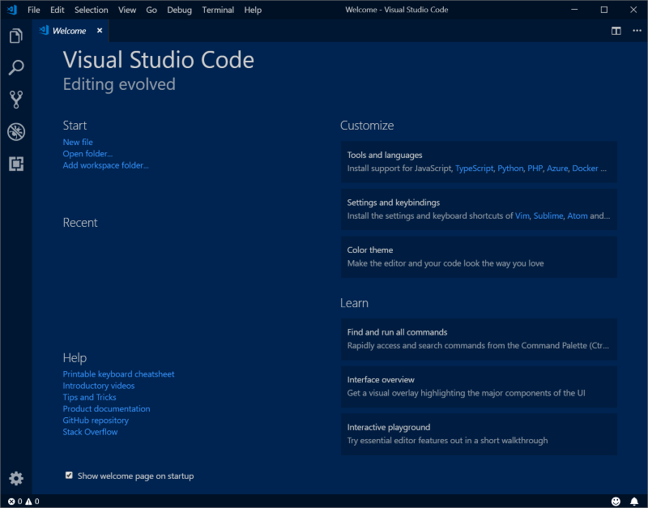

# Set up a development environment

[!include [banner](../includes/banner.md)]

This article describes how to set up a development environment for Microsoft Dynamics 365 Commerce.

To set up a development environment for Dynamics 365 Commerce online extensibility development, you must install three free tools: Microsoft Visual Studio Code, Node.js, and Yarn. You must also install the Dynamics 365 Commerce Online Software Development Kit (SDK). You can install these tools in any order.

## Install Visual Studio Code

We recommend that you use a source code editor such as Visual Studio Code. Visual Studio Code is a lightweight source code editor that runs on your Microsoft Windows desktop. It has built-in support for JavaScript, TypeScript, and Node.js.

Go to the [Visual Studio Code site](https://code.visualstudio.com), and download and install the latest build. After installation is completed, Visual Studio Code is automatically opened and should resemble the following screenshot.



## Install Node.js

Node.js is a JavaScript runtime that is built on [Chrome's V8 JavaScript Engine](https://v8.dev/).

Version 16.x is the current supported version for online SDK bootloader package 1.27 and later. If you're using online SDK bootloader package 1.26 or earlier, you need to install Node 12.x. You can find the installer on the [Node.js website](https://nodejs.org).

If you rely on other versions of Node.js for other projects, we recommend that you use [Node Version Manager (nvm)](https://github.com/creationix/nvm) to help guarantee that each version runs in its own isolated environment.

## Install Yarn

Yarn is a dependency management tool that helps guarantee that you have all the latest packages that you require for e-Commerce extensibility.

Currently, version 1.x is the only supported version. You can find the installer on the [Yarn website](https://classic.yarnpkg.com). As newer versions become supported, this document will be updated.

## Install the Online SDK and module library

The Online SDK provides everything that you require to extend your online channel with new modules, data actions, and themes.

The SDK configuration package is available through the [Msdyn365.Commerce.Online GitHub repository (repo)](https://github.com/microsoft/Msdyn365.Commerce.Online). Download or clone the repo to a local folder on your development computer. To clone the repo, use the following command. (This command only works if you have [Git tools](https://git-scm.com/downloads) installed.)

```Console
git clone https://github.com/microsoft/Msdyn365.Commerce.Online.git
```

> [!NOTE]
> The whole SDK and module library won't be downloaded and installed until you run the **yarn** command. For more information, see the [Download SDK dependencies](#download-sdk-dependencies) section later in this article.

If you cloned the repo, you can remove the .git folder (the hidden directory under the root). You can use Yarn to pull down updated dependencies.

We recommend that you use a source code repository to manage your configuration changes. Many options are available, such as [Git](https://git-scm.com/downloads).

## Download SDK dependencies

To download the SDK dependency packages, follow these steps.

1. At a command prompt, go to the root folder of the e-Commerce SDK (**c:\\repos\\Msdyn365.Commerce.Online** in the following example).
2. To get all the latest dependency packages that are required, run the **yarn** command.

    > [!IMPORTANT]
    > This step should be done after you've completed any update to the package.json file.

    ```Console
    c:\repos\Msdyn365.Commerce.Online>yarn
    ```

    This command can take several minutes to run.

## Run your Node app

To run your Node app, follow these steps.

1. Run the **yarn start** command to open the Node app.

    ```Console
    c:\repos\Msdyn365.Commerce.Online>yarn start
    ```

    This command can take up to a minute to run. When completed, you see output that indicates that the server has started. The output also shows the allocated port number (4000 by default, but you can change the value in the .env file).

2. To test that your Node app is running correctly, open the following URLs in a web browser:

    * `https://localhost:4000/version`
    * `https://localhost:4000/_sdk/allmodules`

3. To close the Node app, at the command prompt, press **Ctrl+C** two times.

## Create a new module

To add a new module, run the **yarn msdyn365 add-module MODULE\_NAME** command. For example, the following command creates a module that is named **product-feature**.

```Console
c:\repos\Msdyn365.Commerce.Online>yarn msdyn365 add-module product-feature
```

This command can take several seconds to run. It adds a new module under \\src\\modules\\product-feature.

## Clone an existing module library module

Several of the available module library modules can be cloned. These modules include the carousel, content-block, and header modules. A cloned module is a copy of the module and has a new name. Unlike the module library modules, cloned modules don't get regular service updates. Instead of cloning a module to make layout changes, you might want to extend the views on the module.

For example, to modify the content-block module, run the **yarn msdyn365 clone MODULE\_LIBRARY\_MODULE\_NAME NEW\_MODULE\_NAME** command to pull down the source code. Here's an example.


```Console
c:\repos\Msdyn365.Commerce.Online>yarn msdyn365 clone content-block super-content-block
```

You can find the new module under \\src\\modules\\super-content-block.

> [!NOTE]
> After a module is cloned, you might have to fix up references in the code. You can run **yarn start** to highlight any errors that must be fixed.

## Preview modules

To preview a specific module (for example, product-feature) in a local web browser, follow these steps.

1. At a command prompt, open your Node app by running the **yarn start** command from the root of your SDK.


    ```Console
    c:\repos\Msdyn365.Commerce.Online>yarn start
    ```

1. In a web browser, open the following URLs. Notice the module name in the **"type=MODULE\_NAME"** query string parameter.

    * `https://localhost:4000/modules?type=product-feature`
    * `https://localhost:4000/modules?type=content-block`
    * `https://localhost:4000/modules?type=super-content-block`
    
## Adding an SSL certificate

The Dynamics 365 online SDK installs a self-signed SSL certificate for developing and testing on a local environment that works against localhost. You can find these files inside the **.ssl** folder under the root SDK folder.  

> [!NOTE]
> The *yarn start* command must be run at least once for these files to be generated.

To install a new certificate on a developer environment, replace the public key (cert.pem) and private key (key.pem) files with your own.

## Additional resources

[Get started with e-commerce online extensibility development](sdk-getting-started.md)

[System requirements for a Dynamics 365 Commerce online extensibility development environment](system-requirements.md)

[Configure a development environment (.env) file](configure-env-file.md)

[Configure an e-commerce development environment against a Commerce cloud environment](debug-tier-1.md)

[Set up Azure DevOps code sharing and create a build pipeline](set-up-code-sharing-build-pipeline.md)


[!INCLUDE[footer-include](../../includes/footer-banner.md)]
