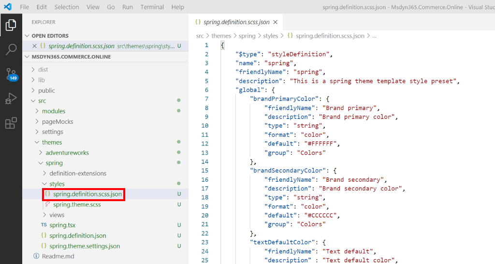
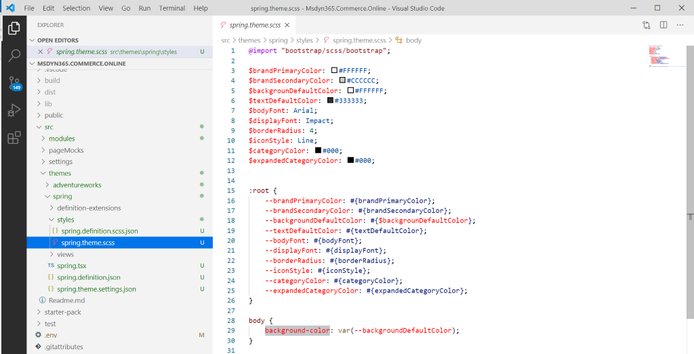

---
# required metadata

title: Configure theme style presets
description: This topic describes how to add style variables called style presets to custom themes in Dynamics 365 Commerce site builder.
author: samjarawan
manager: annbe
ms.date: 06/26/2020
ms.topic: article
ms.prod: 
ms.service: dynamics-365-commerce
ms.technology: 

# optional metadata

# ms.search.form: 
audience: Developer
# ms.devlang: 
ms.reviewer: v-chgri
ms.search.scope: Retail, Core, Operations
# ms.tgt_pltfrm: 
ms.custom: 
ms.assetid: 
ms.search.region: Global
# ms.search.industry: 
ms.author: samjar
ms.search.validFrom: 2019-10-31
ms.dyn365.ops.version: Release 10.0.5
---

# Configure theme style presets

[!include [banner](../includes/banner.md)]

This topic describes how to add style variables called style presets to custom themes in Dynamics 365 Commerce site builder.

## Overview

A style preset is a stored set of all authorable style values across a site's theme. Style presets can be used to immediately change the look of a site from within site builder. Style presets let Commerce site builder authors quickly change, preview, and activate a set of style values across their site, without having to use Cascading Style Sheets (CSS) or deploy themes. Font styles, button styles, and site colors are typical examples of style variables that can be managed through style presets.

For more details on how style presets works in site builder, see [Work with style presets](../style-presets.md).

## Default style presets

Themes with authorable style presets must have a default style preset but can also have additional optional preset settings called preset instances. An example of this would be a theme with a default "modern light" style that has optional preset instances such as "modern dark" and "vintage dark."

### Style preset definition files

Each theme contains a style presets definition file that provides metadata for site builder such as the friendly name and description of the style preset. This definition file also includes the global and module-specific styles that will be available in site builder to be customized as needed. 

When using the command line interface (CLI) command "add-theme" to create a theme, a style preset definition file is automatically created under the theme's "styles" directory. The naming convention for the definition file's name is **THEME_NAME.definition.scss.json**.

The following illustration shows a Visual Studio Code example of a theme style definition file that was created using the 'add-theme' [CLI command](cli-command-reference.md).



Each style defined under the global and modules section should also be defined in the theme's Sassy CSS (SCSS) file. The naming convention for this file's name is **THEME_NAME.scss** 

In the example illustration below, Sassy CSS (SCSS) variables have been defined in the theme.scss file for **brandPrimaryColor** with a default color of **#FFFFFF**.  When the style preset is turned on, the color value is replaced with the default color value defined in the style preset definition file. This happens to be the same color in this example, but a site builder author can choose to override this property with any color. Modules that use this global SCSS variable will then automatically pick up the color change when the user applies the setting from within site builder.



### Style preset definition schema

The style preset definition schema below is used for top-level section properties in the style presets definition file.

* "**$type**" - The definition file type. The value for this must be **styleDefinition**.
* "**name**" – The name of the theme. This property must match the theme name found in the theme definition file.
* "**friendlyName**" – The friendly name of the style preset. This name is shown in site builder when configuring style presets. The minimum length is three characters.
* "**description**" – The description of the style preset. The description provides a friendly string that is shown in site builder when configuring the style presets.
* "**global**" – The global section is used to add style presets that are globally scoped across the theme. CSS property names are used as children of this node to define styles for the CSS style.
* "**module**" – The module section is used to add style presets that are designated for specific modules. Module names are used as children of this node to define module-specific style presets.

#### Style preset property schema

The style preset property schema below is used for each style property that is defined within the global and module style sections of the style presets definition file.

* "**friendlyName**" – The friendly name of the individual style preset property. This name is shown in site builder when configuring style presets. The minimum length is three characters.
* "**description**" – This property is used for the description of the style preset property. The description provides a friendly string that is shown in site builder when configuring the style presets.
* "**type**" – This property is used as metadata for site builder. The only supported value is **string**.
* "**format**" – This property provides extra metadata to site builder so that it can present specific user experience (UX) entry scenarios. This field is optional and currently only supports the value **color**, which is used to open the color picker within site builder.
* "**default**" – The default CSS style value set for this property.
* "**group**" – This property is used in the site builder to group together similar properties.
                    
## Style preset instances

Along with the default style preset settings, a theme can contain one or more optional style preset instances. To create an preset instance file, additional style preset definition files can be manually created under the "styles" directory. These style preset definition files will have similar contents to the default style preset definition file but would generally have different default values for the properties within the global and modules sections. The naming convention for the preset instance file's name is **PRESET_INSTANCE_NAME.scss.json**.

The following example shows a style preset instance file for a dark theme. The file name is **modern-dark.scss.json**. 

> [!NOTE]
> The "name" property value must be unique and different from the default theme and other style preset instances.

```json
{
    "$type": "styleDefinition",
    "name": "modern-dark",
    "friendlyName": "modern dark",
    "description": "This is a spring modern light theme template style preset",
    "global": {
        "brandPrimaryColor": {
            "friendlyName": "Brand primary",
            "description": "Brand primary color",
            "type": "string",
            "format": "color",
            "default": "#AAAAAA",
            "group": "Colors"
        },
        "brandSecondaryColor": {
            "friendlyName": "Brand secondary",
            "description": "Brand secondary color",
            "type": "string",
            "format": "color",
            "default": "#CCCCCC",
            "group": "Colors"
        },
        "textDefaultColor": {
            "friendlyName": "Text default",
            "description" : "Text default color",
            "type": "string",
            "format": "color", 
            "default": "#555555",
            "group": "Colors" 
        },
        "backgrounDefaultColor": {
            "friendlyName": "Background default",
            "description" : "Background default color",
            "type": "string",
            "format": "color",
            "default": "#000000",
            "group": "Colors"         
        },
        …
```

## Localize style preset names and descriptions

Property names and descriptions for the style preset and style preset instance files can be localized in a similar manner to the module config properties found in the [Localize a module](localize-module.md) topic, using the "themes" node within the global.json file.

The following example shows a global.json file that sets various localized style preset properties.

```json
{
    "settings" : {…},
    "modules" : {…},
    "themes" : {
        "spring": {
            "friendlyName": {
                "value": "Spring",
                "_value.comment": "Spring theme name"
            },
            "description": {
                "value": "This is the spring theme.",
                "_value.comment": "Spring theme description"
            },
            "styles": {
                "definition": {
                    "description": {
                        "value": "This is the Spring theme style preset",
                        "_value.comment": ""
                    },
                    "global": {
                        "brandPrimaryColor": {
                              "friendlyName": {
                                  "value": "Primary brand color",
                                  "_value.comment": ""
                              },
                              "description": {
                                  "value": "The primary brand color used across the site.",
                                  "_value.comment": ""
                              },
                              "group": {
                                  "value": "Colors",
                                  "_value.comment": ""
                              }
                          }
                    },
                    "modules"
                        "header": {
                            "categoryColor" : {
                                "friendlyName": {
                                    "value": "Header background",
                                    "_value.comment": ""
                                },
                                "description": {
                                    "value": "This is the background color for the module",
                                    "_value.comment": ""
                                },
                                "group": {
                                    "value": "Color",
                                    "_value.comment": ""
                                }
                            }                            
                        }
                    }
                },
                "presets":  {
                    "dark-theme": {
                        "description": {
                            "value": "This is the dark theme style preset",
                            "_value.comment": ""
                        }
                    },
                    "light-theme": {
                        "description": {
                            "value": "This is the dark theme style preset",
                            "_value.comment": ""
                        }
                    }
                }
            }
        }
    }
}
```

## Additional resources

[Theming overview](theming.md)

[Create a new theme](create-theme.md)

[Configure theme settings](configure-theme-settings.md)

[Extend a theme to add module extensions](theme-module-extensions.md)

[Extend a theme from a base theme](extend-theme.md)
