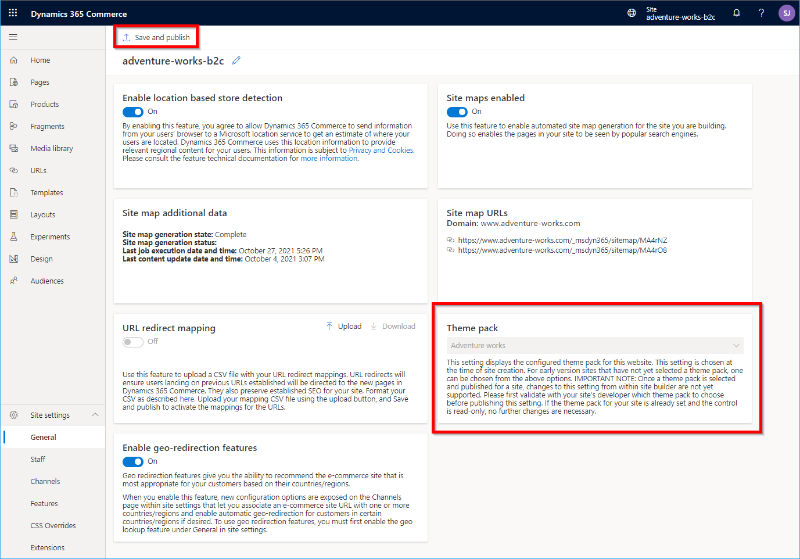
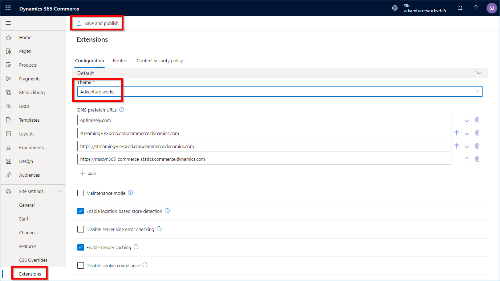

---
# required metadata

title: Theming overview
description: This topic presents an overview of online site theming in Microsoft Dynamics 365 Commerce.
author: samjarawan
ms.date: 11/22/2021
ms.topic: article
ms.prod: 
ms.technology: 

# optional metadata

# ms.search.form: 
audience: Developer
# ms.devlang: 
ms.reviewer: v-chgri
# ms.tgt_pltfrm: 
ms.custom: "intro-internal"
ms.assetid: 
ms.search.region: Global
# ms.search.industry: 
ms.author: samjar
ms.search.validFrom: 2019-10-31
ms.dyn365.ops.version: Release 10.0.5

---
# Theming overview

[!include [banner](../includes/banner.md)]

This topic presents an overview of online site theming in Microsoft Dynamics 365 Commerce.

A Dynamics 365 Commerce theme (also called a theme pack) defines the look and feel of the site brand and modules that make up an e-commerce page for merchants and their customers. Only one theme pack can be set for a given e-commerce site.  

## Style presets

A theme pack can contain one or more [style presets](../style-presets.md) that define a different set of styles for each preset. Style presets include styles for individual modules as well as global styles such as the brand accent color. For example, a theme could contain style presets for a "light" versus "dark" theme, or perhaps a "classic" versus "vintage" look and feel. The definition and naming of style presets is determined by the [theme developer](theme-style-presets.md).  

Style presets support global Cascading Style Sheets (CSS) values such as brand colors and fonts as well as module-specific CSS values that could include text color and size for individual modules. Only one style preset can be configured per site, however CSS values can be overridden from within Commerce site builder and saved as a custom style preset if changes are desired. Examples of style preset changes could be a change to the default global brand accent color which various modules leverage, or a change of a font size within a particular module. Whenever an affected module is rendered on a site page it will always use the newer, custom value.

Themes include SCSS (Sassy Cascading Style Sheets) files that you can use to style your modules. SCSS files can optionally contain [module view extensions](theme-module-extensions.md#theme-module-view-extensions) and [module definition extensions](theme-module-extensions.md#theme-definition-extensions) so that modules can render different views, based on the theme that is selected. 

After a theme is created it can be uploaded to your sandbox or production site. A theme pack is selected when creating a new site, as shown in the following example image.


If you have already deployed a site with no theme pack selected, a theme can be set within the **General** site builder site settings using the special query string parameter **&amp;set=showThemePack**. Ensure you select **Save and publish** after a them has been set. Once a theme pack is selected it can only be changed by contacting Microsoft Dynamics 365 support.



There is an additional configuration needed in site builder when setting a theme. On the site settings **Extensions** page, ensure that the theme matches the site-selected theme pack as shown in the following example image.



The site builder tool also lets you upload additional [CSS overrides](../css-override-files.md). Uploading additional CSS override files allows you to directly make changes on top of the theme selected in site builder without having to make code changes to the theme and republish it. This option is useful for making small quick changes, but it's recommended that such changes are eventually migrated to the theme code. There can be a small performance impact when additional CSS override files are loaded for every site page.

## General guidelines for creating a custom theme

- A new theme can be created using the **yarn msdyn365 add-theme NEW_THEME_NAME** [CLI (command-line interface)](cli-command-reference.md#add-theme) command. This command will create a theme in the /src/themes/ folder.  
- Under the styles directory, you will find the SCSS entry point file for the theme. This file uses the naming pattern **THEME_NAME.theme.scss**. 
- Themes are created as special modules. They contain definition files that include the theme's friendly name and description, and also a template React component.
- There is no limit to the number of SCSS files that your theme can contain.
- Your theme entry point can import other SCSS files by using relative paths.

## Best practices

- Module library modules are built by using Bootstrap 4 classes. Therefore, it is recommended that every theme include either Bootstrap 4 or Bootstrap 4 RTL as the SCSS framework.
- If you want to take advantage of module library modules that are built by using Font Awesome glyph icons, you should include **font-awesome** in the SCSS file. The following example shows how to include **Bootstrap** and **font-awesome** in a SCSS file.

    ```css
    $fa-font-path: 'https://use.fontawesome.com/releases/v5.2.0/webfonts' !default;
    @import "bootstrap/scss/bootstrap";
    
    ```
    
## Create a theme from a reference theme

It is recommended to start a new theme with a copy of one of the reference themes provided ("Fabrikam", "Starter", or "Adventure Works") and then make appropriate changes.  These themes already contain all the SCSS styles for the module library. If you start from a brand new theme each module's styles would need to be redefined. The "fabrikam" and "starter" themes are included as part of the module library and can be copied using the CLI [clone](cli-command-reference.md#clone) command, for example:

```Console
yarn msdyn365 clone fabrikam my-new-theme
```

> [!NOTE]
> Since themes are seen as special modules by the system, the module clone command shown above will automatically put the new cloned theme in the "\src\modules" directory. You will then need to manually move the new theme to the "\src\themes" directory. If the "\src\themes" directory does not exist, it can be created manually.

The [Adventure Works theme](../adventure-works-theme.md) is not included in the module library but is instead shipped as an extension. For steps on installing the Adventure Works theme, see [Install the Adventure Works theme](../install-adventure-works.md). The clone command will not work for the Adventure Works theme, but the source code can be copied to your themes directory and changed as needed.

## Recommended structure for a custom theme

This section shows the recommended structure for any custom theme. 

Import or define the following items:

- Fonts and glyph icons
- Mix-ins and functions:

    - **Bootstrap:** Dependencies, excluding components and utilities
    - **Shared components:** Dependencies, excluding components and utilities
    - Custom theme mix-ins and functions

- Theme variables:

    - Custom theme variables
    - **Bootstrap:** Default theme variables (fallbacks)

- SCSS for components and modules:

    - **Shared components:** Components
    - Custom components and modules

- Utilities:

    - Bootstrap, shared component, and custom utilities

## Hooks for module theming

For every module, a class name is defined that matches the module name. In this way, any theme can target the module. This class name should be the first class name that is applied to the outermost element that is rendered by the React component. To allow for more granular theme options, developers can provide additional class names on elements or features of a module. In that way, custom themes can target those elements or features.

## Custom themes

Custom themes can be created by using the Dynamics 365 Commerce online SDK. They can then be stored in the **/src/themes/** folder. For more information, see [Create a theme](create-theme.md).

## RTL and LTR support within a theme

You may have requirements to support both right-to-left (RTL) and left-to-right (LTR) languages on your e-Commerce site. Themes support the ability to specify different RTL and LTR SCSS files. 

> [!NOTE]
> RTL and LTR support within a theme is available in Dynamics 365 Commerce release 10.0.15.

Each theme has a **styles\THEME_NAME.theme.scss** file that is created using the **yarn msdyn365 add-theme** command-line interface (CLI) command. For example, using the command **yarn msdyn365 add-theme spring** to create a new theme called "spring" will create the file "\src\themes\spring\styles\spring.theme.scss", which contains the SCSS code for the theme. SCSS files are compiled into CSS files when using the **yarn start** or **yarn pack** commands, and are then used to render site pages. 

To support specific RTL or LTR versions of a SCSS file, you can provide additional files using the following file naming convention: **THEME_NAME.rtl.theme.scss** for RTL support and **THEME_NAME.ltr.theme.scss** for LTR support. When a page renders, the appropriate CSS file will be referenced according to the browser language setting. If you only need support for a single language, use the default **THEME_NAME.theme.scss** file.

## RTL and LTR best practices

Because the CSS code used in RTL and LTR layouts is generally the same except for a few properties, those differing properties can be specified in their respective "theme" files and a "base-style" file can be created to be shared (and imported) by both the RTL and LTR SCSS files.

- **THEME_NAME-rtl.theme.scss** - Contains specific properties for the RTL layout.
- **THEME_NAME-ltr.theme.scss** - Contains specific properties for the LTR layout.
- **base-style.scss** - Contains shared styles and is imported in the two THEME_NAME files.

## Additional resources

[Create a new theme](create-theme.md)

[Configure theme settings](configure-theme-settings.md)

[Configure theme style presets](theme-style-presets.md)

[Extend a theme to add module extensions](theme-module-extensions.md)

[Override a module library component in a theme](override-theme-component.md)

[Extend a theme from a base theme](extend-theme.md)

[Add custom resources to your customization code](add-custom-resources.md)

[CLI command reference](cli-command-reference.md)


[!INCLUDE[footer-include](../../includes/footer-banner.md)]
