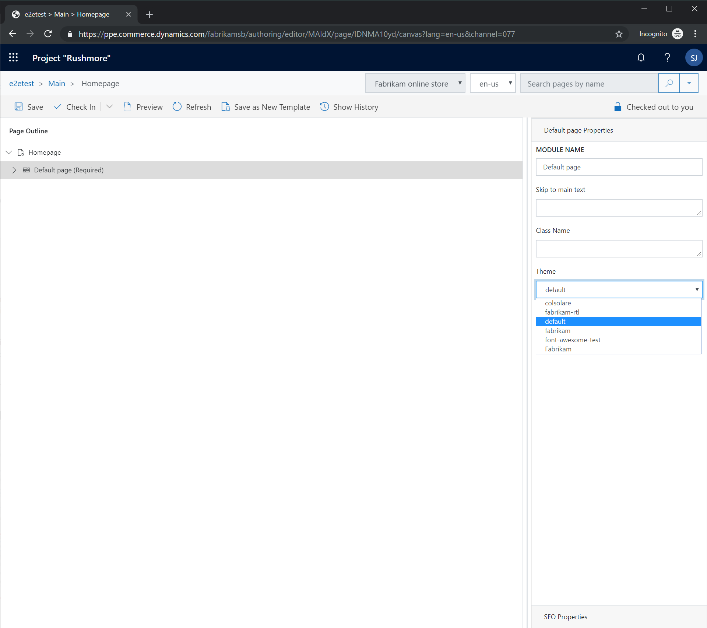

---
# required metadata

title: Theming overview
description: This topic presents an overview of online site theming in Microsoft Dynamics 365 Commerce.
author: samjarawan
manager: annbe
ms.date: 01/31/2020
ms.topic: article
ms.prod: 
ms.service: dynamics-365-commerce
ms.technology: 

# optional metadata

# ms.search.form: 
audience: Developer
# ms.devlang: 
ms.reviewer: v-chgri
ms.search.scope: Retail, Core, Operations
# ms.tgt_pltfrm: 
ms.custom: 
ms.assetid: 
ms.search.region: Global
# ms.search.industry: 
ms.author: samjar
ms.search.validFrom: 2019-10-31
ms.dyn365.ops.version: Release 10.0.5

---
# Theming overview

[!include [banner](../includes/banner.md)]

This topic presents an overview of online site theming in Microsoft Dynamics 365 Commerce.

## Overview

Dynamics 365 Commerce lets you apply a theme to your whole online site, individual templates, or individual pages. For example, you might have a default theme that is set for the whole online site and a campaign theme that is applied to just a subset of the pages on the site. 

Themes include Sassy Cascading Style Sheets (SCSS) files that you can use to format your site pages and modules. They can optionally also contain module view and definition extensions, so that modules can render different views, depending on the theme that is selected. 

After a theme is created and uploaded to your production site, you can use the site builder tool to set the theme for the site. You can set the site's theme in a template, in a layout, or on a single page. When an online page is rendered, the appropriate theme is applied, so that all the modules on that page have a consistent look and feel. The site builder tool also lets you upload additional CSS overrides. In that way, you can make changes on top of the selected theme.

The following illustration shows how a theme is selected for a page in Dynamics 365 Commerce. Notice that the page container (**Default page**) is selected, and the **Theme** field for the page appears in the properties pane on the right.



A theme can be set on the master page in a similar manner. In this case, the theme is applied to all pages that are derived from the master page. Note that if the **locked** property is turned off, individual pages can override the theme.

## General instructions to create a custom theme
•	Create a new theme using the CLI command “yarn msdyn365 add-theme NEW_THEME_NAME” which will create a theme in the “/src/themes/” folder.
•	Under the styles directory you will find the SCSS entry point file for the theme which uses name pattern “THEME_NAME.theme.scss”.  
•	Themes are created as special modules and contain a definition file which includes the theme friendly name and description, as well as a template react component.
•	There is no limit to the number of “.scss” files your theme may contain.
•	Your theme entry point may import other “.scss” files using relative paths.

## Best practices

- Starter kit modules are built by using Bootstrap 4 classes. Therefore, we recommend that every theme include either Bootstrap 4 or Bootstrap 4 RTL as the  SCSS framework.
- If you want to take advantage of starter kit modules that are built by using Font Awesome glyph icons, **font-awesome** should be included in the SCSS file. The following example shows how to include **Bootstrap** and **font-awesome** in an SCSS file.


    ```css
    $fa-font-path: 'https://use.fontawesome.com/releases/v5.2.0/webfonts' !default;
    @import "bootstrap/scss/bootstrap";
    ...
    ```

## Recommended structure for a custom theme

This section shows the recommended structure for any custom theme. 

Import or define the following items:

- Fonts and glyph icons
- Mix-ins and functions:

    - **Bootstrap:** Dependencies, excluding components and utilities
    - **Shared components:** Dependencies, excluding components and utilities
    - Custom theme mix-ins and functions

- Theme variables:

    - Custom theme variables
    - **Bootstrap:** Default theme variables (fallbacks)

- SCSS for components and modules:

    - **Shared components:** Components
    - Custom components and modules

- Utilities:

    - Bootstrap, shared component, and custom utilities

## Hooks for module theming

For every module, a class name is defined that matches the module name. In this way, any theme can target the module. This class name should be the first class name that is applied to the outermost element that is rendered by the React component. To allow for more granular theme options, developers can provide additional class names on elements or features of a module. In that way, custom themes can target those elements or features.

## Custom themes

Custom themes can be created by using the Dynamics 365 Commerce online SDK. They can then be stored in the **/src/themes/** folder. For more information, see [Create a theme](create-theme.md).

## Additional resources

[Create a new theme](create-theme.md)

[Configure theme settings](configure-theme-settings.md)
