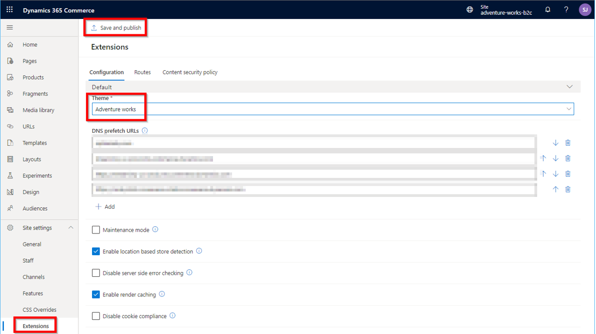

# Theming overview

[!include [banner](../includes/banner.md)]

This article presents an overview of online site theming in Microsoft Dynamics 365 Commerce.

A Dynamics 365 Commerce theme (also known as a *theme pack*) defines the look and feel of the site brand and modules that make up an e-commerce page for merchants and their customers. Only one theme pack can be set for each e-commerce site.

## Style presets

A theme pack can contain one or more [style presets](../style-presets.md) that define a different set of styles for each preset. Style presets include both styles for individual modules and global styles such as the brand accent color. For example, a theme pack might contain style presets for a "light" theme and a "dark" theme, or for a "classic" look and feel and a "vintage" look and feel. The definition and naming of style presets is determined by the [theme developer](theme-style-presets.md).

Style presets support global Cascading Style Sheets (CSS) values such as brand colors and fonts. They also support module-specific CSS values that might include text colors and sizes for individual modules. Only one style preset can be configured per site. However, if changes are required, CSS values can be overridden in Commerce site builder and saved as a custom style preset. Examples of changes to style presets include a change to the default global brand accent color that various modules use or a change to a font size in a specific module. Whenever an affected module is rendered on a site page, it always uses the newer, custom value.

Themes include SCSS (Sassy Cascading Style Sheets) files that you can use to style your modules. SCSS files can optionally contain [module view extensions](theme-module-extensions.md#theme-module-view-extensions) and [module definition extensions](theme-module-extensions.md#theme-definition-extensions). In that way, modules can render different views, based on the theme that is selected. 

After a theme is created, it can be uploaded to your sandbox or production site. You select a theme pack when you create a new site, as shown in the example in the following illustration.


If you deployed a site where no theme pack is selected, you can set a theme on the **General** site settings page in Commerce site builder by using the **&amp;set=showThemePack** query string parameter. Ensure that you select **Save and publish** after you set a theme. After a theme pack is selected, you must contact Microsoft Dynamics 365 Support to change it.


Additional configuration in Commerce site builder is required when you set a theme. On the **Extensions** site settings page, make sure that the theme matches the site-selected theme pack, as shown in the example in the following illustration.



Commerce site builder also lets you upload additional [CSS override files](../css-override-files.md). In this way, you can make direct changes on top of the theme that is selected in site builder, without having to make code changes to the theme and then republish it. This option is useful when you must make small, quick changes. However, Microsoft recommends that you eventually migrate those changes to the theme code. There can be a small performance impact if additional CSS override files are loaded for every site page.

## General guidelines for creating a custom theme

- You can create a new theme by using the **yarn msdyn365 add-theme NEW_THEME_NAME** [CLI (command-line interface)](cli-command-reference.md#add-theme) command. This command creates a theme in the /src/themes/ folder.
- You can find the SCSS entry point file for the theme under the styles directory. This file uses the naming pattern **THEME_NAME.theme.scss**. 
- Themes are created as special modules. They contain definition files that include the theme's friendly name and description, and also a template React component.
- There's no limit on the number of SCSS files that your theme can contain.
- Your theme entry point can import other SCSS files by using relative paths.

## Best practices

- Module library modules are built by using Bootstrap 4 classes, so Microsoft recommends that every theme includes either Bootstrap 4 or Bootstrap 4 RTL as the SCSS framework.
- If you want to take advantage of module library modules that are built by using Font Awesome glyph icons, you should include **font-awesome** in the SCSS file. The following example shows how to include **Bootstrap** and **font-awesome** in an SCSS file.

    ```css
    $fa-font-path: 'https://use.fontawesome.com/releases/v5.2.0/webfonts' !default;
    @import "bootstrap/scss/bootstrap";
    ```

## Create a theme from a reference theme

Microsoft recommends that you start a new theme from a copy of one of the provided reference themes (Fabrikam, Starter, or Adventure Works), and then make the appropriate changes. These reference themes already contain all the SCSS styles for the module library. If you start from a brand-new theme, every module's styles must be redefined.

The Fabrikam and Starter themes are included as part of the module library and can be copied by using the [clone](cli-command-reference.md#clone) CLI command, as shown in the following example.

```Console
yarn msdyn365 clone fabrikam my-new-theme
```

> [!NOTE]
> Because the system treats themes as special modules, the **clone** command automatically puts the new cloned theme in the \\src\\modules directory. You must then manually move the new theme to the \\src\\themes directory. If the \\src\\themes directory doesn't exist, you can manually create it.

The [Adventure Works theme](../adventure-works-theme.md) isn't included in the module library, but is instead released as an extension. For information about how to install the Adventure Works theme, see [Install the Adventure Works theme](../install-adventure-works.md). The **clone** CLI command doesn't work for the Adventure Works theme. However, you can copy the source code to your themes directory and change it as you require.

## Recommended structure for a custom theme

This section shows the recommended structure for any custom theme. 

Import or define the following items:

- Fonts and glyph icons
- Mix-ins and functions:

    - **Bootstrap:** Dependencies, excluding components and utilities
    - **Shared components:** Dependencies, excluding components and utilities
    - Custom theme mix-ins and functions

- Theme variables:

    - Custom theme variables
    - **Bootstrap:** Default theme variables (fallbacks)

- SCSS for components and modules:

    - **Shared components:** Components
    - Custom components and modules

- Utilities:

    - Bootstrap, shared component, and custom utilities

## Hooks for module theming

For every module, a class name is defined that matches the module name. In this way, any theme can target the module. This class name should be the first class name that is applied to the outermost element that is rendered by the React component. To allow for more granular theme options, developers can provide additional class names on elements or features of a module. In that way, custom themes can target those elements or features.

## Custom themes

Custom themes can be created by using the Dynamics 365 Commerce online SDK. They can then be stored in the **/src/themes/** folder. For more information, see [Create a theme](create-theme.md).

## RTL and LTR support within a theme

You may have requirements to support both right-to-left (RTL) and left-to-right (LTR) languages on your e-Commerce site. Themes support the ability to specify different RTL and LTR SCSS files. 

> [!NOTE]
> RTL and LTR support within a theme is available in Dynamics 365 Commerce release 10.0.15.

Each theme has a **styles\THEME_NAME.theme.scss** file that is created using the **yarn msdyn365 add-theme** command-line interface (CLI) command. For example, using the command **yarn msdyn365 add-theme spring** to create a new theme called "spring" creates the file "\src\themes\spring\styles\spring.theme.scss", which contains the SCSS code for the theme. SCSS files are compiled into CSS files when using the **yarn start** or **yarn pack** commands, and are then used to render site pages. 

To support specific RTL or LTR versions of an SCSS file, you can provide additional files using the following file naming convention: **THEME_NAME.rtl.theme.scss** for RTL support and **THEME_NAME.ltr.theme.scss** for LTR support. When a page renders, the appropriate CSS file is referenced according to the browser language setting. If you only need support for a single language, use the default **THEME_NAME.theme.scss** file.

## RTL and LTR best practices

Because the CSS code used in RTL and LTR layouts is generally the same except for a few properties, those differing properties can be specified in their respective "theme" files, and you can create a "base-style" file to be shared (and imported) by both the RTL and LTR SCSS files.

- **THEME_NAME-rtl.theme.scss** - Contains specific properties for the RTL layout.
- **THEME_NAME-ltr.theme.scss** - Contains specific properties for the LTR layout.
- **base-style.scss** - Contains shared styles and is imported in the two THEME_NAME files.

## Additional resources

[Create a new theme](create-theme.md)

[Configure theme settings](configure-theme-settings.md)

[Configure theme style presets](theme-style-presets.md)

[Extend a theme to add module extensions](theme-module-extensions.md)

[Override a module library component in a theme](override-theme-component.md)

[Extend a theme from a base theme](extend-theme.md)

[Add custom resources to your customization code](add-custom-resources.md)

[CLI command reference](cli-command-reference.md)


[!INCLUDE[footer-include](../../includes/footer-banner.md)]
