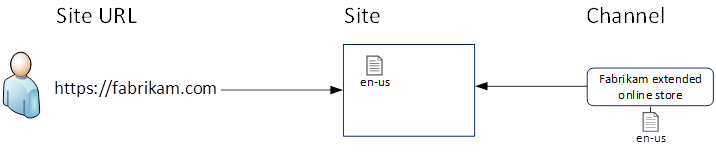
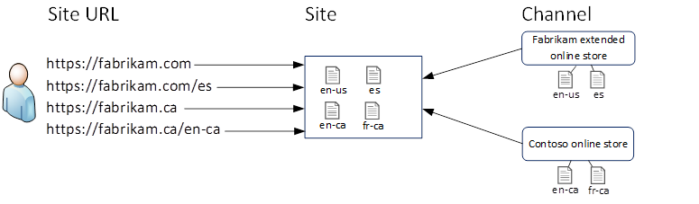
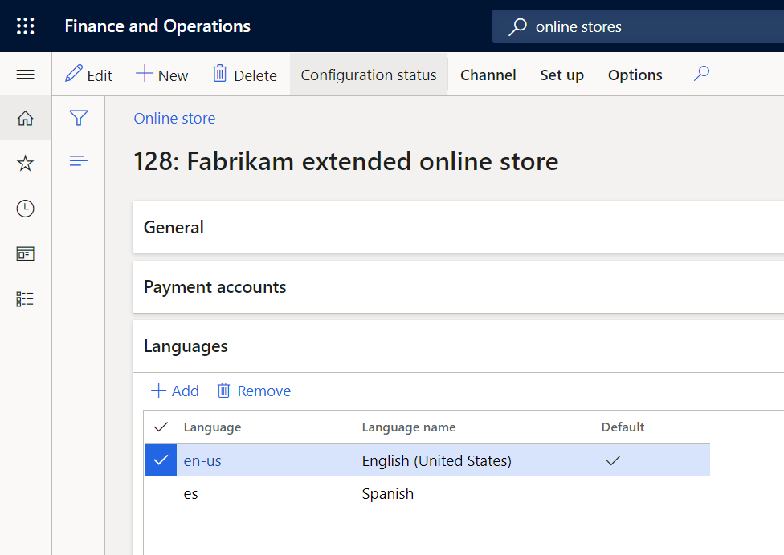

---
# required metadata

title: Dynamics 365 Commerce e-commerce localization guide
description: This article describes how to localize a Microsoft Dynamics 365 Commerce e-commerce site into additional languages and configure the site to support multiple channels.
author: bicyclingfool
ms.date: 04/29/2022
ms.topic: article
audience: Application User, Developer, IT Pro
ms.reviewer: v-chgriffin
ms.search.region: Global
ms.author: stuharg
ms.search.validFrom: 2017-06-20
---

# Dynamics 365 Commerce e-commerce localization guide

[!include [banner](includes/banner.md)]

This article describes how to localize a Microsoft Dynamics 365 Commerce e-commerce site into additional languages and configure the site to support multiple channels, and also covers the concepts and terminology related to the process.

The e-commerce capabilities in Dynamics 365 Commerce have been designed to enable online experiences that can be tailored to specific countries/regions and languages, but at the same time allowing for the maximum reuse of templates, pages, content, and media. You can also create a basic site and then expand into new markets by adding support for additional countries/regions and languages over time.

## Definitions

**Locale, locale identifier**: A locale (also known as a locale identifier) defines a language that is associated with a country or region. For example, the locale identifier "fr-ca" is associated with Canadian French.

**Base language**: The language that you develop your site content in before you export it for localization.

**Channel, online store**: A channel (also known as an online store) defines the payment methods, price groups, product hierarchies, assortments, and products for an online e-commerce storefront.

## Concepts

### URL-driven experience

Dynamics 365 Commerce e-commerce sites deliver unique marketized and localized experiences for customers through channels and locale identifiers. Channels define the unique products, categories, currencies, and payment methods for a market, and locale identifiers determine the language of the content that customers see. An e-commerce site uses URLs to differentiate between marketized and localized experiences. Site URLs for these unique channel and locale experiences are defined for a site on the **Site settings \> Channels** page in Dynamics 365 Commerce site builder.

In site builder, a URL is a combination of a domain and a path that defines the entry point for a unique combination of a channel and a locale. In the following example, a fictitious online store called Fabrikam Inc. defines four unique combinations of a channel and a locale, and maps each combination to a unique URL that serves content to customers.

| Domain                     |  Path      | Channel       |   Locale     |
|------------------------|--------|--------------------------------|--------|
| `https://fabrikam.com` | /      | Fabrikam extended online store | en-us  |
| `https://fabrikam.com` | /es    | Fabrikam extended online store | es     |
| `https://fabrikam.ca`  | /      | Contoso online store    | fr-ca  |
| `https://fabrikam.ca`  | /en-ca | Contoso online store    | en-ca  |

#### Domain

Domains are established when you set up your e-commerce site in Microsoft Dynamics Lifecycle Services (LCS). After your e-commerce environment is provisioned, you can add more domains by opening a service request. For more information about how to set up domains for your e-commerce site, see [Domains in Dynamics 365 Commerce](domains-commerce.md).

#### Path

- A path is an arbitrary string that, in combination with the domain, is mapped to a unique combination of a channel and a locale. In the preceding example, the string that is used as the path matches the locale identifier that the path is mapped to. However, you can use a different approach.
- A combination of a channel and a locale can be mapped to a domain and an empty path ("/"). In the preceding example, customers who visit `https://fabrikam.ca/` will get the products and assortments for the Canadian market in Canadian French.
- Commerce site builder prevents you from creating duplicate combinations of a domain and a path. However, you can map duplicate combinations of a channel and a locale to a different combination of a domain and a path.

#### Channel

- Channels (also known as online stores) define the payment methods, price groups, product hierarchies, assortments, and products for an online e-commerce storefront.
- Channels are defined, configured, and published in Dynamics 365 Commerce headquarters.
- Site builder can detect the online stores that have been configured in Commerce headquarters and are available to be mapped to a site.

For more information about channels, see [Channels overview](channels-overview.md). For more information about how to set up an online channel, see [Set up an online channel](channel-setup-online.md).

#### Locale

- The locale is the actual identifier used when you hand off XML Localization Interchange File Format (XLIFF) files for localization. Locales are defined and published for each channel in Commerce headquarters. For information about how to configure languages and channels in site builder, see the next section.
- The same locale can be mapped to multiple channels. In this way, a common language can be offered across multiple markets.

## Configure languages and channels for your e-commerce site

Out of the box, all Dynamics 365 Commerce e-commerce sites are configured to use a single online channel and a single language, regardless of whether you start with the Fabrikam demo site or create a new site from scratch.

In this configuration, customers and partners typically develop all the assets that will be used across countries/regions and languages. These assets include templates, pages, fragments, content, and media. All site content is developed in the first language you selected for your site, or if you're using the Fabrikam demo site, site content will be developed in English.

> [!NOTE]
> You can configure the Fabrikam demo site for an additional language so that content development can be done in that language. For information about how to for add a new language to a site and a channel, see the [Configure an additional language for your site](#configure-an-additional-language-for-your-site) section later in this article.

However, the content management system (CMS) and page model for Dynamics 365 Commerce e-commerce sites have been designed to enable expansion into new markets and locales. Therefore, through a single e-commerce site, you can manage the assets for an online store that spans multiple markets and languages.

### Configure an additional language for your site

The process of configuring a new language for an e-commerce site has three steps.

#### Step 1: Add the language to your channel (online store) in Commerce headquarters

1. In Commerce headquarters, go to the channel that you want to add the new language to. To find the list of channels that you've configured in Commerce headquarters, go to **Retail and Commerce \> Channels \> Online stores**.
1. Open the online store that is mapped to your site by selecting its  **Retail Channel ID** value. You can verify the online store that is mapped to your site by opening the **Channels** site setting page in Commerce site builder and looking at the name of the online store in the **Channels** column. 
1. On the **Languages** FastTab, select **Add**. In the **Language** field, select the locale code for the new language. Then select **Save**.
1. Go to **Retail and Commerce \> Retail and Commerce IT \> Distribution schedule**, and run job **1070 Channel configuration**. When the job has finished running, you can move on to step 2 and add the language to a channel for your site in site builder.

#### Step 2: Add the language to a channel in site builder

To add a language to a channel in site builder, follow these steps.

1. In Commerce site builder, open your site, and then open the **Channels** page in site settings.
1. Select the name of the channel that you want to add the language to.
1. In the right pane, select **Add a locale**.
1. In the **Add a locale** dialog box, under **Add a locale** select the locale for the language that you previously added to the channel in Commerce headquarters.
1. Select the domain and path that customers will request to view your site in this channel and language.
1. If you want the language to be the default language for viewing, creating, and updating site builder pages and fragments, select the **Use as default authoring channel language** checkbox. 
    > [!NOTE]
    > This setting affects only site builder. It doesn't influence the published site experience for your customers.
1. Select **OK**.
1. Select **Save and Publish**.

#### Step 3: Localize your site content

When you return to the **Pages** view in Commerce site builder, the new language will be available in the channel and locale picker in the upper right. You can now create localized versions of pages in your base language.

The process for localizing the content of your pages and fragments is covered in the [Localize e-commerce site content](#localize-e-commerce-site-content) section later in this article.

### Configure a new channel for your site

Dynamics 365 Commerce e-commerce sites can serve experiences that are defined across multiple online channels that are configured in Commerce headquarters. A site uses multiple channels to show customers a unique configuration of payment methods, price groups, product hierarchies, assortments, and a set of products. A channel is typically used to configure these dimensions to suit the requirements and preferences for the experience that is associated with individual countries/regions. However, this approach is a business decision that the customer makes. It isn't a requirement.

The prerequisites and tasks that are associated with setting up a channel (online store) are beyond the scope of this document. For more information about how to set up an online channel in Commerce headquarters, see [Channel setup basics](channels-overview.md#channel-setup-basics). For information about the steps and requirements specific to online channels, see [Set up an online channel](channel-setup-online.md).

To add a channel to your site in site builder, follow these steps.

1. In Commerce site builder, go to **Site settings \> Channels**. 
1. Select **Add a channel**.
1. In the **Add a channel** dialog box, under **Channel** select the channel that you want to add. 
    > [!NOTE]
    > You can only add channels that haven't already been added to your site.
1. Select the default locale for the channel. If you add new languages to the channel, you can change the default language to one of them.
1. Specify the domain and path that will constitute the URL that serves content and experiences for this combination of a channel and a language.
1. Select **OK**.
1. Select **Save and Publish**.

## Localize e-commerce site content

### XLIFF basics

XLIFF is an industry-standard file format for passing localizable content between content management tools. Commerce site builder uses the XLIFF file format to export page, fragment, and image metadata content so that it can be localized and reimported.

Microsoft Dynamics customers typically work with third-party localization vendors such as [Translated.com](https://translated.com/welcome) to translate their XLIFF files into the languages they require.

### Localize assets in site builder

The following e-commerce site assets can be localized in site builder:

- Pages
- Fragments
- Media assets
- Modules

All new pages, fragments, and media assets are created in the context of the channel and language that are currently selected in the channel and locale
picker. This language is usually your "base language", provided that you haven't configured additional languages or channels. On sites where multiple channels and languages are configured, the "base language" is defined by the channel and locale you've set as the default on the **Channels** page in site settings.

The steps for localizing content for pages, fragments, and media assets are similar. Exceptions and differences will be pointed out in the sections that follow. However, the steps for localizing module content differ. For more information, see the [Localize modules](#localize-modules) section later in this article.

#### Step 1: Export an XLIFF file

To export an XLIFF file for a page, fragment, or image in site builder, follow these steps.

1. Open the asset that you want to export base language content for, so that it can be localized.
1. On the command bar, select **Localization \> Export XLIFF**.
    > [!NOTE]
    > The **Localization** option is visible only when the asset is in an **Edit** state.

An XLIFF file named **\<assetname\>.xlf** will be downloaded to your browser's download folder. This XLIFF file is specific to the asset that you're localizing. You will export an XLIFF file for every asset that you want to localize.

#### Step 2: Localize the XLIFF file

In most cases, you'll work with a localization vendor to translate your XLIFF files. However, if you're localizing assets internally, or if you just want to test the localization process, you must make the following changes to an XLIFF file:

- Add a target language attribute to the /xliff/file element and set the value to the locale identifier of the language you're localizing to. 
    > [!NOTE]
    > This locale identifier must match the locale identifier from the **Channels** page in site settings.
- For each //source element, add a target element sibling where the text value is the localized version of the content of that source element.

For information about the schema that governs XLIFF files, see the [XLIFF 1.2 Specification](http://docs.oasis-open.org/xliff/xliff-core/xliff-core.html).

> [!NOTE]
> To localize an asset into multiple languages, you must create a localized XLIFF file for each of those languages.

#### Step 3: Import the localized XLIFF file

To import an XLIFF file for an asset, follow these steps.

1. In Commerce site builder, open the asset that you want to import an XLIFF file for.
1. In the channel and locale picker in the upper right, select the channel and language that you're importing localized content for.
1. On the command bar, select **Localization \> Import XLIFF**. Then browse to and select the localized XLIFF file for the selected asset and language.

After the XLIFF file is successfully imported, a "variant" of the page, fragment, or asset is created. From that point onward, all changes that are made to the localized variant will affect only that variant. They won't affect the base asset that the variant was derived from. Likewise, changes to the base asset won't affect the variant of that asset. 

However, in the case of pages, you can make changes across variants by modifying the template or layout that those pages are bound to. Likewise, changes to a fragment will affect all pages that take a dependency on that variant.

### Images

Images can be rendered in a page or module variant only if the content metadata that is associated with those images is localized. Currently, the following metadata in a media asset is localizable:

- Alt text
- Description
- Title

Currently, you can't localize the binary for a digital asset such as an image or a video. The Dynamics 365 Commerce product team is currently working on this capability.

### Localize modules

Strings that are rendered as part of the module itself (for example, "Previous" and "Next" in a carousel module) are localized separately from module content. For instructions, see [Localize a module](e-commerce-extensibility/localize-module.md).

## Additional resources

[Page model glossary](page-elements-overview.md)

[Cross-channel sharing](cross-channel-sharing.md)

[Localize a module](e-commerce-extensibility/localize-module.md)

[Module definition file](e-commerce-extensibility/module-definition-file.md)

[Localize Commerce extension resources and label files](dev-itpro/extension-resource-localization.md)

[Globalize modules using the CultureInfoFormatter class](e-commerce-extensibility/globalize-modules.md)

[App settings: Themes](e-commerce-extensibility/app-settings.md#themes-section)
