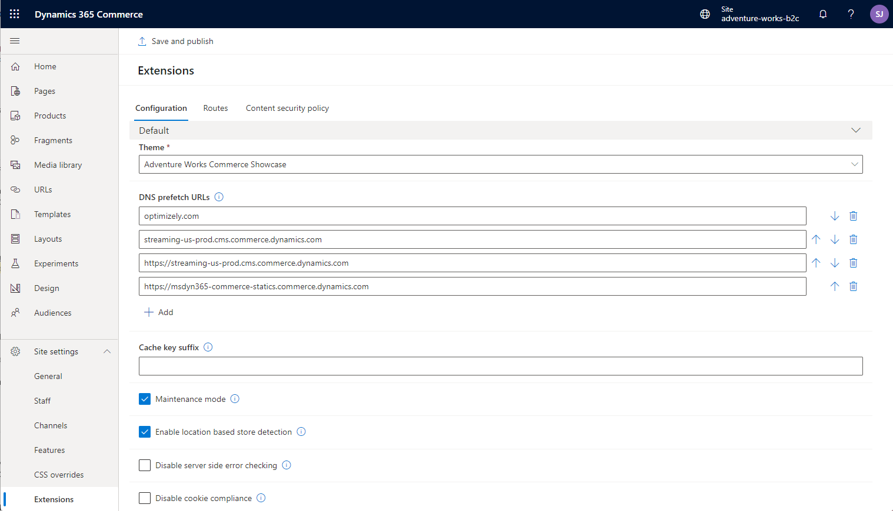
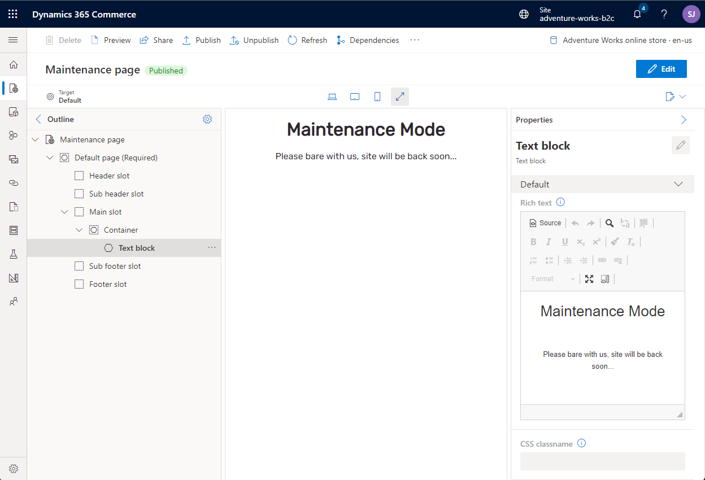
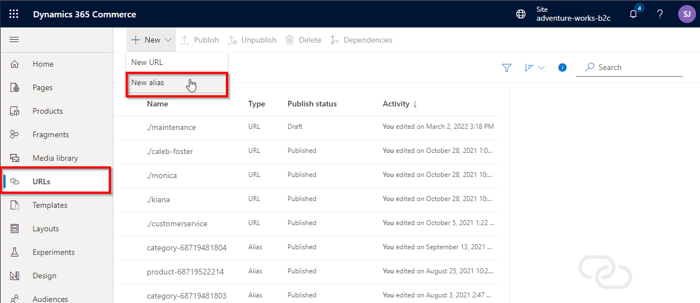
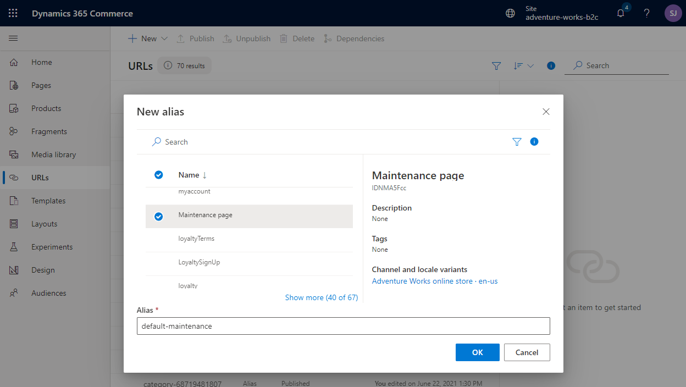

---
# required metadata

title: E-commerce maintenance mode
description: This topic describes how to enable e-commerce maintenance and build a custom maintenance mode page.
author: samjarawan
ms.date: 03/25/2021
ms.topic: article
ms.prod: 
ms.technology: 

# optional metadata

# ms.search.form: 
audience: Developer
# ms.devlang: 
ms.reviewer: v-chgri
# ms.tgt_pltfrm: 
ms.custom: 
ms.assetid: 
ms.search.region: Global
# ms.search.industry: 
ms.author: samjar
ms.search.validFrom: 2019-10-31
ms.dyn365.ops.version: Release 10.0.5

---
# E-commerce maintenance mode

[!include [banner](../includes/banner.md)]

This topic describes how to enable e-commerce maintenance and build a custom maintenance mode page.  Maintenance mode is generally used when the site needs to be taken down temporarily or during site development to block access to the entire site.  When maintenance mode is enabled, a static page is shown or a custom page can be created.

## Enable maintenance mode

Maintenance mode can be enabled from within the site builder tool.  Select the site you wish to use and select the "Extensions" option under the "Site Settings" tab as shown in the below image.  Enable the **Maintenance mode** checkbox then select "Save and publish" at the top to make it active.

When maintenance mode is turned on, browsing to the web site will show the default maintenance mode image as shown below:

## Create a custom maintenance mode page

1. From within the site builder tool, create a new page that will be the used for the maintenance page as shown in the below example:

2. Create a new alias under the URLs tab as shown below:

Select the new page and provide the alias name **default-maintenance** and then ensure the page is published.

