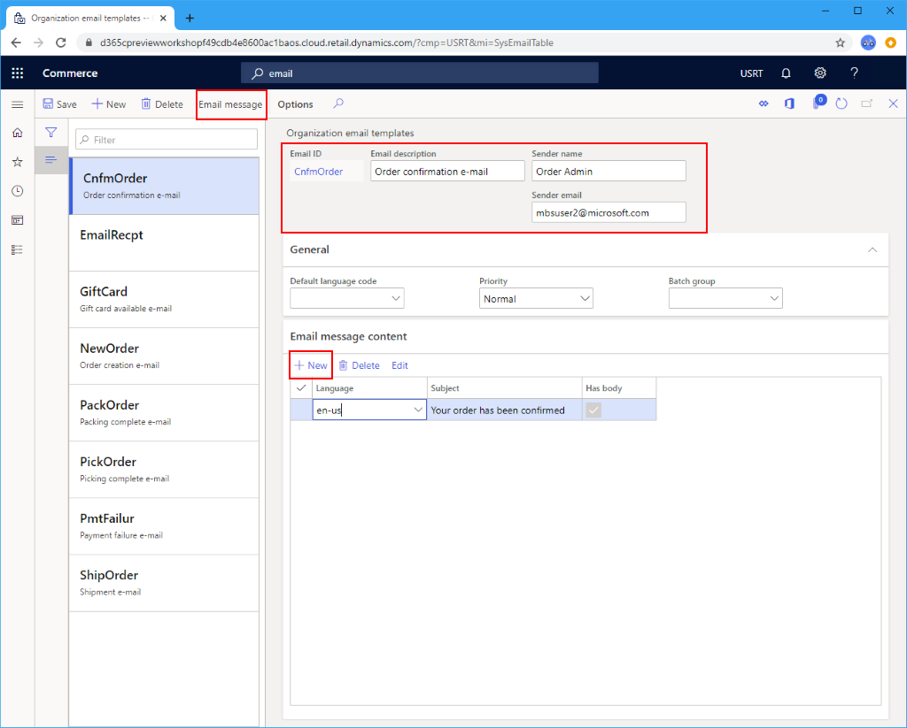
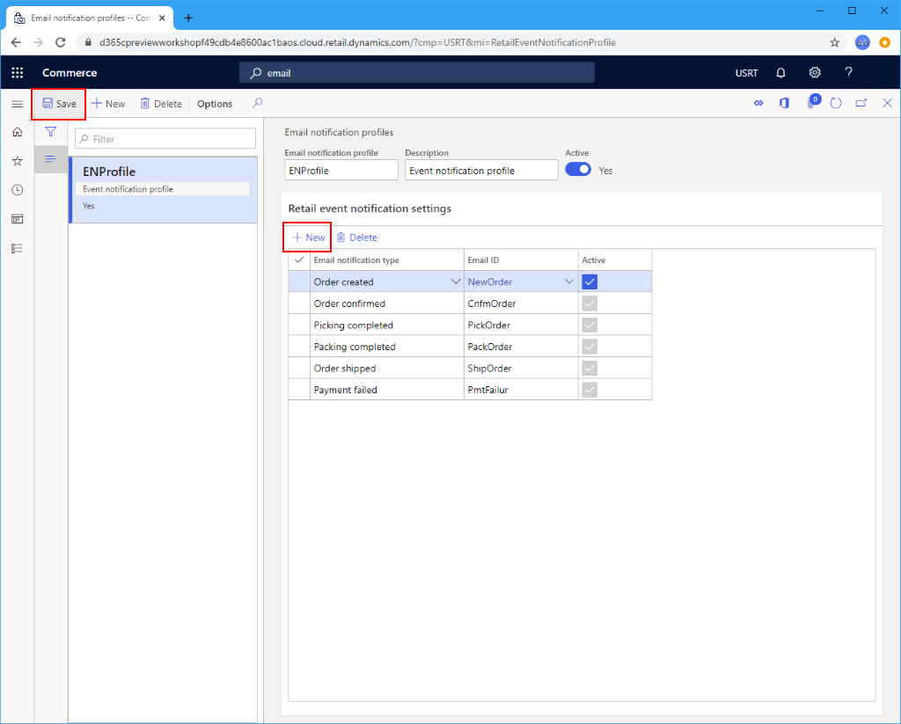

# Set up an email notification profile

[!include [banner](includes/banner.md)]

This article describes how to create an email notification profile in Microsoft Dynamics 365 Commerce.

When you create channels, you can set up an email notification profile. The email notification profile defines the events of a sales transaction (such as order created, order packed, and order invoiced events) for which you will send notifications to your customers. 

For additional email configuration information, see [Configure and send email](../fin-ops-core/fin-ops/organization-administration/configure-email.md?toc=/dynamics365/commerce/toc.json).

## Create an email template

Before an email notification type can be enabled, you must create an organization email template in Commerce headquarters for each notification type you want to support. This template defines the email subject, sender, default language, and email body for each supported language.

To create an email template, follow these steps.

1. In the navigation pane, go to **Modules \> Retail and commerce \> Headquarters setup \> Parameters \> Organization email templates**.
1. On the action pane, select **New**.
1. In the **Email ID** field, enter an ID to help identify this template.
1. In the **Sends name** field, enter the senders name.
1. In the **Email Description**, enter a meaningful description.
1. In the **Sender email**, enter the senders email address.
1. In the **General** section, select a default language for the email template. The default language will be used when no localized template exists for the specified language.
1. Expand the **Email message content** section and select **New** to create the template content. For each content item, select the language and provide the email subject line. If the email will have a body, ensure that the **Has body** box is checked.
1. On the action pane, select **Email message** to provide an email body template.

The following image shows some example email template settings.

For more information about creating email templates, see [Create email templates for transactional events](email-templates-transactions.md). 

## Create an email notification profile

To create an email notification profile in headquarters, follow these steps.

1. In the navigation pane, go to **Modules \> Retail and commerce \> Headquarters setup \> Commerce email notification profile**.
1. On the action pane, select **New**.
1. In the **Email notification profile** field, enter a name to identify the profile.
1. In the **Description** field, enter a relevant description.
1. Set the **Active** switch to **Yes**.

## Add a notification type

To create an email event, follow these steps.

1. In the navigation pane, go to **Modules \> Retail and commerce \> Headquarters setup \> Commerce email notification profile**.
1. Under **Retail email notification settings**, select **New**.
1. Select the appropriate **Email notification type** from the drop-down list.
1. Select the email template you created above from the **Email ID** drop-down list.
1. Select the **Active** checkbox.
1. On the action pane, select **Save**.

The following image shows some example event notification settings.

## Schedule a recurring email notification process job

To send out email notifications, you must have the **Process retail order email notification** job running.

To set up a batch job in headquarters for sending transactional emails, follow these steps.

1. Go to **Retail and Commerce \> Retail and Commerce IT \> Email and notifications \> Send email notification**.
1. In the **Process retail order email notification** dialog box, select **Recurrence**.
1. In the **Define recurrence** dialog box, select **No end date**.
1. Under **Recurrence pattern**, select **Minutes**, and then set the **Count** field to **1**. These settings will ensure that email notifications are processed as quickly as possible.
1. Select **OK** to return to the **Process retail order email notification** dialog box.
1. Select **OK** to complete the job setup.

### Enable optimized email notification processing

The **Optimized order notifications processing** feature enables optimized processing of email order notifications. When this feature is enabled, order notification emails are sent by several tasks running in parallel, resulting in higher job throughput. 

To enable optimized email notification processing, go to **Workspaces \> Feature Management** and enable the **Optimized order notifications processing** feature. 

> [!NOTE]
> If your Commerce headquarters version is older than 10.0.31, you must cancel the currently running **Process retail email order notification** batch job by going to **System Administration \> Inquiries \> Batch jobs** and deleting it. Then follow the instructions in [Schedule a recurring email notification process job](#schedule-a-recurring-email-notification-process-job) to recreate the batch job. 

## Next steps

Before emails can be sent, you must configure your outgoing mail service. For more information, see [Configure and send email](../fin-ops-core/fin-ops/organization-administration/configure-email.md?toc=/dynamics365/commerce/toc.json).

## Additional resources

[Configure and send email](../fin-ops-core/fin-ops/organization-administration/configure-email.md?toc=/dynamics365/commerce/toc.json)

[Channels overview](channels-overview.md)

[Channel setup prerequisites](channels-prerequisites.md)

[Organizations and organizational hierarchies overview](../fin-ops-core/fin-ops/organization-administration/organizations-organizational-hierarchies.md?toc=/dynamics365/commerce/toc.json)

[!INCLUDE[footer-include](../includes/footer-banner.md)]
