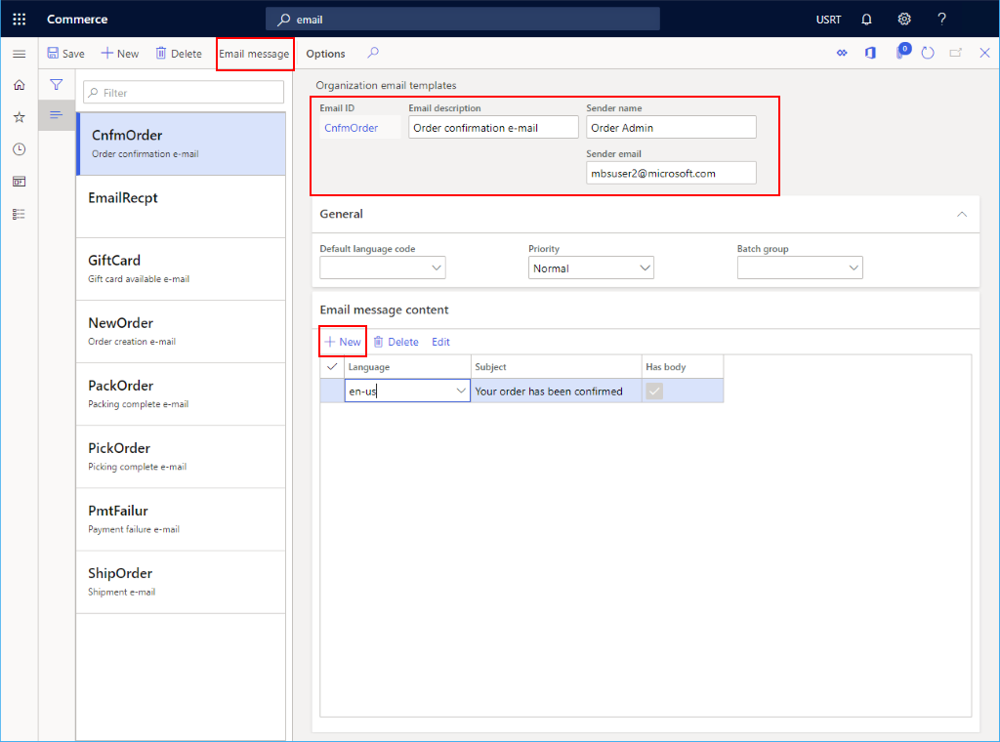

---
# required metadata

title: Set up an email notification profile
description: This topic describes how to create an email notification profile in Microsoft Dynamics 365 Commerce.
author: bicyclingfool
ms.date: 03/01/2021
ms.topic: article
ms.prod: 
ms.technology: 

# optional metadata

# ms.search.form: 
audience: Application User
# ms.devlang: 
ms.reviewer: v-chgri
# ms.tgt_pltfrm: 
ms.custom: 
ms.assetid: 
ms.search.region: Global
# ms.search.industry: 
ms.author: stuharg
ms.search.validFrom: 2020-01-20
ms.dyn365.ops.version: Release 10.0.8

---
# Set up an email notification profile

[!include [banner](includes/banner.md)]

This topic describes how to create an email notification profile in Microsoft Dynamics 365 Commerce.

When you create channels, you can set up an email notification profile. In that way, emails can be sent to customers for various transactional events, such as order creation, order shipping status, and payment failure.

For additional email configuration information, see [Configure and send email](../fin-ops-core/fin-ops/organization-administration/configure-email.md?toc=/dynamics365/commerce/toc.json).

## Create an email notification profile

To create an email notification profile, follow these steps.

1. In the navigation pane, go to **Modules \> Retail and commerce \> Headquarters setup \> Commerce email notification profile**.
1. On the action pane, click **New**.
1. In the **Email notification profile** field, enter a name to identify the profile.
1. In the **Description** field, enter a relevant description.
1. Set the **Active** switch to **Yes**.

### Create an email template

Before an email notification type can be enabled, you must create an organization email template in Commerce headquarters. This template defines the email subject, sender, default language, and email body for each language that you want to support.

To create an email template, follow these steps.

1. In the navigation pane, go to **Modules \> Retail and commerce \> Headquarters setup \> Parameters \> Organization email templates**.
1. On the action pane, select **New**.
1. In the **Email ID** field, enter an ID to help identify this template.
1. In the **Sends name** field, enter the senders name.
1. In the **Email Description**, enter a meaningful description.
1. In the **Sender email**, enter the senders email address.
1. In the **General** section, select a default language for the email template. The default language will be used when no localized template exists for the specified language.
1. Expand the **Email message content** section and select **New** to create the template content. For each content item, select the language and provide the email subject line. If the email will have a body, ensure that the **Has body** box is checked.
1. On the action pane, select **Email message** to provide an email body template.

The following image shows some example email template settings.

### Create an email event

To create an email event, follow these steps.

1. In the navigation pane, go to **Modules \> Retail and commerce \> Headquarters setup \> Commerce email notification profile**.
1. In the list, find and select the desired record. 
1. Select the email template from the **Email ID** drop-down list.
1. Select the appropriate **Email notification type** from the drop-down list.
1. Select the **Active** check box.
1. On the action pane, select **Save**.

The following image shows some example event notification settings.

### Next steps

Before you can send mails, you must configure your outgoing mail service and set up a batch job. For more information, see [Configure and send email](../fin-ops-core/fin-ops/organization-administration/configure-email.md?toc=/dynamics365/commerce/toc.json).

## Additional resources

[Configure and send email](../fin-ops-core/fin-ops/organization-administration/configure-email.md?toc=/dynamics365/commerce/toc.json)

[Channels overview](channels-overview.md)

[Channel setup prerequisites](channels-prerequisites.md)

[Organizations and organizational hierarchies overview](../fin-ops-core/fin-ops/organization-administration/organizations-organizational-hierarchies.md?toc=/dynamics365/commerce/toc.json)

[!INCLUDE[footer-include](../includes/footer-banner.md)]
