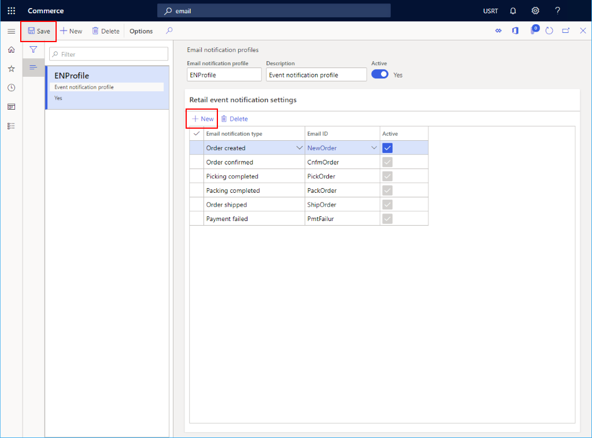

---
# required metadata

title: Email notification profile
description: This topic presents an overview of Microsoft Dynamics 365 Commerce email notification profile.
author: samjarawan
manager: annbe
ms.date: 10/01/2019
ms.topic: article
ms.prod: 
ms.service: dynamics-365-commerce
ms.technology: 

# optional metadata

# ms.search.form: 
audience: Developer
# ms.devlang: 
ms.reviewer: v-chgri
ms.search.scope: Retail, Core, Operations
# ms.tgt_pltfrm: 
ms.custom: 
ms.assetid: 
ms.search.region: Global
# ms.search.industry: 
ms.author: samjar
ms.search.validFrom: 2019-10-31
ms.dyn365.ops.version: Release 10.0.8

---
# Email notification profile

[!include [banner](../includes/preview-banner.md)]
[!include [banner](../includes/banner.md)]

This topic presents an overview of Microsoft Dynamics 365 Commerce email notification profile.

## Overview
Before creating channels you'll want to ensure you have set up an email notification profile to ensure email notifications can be sent out for various activities such as order creation, order shipped and payment failure.

## Creating an email notification profile
* Go to **Navigation pane** > **Modules** > **Retail** > **Headquearters setup** > **Retail Email notification profile**.
* On the **Action pane**, click **New**.
* In the **Email notification profile** field, provide a name to identify the profile.
* In the **Description** field, provide a relevant description.
* Set the **Active** switch to Yes.

## Create email events
Before an email notification can be created it will require an organization email template which contains the senders email information and the email template.  Follow the below steps to create one.

### Create email template
* Go to **Navigation pane** > **Modules** > **Retail** > **Headquearters setup** > **Parameters > **Organization email templates**.
* On the **Action pane**, click **New**.
* In the **Email ID** field, provide an ID to help identify this template.
* In the **Sends name** field, provide the senders name.
* In the **Email Description**, provide a meaningful description.
* In the **Sender email**, provide the senders email address.
* Fill out any optional information in the **General** section as needed such as the email priority.
* Expand the **Email message content** section and click **New** to create the content.  For each content select the **Language** and provid eht email **Subject** line.  If the email will have a body ensure **Has body** is checked.
* On the **Action pane**, click "Email message** to provide an email body template.

### Create email event
* Go to **Navigation pane** > **Modules** > **Retail** > **Headquearters setup** > **Retail Email notification profile**.
* In the list, find and select the desired record. 
* Select the email template created in the previous step from the **Email ID** drop down
* Select the appropriate **Email notification type** from the drop down.
* Select the **Active** check box.
* Click **Save**.

