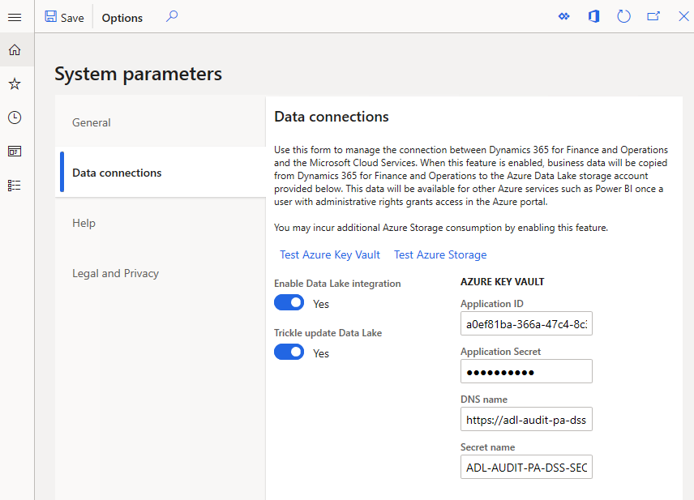
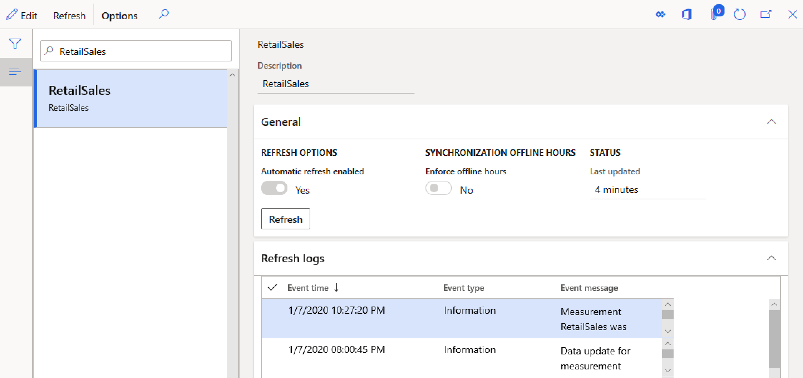

---
# required metadata

title: Enable ADLS in a Dynamics 365 Commerce environment
description: This topic explains how to enable and test Azure Data Lake Storage (ADLS) for a Dynamics 365 Commerce environment, which is a prerequisite for enabling product recommendations.
author: bebeale
manager: AnnBe
ms.date: 03/12/2020
ms.topic: article
ms.prod: 
ms.service: dynamics-365-commerce
ms.technology: 

# optional metadata

ms.search.form: 
# ROBOTS: 
audience: Application User
# ms.devlang: 
ms.reviewer: v-chgri
ms.search.scope: 
# ms.tgt_pltfrm: 
ms.custom: 
ms.assetid: 
ms.search.region: global
ms.search.industry: Retail, eCommerce
ms.author: bebeale
ms.search.validFrom: 2019-10-31
ms.dyn365.ops.version: 10.0.5

---

# Enable ADLS in a Dynamics 365 Commerce environment

[!include [banner](includes/banner.md)]

This topic explains how to enable and test Azure Data Lake Storage (ADLS) for a Dynamics 365 Commerce environment, which is a prerequisite for enabling product recommendations.

## Overview

In the Dynamics 365 Commerce solution, all product and transaction information is tracked in the environment's Entity store. To make this data accessible to other Dynamics 365 services, such as data analytics, business intelligence, and personalized recommendations, it is necessary to connect the environment to a customer-owned Azure Data Lake Storage Gen 2 (ADLS) solution.

As ADLS is configured in an environment, all necessary data is mirrored from the Entity store while still being protected and under customer's control.

If product recommendations or personalized recommendations are also enabled in the environment, then the product recommendations stack will be granted access to the dedicated folder in ADLS to retrieve the customer’s data and compute recommendations based on it.

## Prerequisites

Customers need to have ADLS configured in an Azure subscription that they own. This topic does not cover the purchase of an Azure subscription or the setup of an ADLS-enabled storage account.

For more information about ADLS, see [ADLS official documentation](https://azure.microsoft.com/pricing/details/storage/data-lake).
  
## Configuration steps

This section covers the configuration steps necessary for enabling ADLS in an environment.

### Enable ADLS in the environment

1. Log in to the environment's back office portal.
1. Search for **System Parameters** and navigate to the **Data connections** tab. 
1. Set **Enable Data Lake integration** to **Yes**.
1. Set **Trickle update Data Lake** to **Yes**.
1. Next, enter the following required information:
    1. **Application ID** // **Application Secret** // **DNS Name** - Needed to connect to KeyVault where the ADLS secret is stored.
    1. **Secret name** - The secret name stored in KeyVault and used to authenticate with ADLS.
1. Save your changes in the top left corner of the page.

The following image shows an example ADLS configuration.

### Test the ADLS connection

1. Test the connection to KeyVault using the **Test Azure Key Vault** link.
1. Test the connection to ADLS using the **Test Azure Storage** link.

> [!NOTE]
> If the tests fail, double-check that all of the KeyVault information added above is correct, then try again.

Once the connection tests are successful, you must enable automatic refresh for Entity store.

To enable automatic refresh for Entity store, follow these steps.

1. Search for **Entity Store**.
1. In the list on the left, navigate to the **RetailSales** entry, and select **Edit**.
1. Ensure that **Automatic Refresh Enabled** is set to **Yes**, select **Refresh**, and then select **Save**.

The following image shows an example of Entity store with automatic refresh enabled.

ADLS is now configured for the environment. 

If not completed already, follow the steps for [enabling product recommendations and personalization](enable-product-recommendations.md) for the environment.

## Additional resources

[Product recommendations overview](product-recommendations.md)

[Enable product recommendations](enable-product-recommendations.md)

[Enable personalized recommendations](personalized-recommendations.md)

[Opt out of personalized recommendations](personalization-gdpr.md)

[Add recommendation lists to an e-Commerce site](add-reco-list-to-page.md)

[Add product recommendations on POS](product.md)

[Add recommendations to the transaction screen](add-recommendations-control-pos-screen.md)

[Adjust AI-ML recommendations results](modify-product-recommendation-results.md)

[Manually create curated recommendations](create-editorial-recommendation-lists.md)

[Create recommendations with demo data](product-recommendations-demo-data.md)

[Product recommendations FAQ](faq-recommendations.md)

