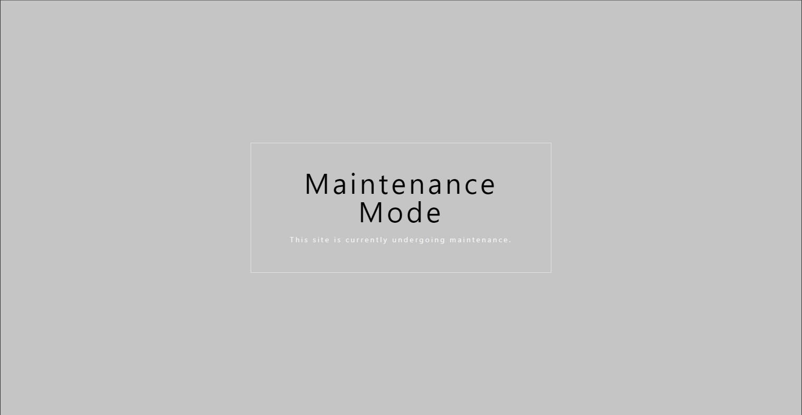
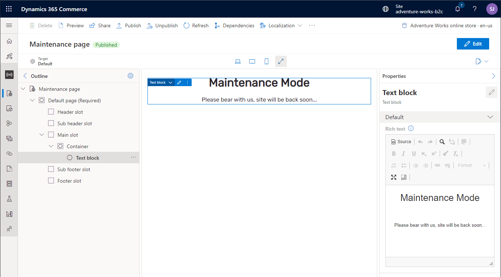

---
# required metadata

title: Enable and activate e-commerce maintenance mode
description: This topic describes how to enable and activate e-commerce maintenance mode and build an optional custom maintenance mode page in Microsoft Dynamics 365 Commerce.
author: samjarawan
ms.date: 03/08/2022
ms.topic: article
ms.prod: 
ms.technology: 

# optional metadata

# ms.search.form: 
audience: Developer
# ms.devlang: 
ms.reviewer: v-chgri
# ms.tgt_pltfrm: 
ms.custom: 
ms.assetid: 
ms.search.region: Global
# ms.search.industry: 
ms.author: samjar
ms.search.validFrom: 2019-10-31
ms.dyn365.ops.version: Release 10.0.5

---
# Enable and activate e-commerce maintenance mode

[!include [banner](../includes/banner.md)]

This topic describes how to enable and activate e-commerce maintenance mode and build an optional custom maintenance mode page in Microsoft Dynamics 365 Commerce.

Maintenance mode is generally used to block access to an entire e-commerce site when the site must temporarily be taken down for site development or other reasons. When maintenance mode is enabled, a default static maintenance mode page is shown. A custom maintenance mode page can also be created.

## Enable and activate maintenance mode

To enable and activate maintenance mode in Commerce site builder, follow these steps.

1. In site builder, go to your site. 
1. In the left navigation, under **Site Settings**, select **Extensions**.
1. Select the **Maintenance mode** checkbox to enable maintenance mode.
1. On the Action Pane, select **Save and publish** to activate maintenance mode.

After maintenance mode is enabled and activated, the default maintenance mode page will be shown to users who browse to the e-commerce site, as shown in the following illustration.

## Create a custom maintenance mode page

To create a custom maintenance mode page in site builder, follow these steps.

1. In site builder, create a new custom maintenance mode page. For instructions on creating site pages, see [Add a new site page](add-new-page.md). The following illustration shows an example.

    

1. In the left navigation, select **URLs**, and then, on the Action Pane, select **New \> New alias** to create a new alias.
1. In the **New alias** dialog box, select the new maintenance mode page, and then, in the **Alias** field, enter **default-maintenance** as the alias name.
1. Publish the custom maintenance mode page.

After these steps have been completed and maintenance mode has been enabled, the custom maintenance mode page will be shown to site users, as shown in the following example illustration.

