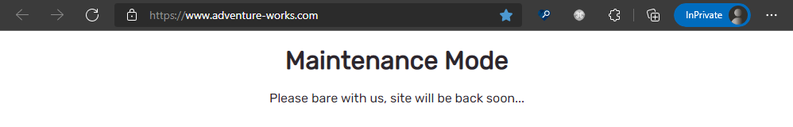

---
# required metadata

title: Enable and activate e-commerce maintenance mode
description: This topic describes how to enable e-commerce maintenance and build a custom maintenance mode page in Microsoft Dynamics 365 Commerce.
author: samjarawan
ms.date: 03/03/2022
ms.topic: article
ms.prod: 
ms.technology: 

# optional metadata

# ms.search.form: 
audience: Developer
# ms.devlang: 
ms.reviewer: v-chgri
# ms.tgt_pltfrm: 
ms.custom: 
ms.assetid: 
ms.search.region: Global
# ms.search.industry: 
ms.author: samjar
ms.search.validFrom: 2019-10-31
ms.dyn365.ops.version: Release 10.0.5

---
# Enable and activate e-commerce maintenance mode

[!include [banner](../includes/banner.md)]

This topic describes how to enable e-commerce maintenance and build a custom maintenance mode page if needed in Microsoft Dynamics 365 Commerce.

Maintenance mode is generally used to block access to an entire e-commerce site when that site needs to be taken down temporarily for site development or other reasons. When maintenance mode is enabled, a default static maintenance site page is shown. A custom maintenance site page can also be created.

## Enable and activate maintenance mode

Maintenance mode can be enabled from within Commerce site builder. 

To enable and activate maintenance mode in site builder, follow these steps.

1. Navigate to your site in site builder. 
1. Under **Site Settings**, select **Extensions**.  
    
1. Select the **Maintenance mode** checkbox. 
1. Select **Save and publish** on the action pane to activate maintenance mode.

After maintenance mode is enabled and activated, browsing to the e-commerce site will show the default maintenance mode image, as shown in the following illustration.

## Create a custom maintenance mode page

To create a custom maintenance mode page in site builder, follow these steps.

1. From within site builder, create a new custom maintenance mode page as shown in the following example illustration.

    

1. Select **URLs**, and then select **New \> New alias** to create a new alias.

    

1. In the **New alias** dialog box, select the new page, and then under **Alias** enter the alias name **default-maintenance**.

    

1. Publish the custom maintenance mode page.

Once these steps have been completed, if maintenance mode is turned on the new page will be shown to the user as shown in the following example illustration.

