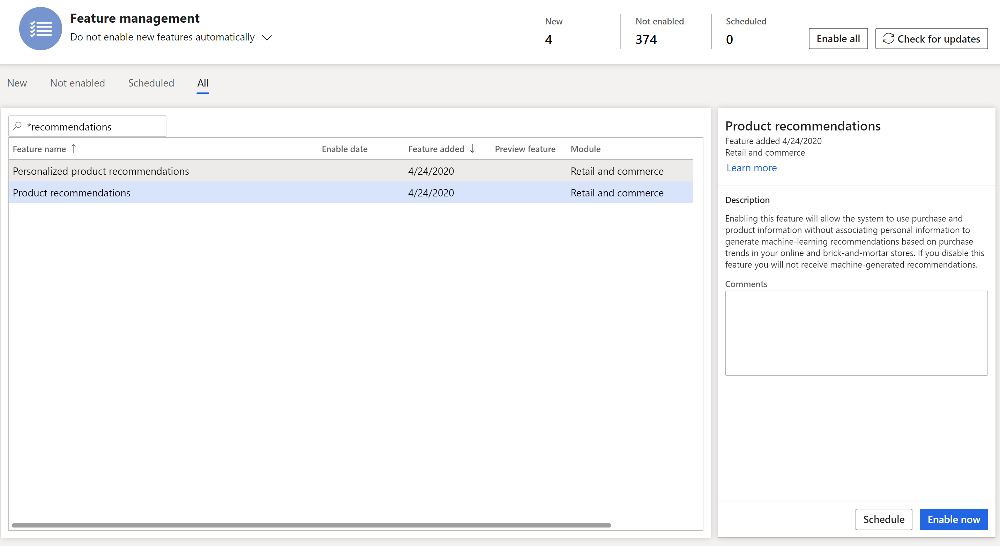

# Enable product recommendations

[!include [banner](includes/banner.md)]

This article explains how to make product recommendations that are based on artificial intelligence-machine learning (AI-ML) available for Microsoft Dynamics 365 Commerce customers. For more information about product recommendation lists, see [Product recommendations overview](product-recommendations.md).

> [!IMPORTANT]
> The Dynamics 365 Commerce Recommendations license is no longer available for new purchases. Renewals for existing customers will soon be discontinued.

## Recommendations precheck

1. Ensure that you have a valid Dynamics 365 Commerce Recommendations license.
1. Ensure that Entity store is connected to a customer-owned Azure Data Lake Storage Gen2 account. Learn more in [Ensure that Azure Data Lake Storage is purchased and successfully verified in the environment](enable-ADLS-environment.md).
1. Confirm that Microsoft Entra Identity configuration contains an entry for Recommendations.
1. Ensure that the Entity store daily refresh to Azure Data Lake Storage Gen2 is scheduled. Learn more in [Ensure that the Entity store refresh is automated](../fin-ops-core/dev-itpro/data-entities/entity-store-data-lake.md).
1. Enable RetailSale measurements for Entity store. Learn more in [Work with measures](/dynamics365/ai/customer-insights/pm-measures).
1. Ensure that your environment has the serving and cooking regions in the currently supported regions configured as follows:

    - **Supported cooking regions:** EU/US/CA/AU.
    - **Supported serving regions:** US/CA/AU. If the serving region doesn't match one of the existing supported regions, the recommendations service selects the closest supported serving region.

After the preceding steps are completed, you are ready to enable recommendations.

> [!NOTE]
> There's a known issue where recommendations don't appear after the following steps are completed. This issue is caused by data flow issues in the environment. If your environment doesn't show recommendation results, configure the alternative data for the recommendations service by following the steps in [Set up an alternate dataflow for recommendations](dev-itpro/set-up-alternate-data-flow.md). You must have Azure administrator permissions to complete these steps. If you need assistance, contact your FastTrack representative.

## Microsoft Entra Identity configuration

This step is required only for customers who run an infrastructure as a service (IaaS) configuration. Microsoft Entra identity configuration is automatic for customers who run on Azure Service Fabric, but we recommend that you verify that the setting is configured as expected.

### Setup

1. In Commerce headquarters, search for the **Microsoft Entra applications** page.
1. Check that an entry exists for **RecommendationSystemApplication-1**. If an entry doesn't exist, create one using the following information:

    - **Client Id**: d37b07e8-dd1c-4514-835d-8b918e6f9727
    - **Name**: RecommendationSystemApplication-1
    - **User Id**: RetailServiceAccount

1. Save and close the page. 

## Turn on recommendations

To turn on product recommendations, follow these steps:

1. In Commerce headquarters, search for **Feature Management**.
1. Select **All** to see a list of available features. 
1. In the search box, enter **Recommendations**.
1. Select the **Product recommendations** feature.
1. In the **Product recommendations** properties pane, select **Enable now**.

> [!NOTE]
> - The procedure starts the process of generating product recommendation lists. It may take several hours before the lists are available and can be viewed at the point of sale (POS) or in Dynamics 365 Commerce.
> - This configuration doesn't enable all recommendations features. Advanced features such as personalized recommendations, "shop similar looks," and "shop similar description" are controlled by dedicated feature management entries. For information on enabling these features in Commerce headquarters, see [Enable personalized recommendations](personalized-recommendations.md), [Enable "shop similar looks" recommendations](shop-similar-looks.md), and [Enable "shop similar description" recommendations](shop-similar-description.md).

## Configure recommendation list parameters

By default, the AI-ML-based product recommendation list provides suggested values. You can change the default suggested values to suit the flow of your business. Learn more in [Manage AI-ML-based product recommendation results](modify-product-recommendation-results.md).

## Include recommendations in e-commerce experiences

After you enable recommendations in Commerce headquarters, the Commerce modules used to display recommendations results for e-commerce experiences are ready to be configured. Learn more in [Product collection modules](product-collection-module-overview.md).

## Show recommendations on POS devices

After you enable recommendations in Commerce headquarters, you must add the recommendations panel to the control POS screen using the layout tool. Learn more in [Add a recommendations control to the transaction screen on POS devices](add-recommendations-control-pos-screen.md). 

## Enable personalized recommendations

In Dynamics 365 Commerce, retailers can make personalized product recommendations (also known as personalization) available. In this way, personalized recommendations can be incorporated into the online customer experience and at the point of sale. When the personalization functionality is turned on, the system can associate a user's purchase and product information to generate individualized product recommendations.

Learn more in [Enable personalized recommendations](personalized-recommendations.md).

## Additional resources

[Product recommendations overview](product-recommendations.md)

[Enable Azure Data Lake Storage in a Dynamics 365 Commerce environment](enable-adls-environment.md)

[Set up alternate data flow for recommendations](dev-itpro/set-up-alternate-data-flow.md)

[Enable personalized recommendations](personalized-recommendations.md)

[Enable "shop similar looks" recommendations](shop-similar-looks.md)

[Opt out of personalized recommendations](opt-out-personalization.md)

[Add product recommendations on POS](product.md)

[Add recommendations to the transaction screen](add-recommendations-control-pos-screen.md)

[Adjust AI-ML recommendations results](modify-product-recommendation-results.md)

[Manually create curated recommendations](create-editorial-recommendation-lists.md)

[Create recommendations with demo data](product-recommendations-demo-data.md)

[Product recommendations FAQ](faq-recommendations.md)

[!INCLUDE[footer-include](../includes/footer-banner.md)]
