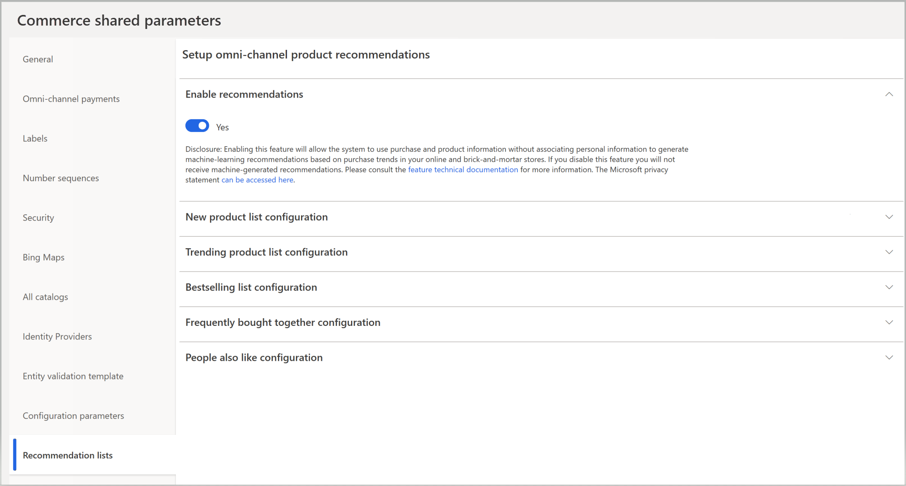

---
# required metadata

title: Enable product recommendations
description: This topic explains how to make product recommendations that are based on artificial intelligence-machine learning (AI-ML) available for Microsoft Dynamics 365 Commerce customers. 
author: bebeale
manager: AnnBe
ms.date: 03/19/2020
ms.topic: article
ms.prod: 
ms.service: dynamics-365-commerce
ms.technology: 

# optional metadata

ms.search.form: 
# ROBOTS: 
audience: Application User
# ms.devlang: 
ms.reviewer: josaw
ms.search.scope: 
# ms.tgt_pltfrm: 
ms.custom: 
ms.assetid: 
ms.search.region: global
ms.search.industry: Retail, eCommerce
ms.author: bebeale
ms.search.validFrom: 2019-10-31
ms.dyn365.ops.version: 10.0.5

---

# Enable product recommendations

[!include [banner](includes/banner.md)]

This topic explains how to make product recommendations that are based on artificial intelligence-machine learning (AI-ML) available for Microsoft Dynamics 365 Commerce customers. For more information about product recommendation lists, see [Product recommendations overview](product-recommendations.md).

## Recommendations pre-check

Before enabling, please note that product recommendations are only supported for Commerce customers who have migrated their storage to using Azure Data Lake Storage (ADLS). 

For steps on enabling ADLS, see [How to enable ADLS in a Dynamics 365 environment](enable-ADLS-environment.md).

Additionally, ensure that RetailSale measurements have been enabled. To learn more about this set up process, go [here.](https://docs.microsoft.com/dynamics365/ai/customer-insights/pm-measures)

## Turn on recommendations

To turn on product recommendations, follow these steps.

1. Go to **Retail and Commerce &gt; Product recommendations &gt; Recommendation parameters**.
1. In the list of shared parameters, select **Recommendation Lists**.
1. Set the **Enable recommendations** option to **Yes**.

> [!NOTE]
> This procedure starts the process of generating product recommendation lists. Up to several hours might be required before the lists are available and can be seen at the point of sale (POS) or in Dynamics 365 Commerce.

## Configure recommendation list parameters

By default, the AI-ML-based product recommendation list provides suggested values. You can change the default suggested values to suit the flow of your business. To learn more about how to change the default parameters, go to [Manage AI-ML-based product recommendation results](modify-product-recommendation-results.md).

## Show recommendations on POS devices

After enabling recommendations in Commerce back office, the recommendations panel must be added to the control POS screen using the layout tool. To learn about this process, see [Add a recommendations control to the transaction screen on POS devices](add-recommendations-control-pos-screen.md). 

## Enable personalized recommendations

To learn more about how to receive personalized recommendations, see [Enable personalized recommendations](personalized-recommendations.md).

## Additional resources

[Product recommendations overview](product-recommendations.md)

[Enable ADLS in a Dynamics 365 Commerce environment](enable-adls-environment.md)

[Enable personalized recommendations](personalized-recommendations.md)

[Opt out of personalized recommendations](personalization-gdpr.md)

[Add product recommendations on POS](product.md)

[Add recommendations to the transaction screen](add-recommendations-control-pos-screen.md)

[Adjust AI-ML recommendations results](modify-product-recommendation-results.md)

[Manually create curated recommendations](create-editorial-recommendation-lists.md)

[Create recommendations with demo data](product-recommendations-demo-data.md)

[Product recommendations FAQ](faq-recommendations.md)

