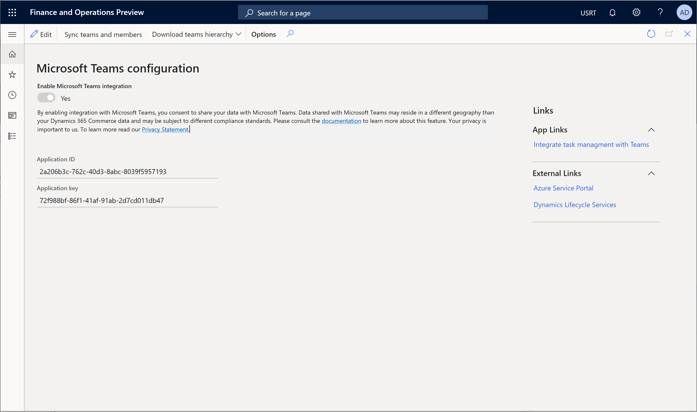

# Enable Dynamics 365 Commerce and Microsoft Teams integration

[!include [banner](includes/banner.md)]

This article describes how to enable Microsoft Dynamics 365 Commerce and Microsoft Teams integration.

To provision Teams with information from Dynamics 365 Commerce and synchronize the task management features between Teams and the point of sale (POS) application, you must enable the integration features in Commerce headquarters.

> [!NOTE]
> When you enable Teams integration, you consent to share your data with Teams. Data that is shared with Teams might reside in a different country/region than your Commerce data, and it might be subject to different compliance standards. For more information, see the [Microsoft Trust Center](https://www.microsoft.com/trust-center). For information about Microsoft privacy policies, see the [Microsoft Privacy Statement](https://aka.ms/privacy).

## Enable Teams integration

Before you can enable Microsoft Teams integration with Commerce, you must register the Teams application with your tenant in the Azure portal.

To register the Teams application with your tenant in the Azure portal, follow these steps.

1. Follow the steps in [Quickstart: Register an app in the Microsoft identity platform](/azure/active-directory/develop/quickstart-register-app) to register the Teams application with your tenant in the Azure portal.
1. On the **App Registration** tab, select the app that you created in the previous step. Then, on the **Authentication** tab, select **Add a platform**.
1. In the dialog box, select **Web**. Then, in the **Redirect URLs** field, enter a URL in the format **\<HQUrl\>/oauth**. Replace **\<HQUrl\>** with your Commerce headquarters URL (for example, `https://hxennugbjtweufmdeo385f47fadb6aa9a0aos.cloudax.int.dynamics.com/oauth`).
1. On the **Overview** page of the registered app, copy the **Application (client) ID** value. You will have to provide this value to enable Teams integration in Commerce headquarters in the next section.
1. Follow the instructions in [Add a client secret](/azure/active-directory/develop/quickstart-register-app#add-a-client-secret) to add a client secret. Then copy the **Secret value** value for the client. You will have to provide this value to enable Teams integration in Commerce headquarters in the next section.
1. Select **API permissions**, and then select **Add a permission**.
1. In the **Request API permissions** dialog box, select **Microsoft Graph**, select **Delegated permissions**, expand **Group**, select **Group.ReadWrite.All**, and then select **Add permissions**.
1. In the **Request API permissions** dialog box, select **Add a permission**, select **Microsoft Graph**, select **Application permissions**, expand **Group**, select **Group.ReadWrite.All**, and then select **Add permissions**.
1. In the **Request API permissions** dialog box, select **Add a permission**. On the **APIs my organization uses** tab, search for **Microsoft Teams Retail Service**, and select it.
1. Select **Delegated permissions**, expand **TaskPublishing**, select **TaskPublising.ReadWrite.All**, and then select **Add permissions**. For more information, see [Configure a client application to access a web API](/azure/active-directory/develop/quickstart-configure-app-access-web-apis).

To enable Teams integration in Commerce headquarters, follow these steps.

1. Go to **Retail and Commerce \> Channel setup \> Microsoft Teams integration configuration**.
1. On the Action Pane, select **Edit**.
1. Set the **Enable Microsoft Teams integration** option to **Yes**.
1. In the **Application ID** field, enter the **Application (client) ID** value that you obtained while you registered the Teams application in the Azure portal.
1. In the **Application key** field, enter the **Secret value** value that you obtained while you added a client secret in the Azure portal.
1. On the Action Pane, select **Save**.

The following illustration shows an example of the configuration of Teams integration in Commerce headquarters.

## Disable Teams integration

To disable Microsoft Teams integration in Commerce headquarters, follow these steps.

1. Go to **Retail and Commerce \> Channel setup \> Microsoft Teams Integration Configuration**.
1. On the Action Pane, select **Edit**.
3. Set the **Enable Microsoft Teams integration** option to **No**.
4. Clear the values from the **Application ID** and **Application Key** fields.
1. On the Action Pane, select **Save**.

> [!NOTE]
> After you disable Teams integration with Commerce, POS terminals will no longer show tasks that are published from the Teams application.

## Additional resources

[Dynamics 365 Commerce and Microsoft Teams integration overview](commerce-teams-integration.md)

[Provision Microsoft Teams from Dynamics 365 Commerce](provision-teams-from-commerce.md)

[Synchronize task management between Microsoft Teams and Dynamics 365 Commerce POS](synchronize-tasks-teams-pos.md)

[Manage user roles in Microsoft Teams](manage-user-roles-teams.md)

[Map stores and teams if there are pre-existing teams in Microsoft Teams](map-stores-existing-teams.md)

[Dynamics 365 Commerce and Microsoft Teams integration FAQ](teams-integration-faq.md)
