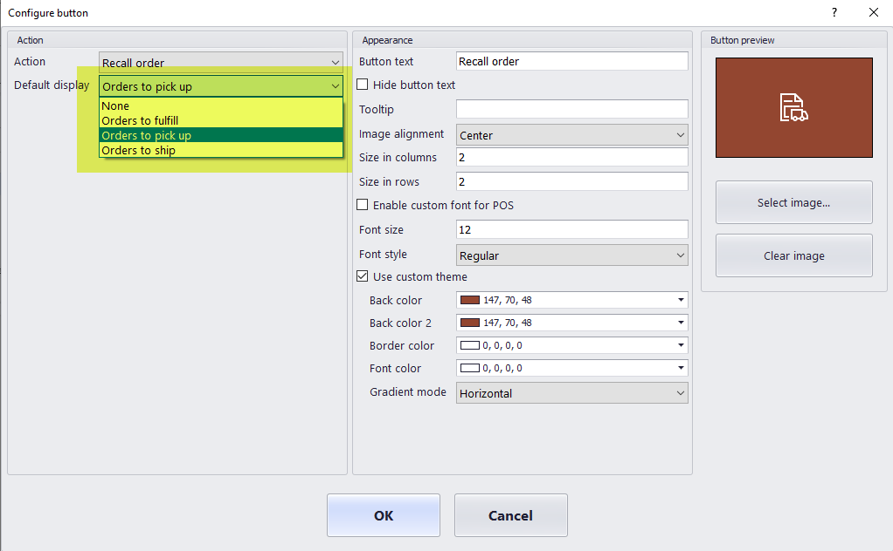
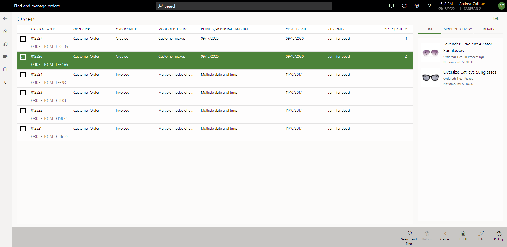

# Recall order operation in POS

[!include [banner](includes/banner.md)]

This article describes feature capabilities available for improved order recall pages in POS in Microsoft Dynamics 365 Commerce.

The **Recall order** operation in the Commerce point of sale (POS) provides updated order search and filtering features and order-specific information. This feature is available in Commerce versions 10.0.15 and later.

To enable this functionality, turn the **Improved Recall order operation in POS** feature on in **Feature management** workspace in Commerce headquarters. After you enable the feature, consider updating your [screen layouts](pos-screen-layouts.md) in POS to take advantage of some of the changed  capabilities.

The configuration of the **Recall order** operation button allows organizations to deploy the operation with a predefined display.

The display options are as follows.
- **None** – This option deploys the operation with no specific display. When a user opens the operation with this configuration, they are prompted to search and find orders or choose from a predefined order filter.
- **Orders to fulfill** – When a user launches the operation, a query runs automatically to search and display a list of orders that are to be fulfilled by the user's current store. These orders are configured for in-store pickup or store shipment and the lines of these orders haven't yet been picked or packed.
- **Orders to pick up** – When a user launches the operation, a query runs automatically to search and display a list of orders that are configured for in-store pickup at the user's current store.
- **Orders to ship** - When a user launches the operation, a query runs automatically to search and display a list of orders that are configured for shipment from the user's current store.

When launching the **Recall order** operation from POS, if the display is configured to **None**, a user is able to search and retrieve orders in one of the following ways:
- Scan order barcodes, which searches order number, channel reference, and receipt ID fields for matches.
- Select **Search orders** or **Search and filter** icon on the AppBar to use the filtering mechanism to locate orders that meet the filter criteria.
- Choose from a predefined filter from the **Show Orders** drop-down menu (orders to fulfill, orders to pick up, or orders to ship).

After search criteria are applied, the application will display a list of matching sales orders. It's important to note that when using the search/filter options, the orders retrieved don't have to be orders linked to the user's current store. This search process retrieves and displays any customer order that matches the search criteria, even if the order was created or set to be fulfilled by another store/channel or warehouse location.

A user can select an order on the list to view additional details. The information panel on the right side of the screen displays specifics on the selected order, including order line details, delivery details, and fulfillment details.

From the AppBar, a user can select an operation. Depending on the status of the order, certain operations may not be enabled.

- **Return** – Initiates the process of creating a return for any of the invoiced products on the selected customer order.

- **Cancel** – Issue a full cancellation of the selected sales order. This option won't be available for orders initiated through a call center channel and can't be used to partially cancel an order.

- **Fulfill** – Transfers the user to the order fulfillment page, which is prefiltered for the selected order. Only order lines that are open for fulfillment by the user's store for the selected order are displayed.

- **Edit** – Allows users to make changes to the selected customer order. Orders are only editable in [certain scenarios](customer-orders-overview.md#edit-an-existing-customer-order).

- **Pick up** – This option is available if the order has one or more lines designated for pickup at the user's current store. This operation launches the pickup flow, which allows the user to choose the products to be picked up and creates the pickup sales transaction.

## Add notifications to the recall order operation

In version 10.0.18 and later, you can configure POS notifications and live tile alerts for the **Order Recall** operation if desired. For more information, see [Show order notifications in the point of sale (POS)](notifications-pos.md).  

> [!NOTE]
> To enable the order lookup feature, ensure that the **Quotations** key is enabled under **License configuration** > **Configuration keys**.
>
> 

[!INCLUDE[footer-include](../includes/footer-banner.md)]
