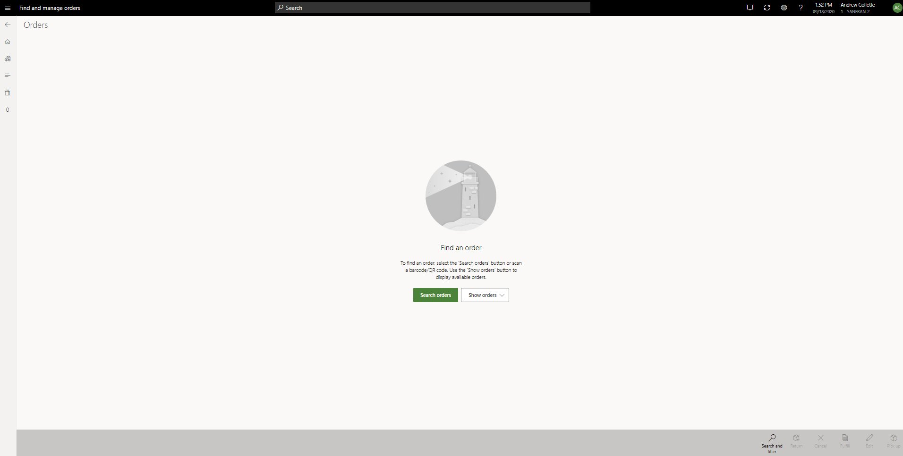

---
# required metadata

title: Using the re-designed Recall Order operation
description: This topic explains new feature capabilities available for improved order recall forms in POS
author: hhainesms
manager: annbe
ms.date: 09/18/2020
ms.topic: article
ms.prod:
ms.service: dynamics-365-commerce
ms.technology: 

# optional metadata

# ms.search.form:
audience: Application User
# ms.devlang: 
ms.reviewer: josaw
ms.search.scope: Core, Operations, Retail
# ms.tgt_pltfrm: 
# ms.custom:
ms.search.region: global
# ms.search.industry:
ms.author: hhainesms
ms.search.validFrom:
ms.dyn365.ops.version: 10.0.15
---

# Using the re-designed Recall order operation

[!include [banner](includes/banner.md)]

In version 10.0.15, the **Recall order** operation in Dynamics 365 Commerce Point of Sale (POS) has been redesigned with improved order search and filtering features and added order-specific information.

These feature improvements are enabled by turning on the **Improved Recall order operation in POS** feature in **Feature management** through **Commerce Headquarters(HQ)**.

After deploying this feature, it is advised that you consider updating your [screen layouts](https://docs.microsoft.com/en-us/dynamics365/commerce/pos-screen-layouts) in Point of Sale (POS) to take advantage of some of the new capabilities around the **Recall order** POS operation.

The **Recall order** operation button configuration has been improved to allow organizations to deploy this operation with a pre-defined display.

The display options:
- **None** – deploys the operation with no specific display. When users open the operation with this configuration, they will be prompted to search and find orders or choose from a pre-defined order filter.
- **Orders to fulfill** – when the user launches the operation configured with this display, a query will run automatically to search and display a list of orders that are to be fulfilled by the store – these are orders that are configured for in-store pickup or store shipment and the lines of these orders have not yet been picked or packed.
- **Orders to pick up** – when the user launches the operation configured with this display, a query will run automatically to search and display a list of orders that are configured for in-store pickup at the users current store.
- **Orders to ship** - when the user launches the operation configured with this display, a query will run automatically to search and display a list of orders that are configured for shipment from the users current store.

When launching the recall order operation from POS, if the display is configured to **None**, users will be able to search and retrieve orders in one of 3 ways

1. Scan order barcodes (this will search order number, channel reference and receipt ID fields for matches)
2. Click Search orders or Search and filter icon on the appbar to leverage the filtering mechanism to locate orders that meet the filter criteria
3. Choose from a pre-defined filter from the Show Orders drop down (orders to fulfill, orders to pick up, orders to ship)

Once search criteria are applied, the application will display a list of matching sales orders.

Users may select an order on the list to view additional details. The information panel on the right side of the screen will allow users to view specifics on the selected order. This includes order line details, delivery details, and fulfillment details.

From the appbar, users may choose an operation. Depending on the status of the order, certain operations may not be enabled.

- **Return** – executes a return for one or more invoices related to the selected customer order

- **Cancel** – issue a full cancelation of the selected sales order

- **Fulfill** – choosing this option will transfer the user to the order fulfillment form which will be pre-filtered for the selected order. Only order lines that are open for fulfillment by the users store for the selected order will be displayed.

- **Edit** – allows user to make edits/changes to the selected customer order

- **Pick up** – launches the pickup flow which allows the user to choose the products to be picked up and creates the pickup sales transaction.
