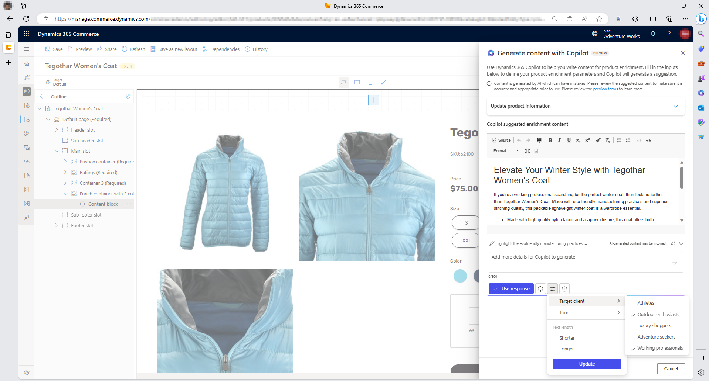
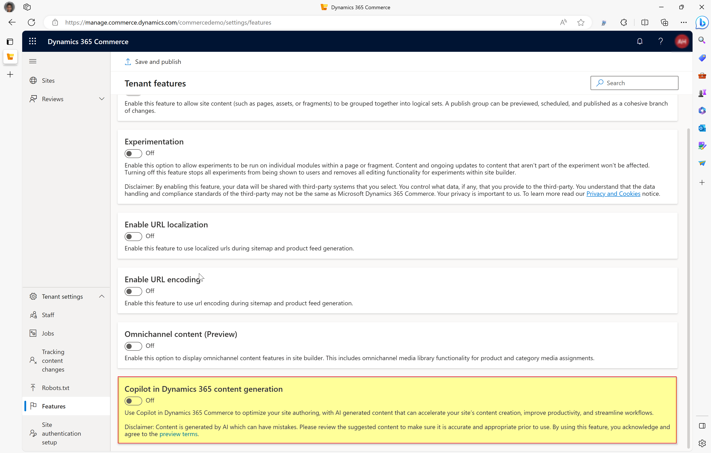
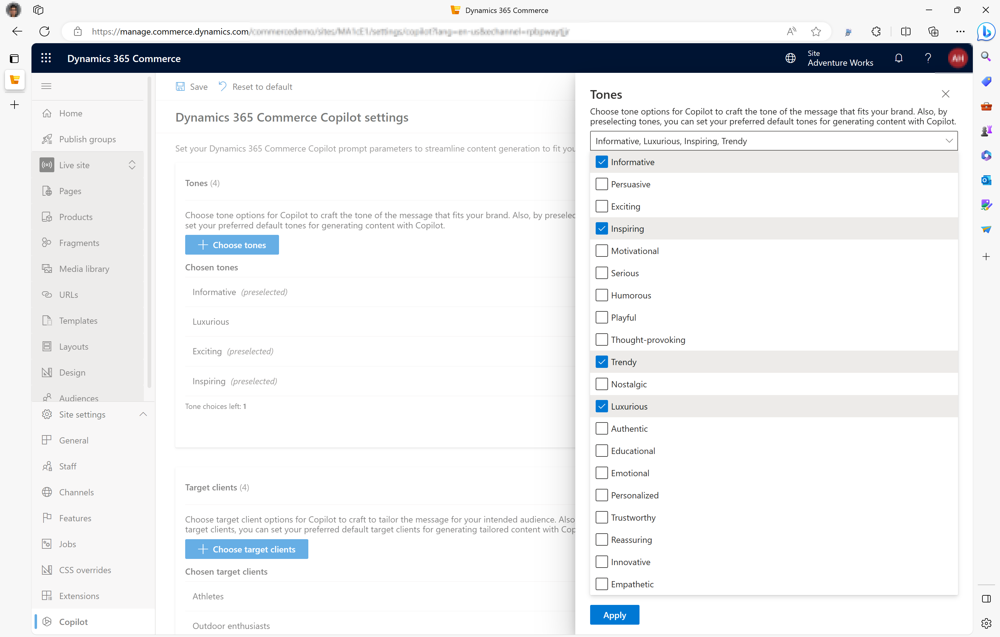
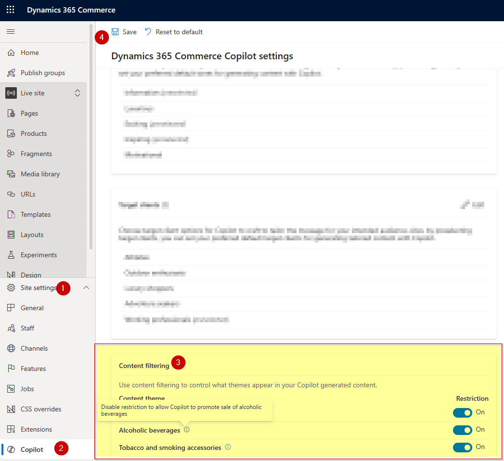
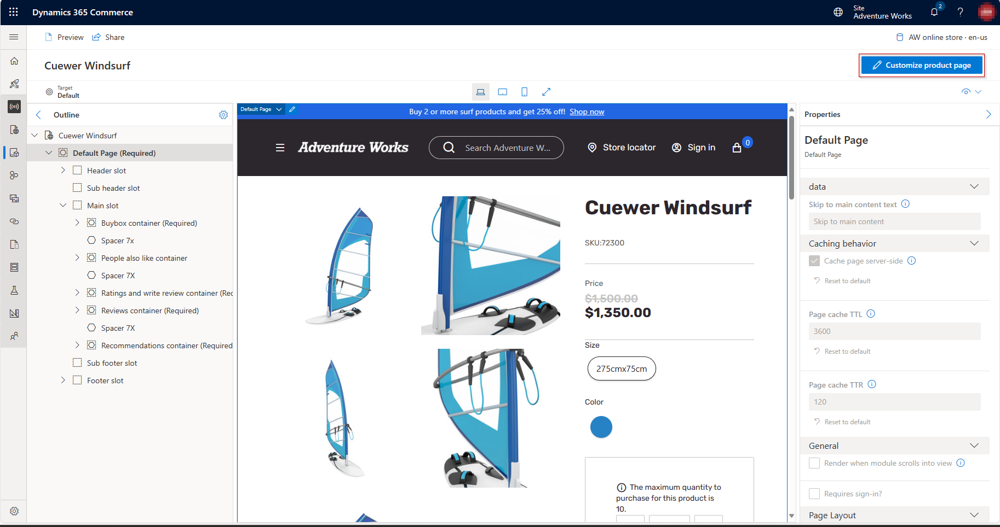
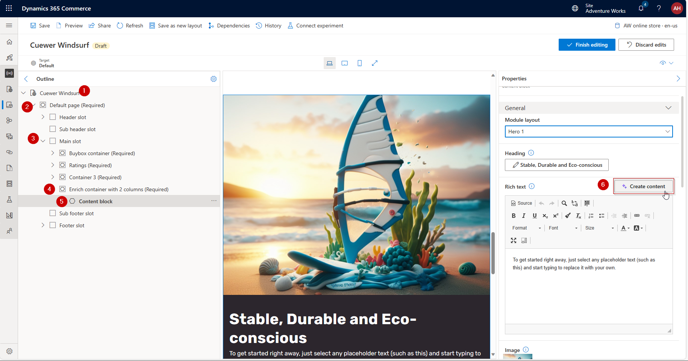
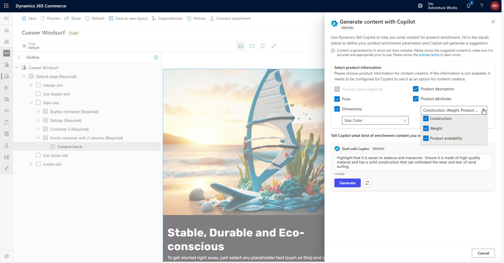
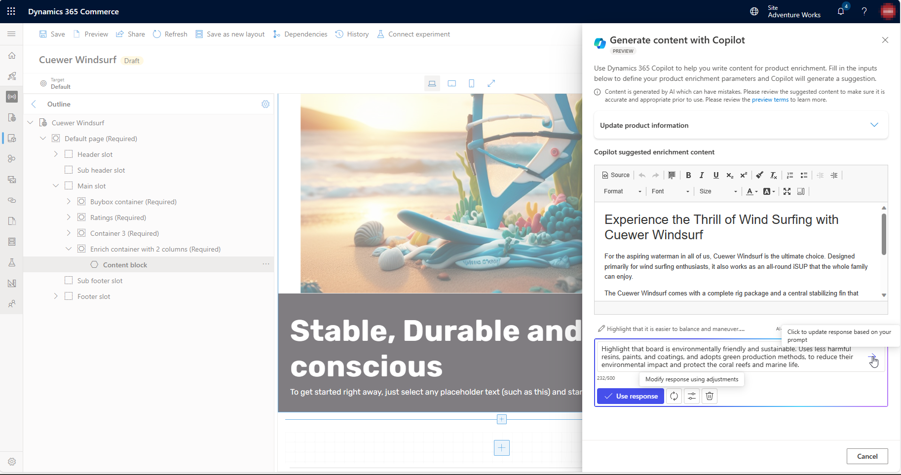
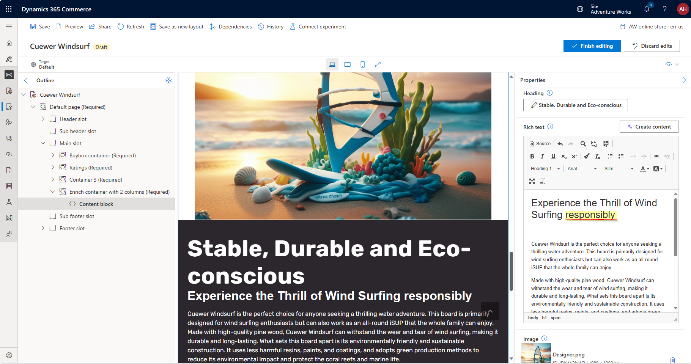
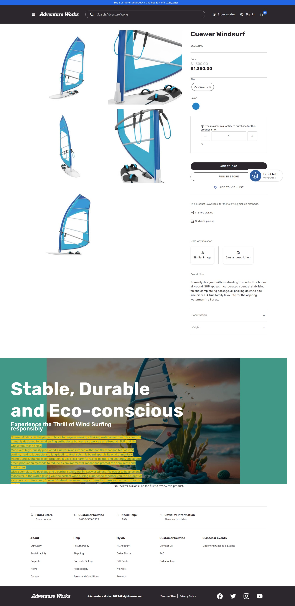

# Using Copilot enrich product details pages for your eCommerce website

If you run an e-commerce website, you know how important it is to have engaging and persuasive product enrichment and marketing content that can attract and convert your customers. But creating such content can be time-consuming and challenging, especially if you have a large product catalog and a diverse audience. That’s why Microsoft is introducing **Copilot in site builder**, a new AI-powered tool that can help you generate high-quality content with ease and efficiency.

Copilot in site builder is a feature that works seamlessly with Sitebuilder, a remarkable website builder service that lets you create stunning websites in minutes. Sitebuilder offers a range of templates, features, and tools to help you customize your website to suit your needs and preferences. With Copilot in site builder, you can now take your Sitebuilder experience to the next level by creating product enrichment and marketing content that is tailored to your target audience and brand tone, with few clicks.

In this article, we will show you what Copilot in site builder is, how it works, and how you can use it to create amazing content for your e-commerce website. We will also give you some examples of Copilot-generated content and how you can edit and optimize it further. By the end of this article, you will see how Copilot in site builder can help you boost your online presence and sales. Let’s dive in!
> [!NOTE]
> Copilot in Sitebuilder preview is available for customers in United States with support for English *(en-us)* locale only. Support for additional regions and locales will be available soon in early part of CY2024, please follow updates and release announcement for future updates.
 
## Overview 
Use Commerce Copilot to jump-start the creative process by first selecting a tone, configured by you, that aligns to your brand, like “adventurous”, “luxurious” or “bold”. Then select an audience choice from choices managed by you, like “sports enthusiast” or “college graduate”. Copilot will then use these prompts to craft compelling and engaging content that makes use of your existing product information like name, description, attributes, price and more! With Copilot in site builder, you can generate persuasive, compelling, and engaging product enrichment and marketing content for your e-commerce websites quickly and efficiently. This feature will offer the following capabilities:

- **Jump-start the creative process**: Copilot creates content that is based on basic product information such as name, description, attributes, and dimensions. You can use the generated content to spark further ideas.
- **Optimize for search engines (SEO)**: Optimize your product marketing content for search engines so that it ranks higher in Internet search results and thereby helps generate more organic growth.
- **Craft the tone of message**: Select the voice that best fits your brand and audience. You can specify a unique tone for each product. The tone of message for a product can be adventurous, casual, luxurious, formal, informational, educational, and more.
- **Craft a tailored message**: Select the intended audience to tailor the message for the specific buyers, such as new parents, graduates, senior citizens, health-care workers, and more.
Amplify with key highlights: Augment your content with key highlights specific to the product in a natural language-based and interactive manner. Generate engaging text snippets that help amplify key highlights for your product.
- **Make basic modifications**: Easily make basic text modifications using an inline rich text editor or by providing key prompts to format the text using natural language.

Always remain in control and have the ability to review and modify any content before it is published! 

> [!NOTE]
> Copilot in sitebuilder is available with content-block or text-block module on your webpage when you enrich product pages [Learn more about standard product enrichment](./enrich-product-page.md)

## How to use Copilot in sitebuilder to enrich product page in Sitebuilder for your eCommerce website? 

### Verify Copilot feature is enabled in Tenant and Site settings
- Launch 'Tenant settings' from your site builder
- Navigate to 'Features' tab
- Locate and verify feature titled as 'Copilot in Dynamics 365 for Content generation' is enabled.

> [!NOTE]
> Content is generated by AI which can have mistakes. Please review the suggested content to make sure it is accurate and appropriate prior to use. By using this feature, you acknowledge and agree to the [preview terms](https://dynamics.microsoft.com/en-us/legaldocs/supp-dynamics365-preview/).
> 
> Upon enabling this feature at a tenant level, automatically all sites have this capability enabled, but as a site admin, you can control the availability of Copilot at an individual site level. Simply navigate to 'Site settings', navigate to 'Features' tab and locate 'Copilot in Dynamics 365 for Content generation' and switch as you may need for an individual site.

### Configure and pre-select tones well-suited for your brand and organization 

Choose tone options for Copilot to craft the tone of the message that fits your brand. Also, by preselecting tones, you can set your preferred default tones for generating content with Copilot.

- Navigate to 'Site settings'
- Locate 'Copilot' tab
- Locate 'Tones' and click 'Edit'
- Choose upto 5 tones for the current site, and choose which options should be pre-selected for quick content generation using Copilot.
- These options will be available at runtime for marketing team and other individuals responsible for updating product enrichment content.
  

### Configure and pre-select target client options to whom you may want to customize and tailor your marketing message
Choose target client options for Copilot to craft to tailor the message for your intended audience. Also, by preselecting target clients, you can set your preferred default target clients for generating tailored content with Copilot.

- Navigate to 'Site settings'
- Locate 'Copilot' tab
- Locate 'Target clients' and click 'Edit'
- Choose upto 5 tones for the current site, and choose which options should be pre-selected for quick content generation using Copilot.
- These options will be available at runtime for marketing team and other individuals responsible for updating product enrichment content.

### Selective content filtering 
At Microsoft, we are committed to providing you with a responsible and ethical solution for your e-commerce needs. That’s why we have designed Copilot in site builder to avoid promoting products from sensitive and regulated industries such as alcohol, tobacco, soft drugs, and others by default. We believe that this is the best practice to protect your customers and your reputation.

However, we also understand that you may have different preferences and requirements for your business. That’s why we give you the admin privileges to override the default behavior and customize the product enrichment and marketing content generated by Copilot in site builder. You can easily change the settings and choose which products you want to promote and how. You have the full control and flexibility to make the best decisions for your business.

- Navigate to 'Site settings'
- Locate 'Copilot' tab
- Locate 'Content filtering' and toggle the switch for specific industries.

> [!NOTE]
> Copilot settings for tones, target clients and sensitive/regulated industries are pre-defined by system, if you were to have additional feedback to revise/add more options, please reach out to us using our Microsoft support channel.

Here is a possible way to rewrite the text as an instruction manual for users to follow:

### How to use Copilot to create content for your product page

1. Choose a product that you want to customize the page for and follow the steps in [this guide](./enrich-product-page.md) to access the page editor.
 
2. Launch Copilot in site builder for product enrichment by locating a module that says 'Content-block' or 'Text-block' and click on the 'Create Content' button in the module properties section, next to the Rich Text Formatting block.

5. You can select some product information that you want Copilot to use as input, such as Price, Attributes, Description, and Dimensions. You can also leave unselect fields if you don't want to include them.
7. Next, you can type in some specific instructions for Copilot to follow when creating the content. For example, you can tell Copilot to highlight the benefits of the product and then make adjustments to use a friendly tone, or target a specific audience. If you don't provide any instructions, Copilot will use the default options from your site settings.

9. After you enter the instructions, Copilot will process them and generate a response based on the product information and your instructions. You can see the response in the preview window.
10. If you are not satisfied with the response, you can change the selection of product information or update the instructions and click on the 'Generate' (Arrow icon) again.
11. Copilot will create a new response based on the updated input. You can repeat this process as many times as you want until you get a response that meets your expectations.

12. Once you are satisfied with the response, you can click on the 'Use response' button. This will copy the response to the text or content block that you selected in step 2.
13. You can still review and edit the response in the text or content block if you want to make any final changes. You can also add images, links, or other elements to enhance your product page.

When you are done editing, you can click on the 'Publish' button to make your product page live on your website. You have successfully used Copilot to create content for your product page!

