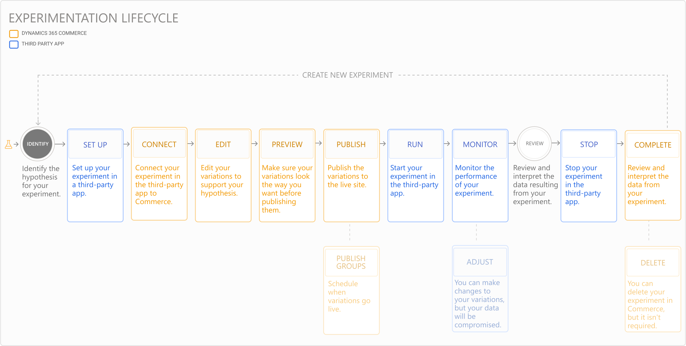

---
# required metadata

title: Identify a hypothesis and determine metrics for an experiment
description: This topic describes how to identify the hypothesis and success metrics for an experiment you'll run on an e-Commerce website in Dynamics 365 Commerce.
author:  sushma-rao 
ms.date: 10/21/2020
ms.topic: article
ms.prod: 
ms.technology: 

# optional metadata

# ms.search.form: 
# ROBOTS: 
audience: Application User
# ms.devlang: 
ms.reviewer: josaw
# ms.tgt_pltfrm: 
ms.custom: 
ms.assetid: 
ms.search.region: global
ms.search.industry: Retail
ms.author: sushmar
ms.search.validFrom: 2020-09-30
ms.dyn365.ops.version: AX 10.0.13
---

# Identify a hypothesis and determine success metrics for an experiment
The first phase in the experimentation lifecycle includes identifying the hypothesis for the experiment and determining the metrics you'll track to evaluate success. The following diagram shows all of the steps involved in [setting up and running an experiment](experimentation-overview.md) on an e-Commerce website in Dynamics 365 Commerce. Additional steps are covered in separate topics. 

A hypothesis is a statement where you predict the outcome of the experiment. Many factors go into defining a hypothesis, for example, research about user behavior and website data you've collected. With the hypothesis, you'll define the assumption or theory you want to validate with your experiment. An example of a hypothesis for your experiment may be "*a picture of a white t-shirt on my home page will drive a higher clickthrough rate than a navy sweater during summer months because people want to wear something lightweight and light colored in the summer.*" In that case, you'll create variations that include a white t-shirt and a navy sweater, and publish both at the same time.

To validate a hypothesis, the success or failure of an experiment should be directly tied to user actions; for example, if the website user clicks on a link or button. These actions must correspond with events that will be reported to the third-party service tracking the experiment. Over time, the percentage of users that take the action will be tallied as a metric you can use to generate reports and conduct analyses. To review all of the available events and attributes, see [Commerce component events for diagnostics and troubleshooting](dev-itpro/retail-component-events-diagnostics-troubleshooting.md).

## Previous step
[Experimentation in Dynamics 365 Commerce](experimentation-overview.md)

## Next step
[Set up an experiment](experimentation-setup.md)

[!INCLUDE[footer-include](../includes/footer-banner.md)]