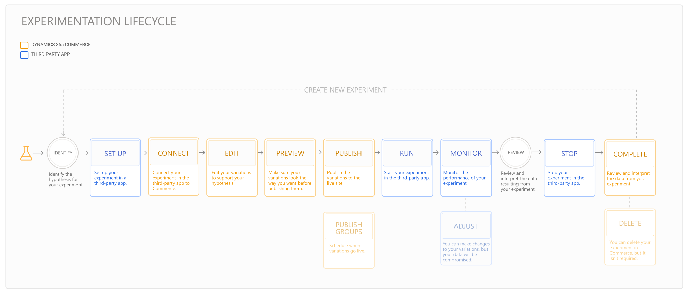

---
# required metadata

title: Experimentation in Dynamics 365 Commerce
description: Experimentation enables the creation, editing, and management of page layout and content treatments in site builder. End-to-end experimentation support is enabled for e-commerce pages and entities within a page.
author:  sushma-rao 
ms.date: 10/21/2020
ms.topic: overview
ms.prod: 
ms.technology: 

# optional metadata

# ms.search.form: 
# ROBOTS: 
audience: Application User
# ms.devlang: 
ms.reviewer: josaw
# ms.tgt_pltfrm: 

ms.assetid: 
ms.search.region: global
ms.search.industry: Retail
ms.author: sushmar
ms.search.validFrom: 2020-09-30
ms.dyn365.ops.version: AX 10.0.13
---

# Experimentation in Dynamics 365 Commerce
Use experimentation in Dynamics 365 Commerce to validate hypotheses about the effectiveness of your e-Commerce pages and make decisions with data-driven confidence. Commerce supports A/B testing on pages, modules, and fragments and enables you to measure the impact of proposed changes to your website.

You can create, edit, and manage page and content treatments known as **variations** in Commerce site builder. Commerce integrates with third-party services that you can use to create experiments and treatment assignments. Real-time event streams captured in Commerce enable the analytics that define the experiment results in the third-party service. You can then leverage these analytics to help support or refute your hypothesis.

## Set up prerequisites
1. **Get the correct version of Commerce** - Upgrade your module library, online channel extensibility software development kit (SDK), and Commerce Scale Unit to Commerce version 10.0.13 or later.
1. **Set up an experimentation connector** - An experimentation connector allows Commerce to connect with third-party services to retrieve the list of experiments and determine when to show an experiment to a user. You can purchase a third-party connector from [AppSource](https://appsource.microsoft.com). Follow the setup instructions provided by the publisher. You can alternatively use the sample test connector from Commerce to test the experimentation workflow without needing to configure an external service. For more information, see [Configure and enable connectors](e-commerce-extensibility/connectors.md). 
1. **Turn on the experimentation feature flags in Commerce** - You can enable experimentation at the tenant level by going to **Tenant Settings > Features** or at the site level at **Site Settings > Features**.
    - Enable the **Experimentation** flag to create experiment variations of modules within a page without affecting or copying other content that isn't part of the experiment. This ensures that ongoing content updates outside the experiment stay in sync during the experiment lifecycle. Disabling this flag stops all experiments from being shown to users and removes all editing functions within site builder.
    - Enable the **Experiment on pages or fragments** flag to run experiments on a page or fragment. This creates a full instance copy of the entire page or fragment for all modules within the page or fragment. Use this mode when you want to test comprehensive content changes, or where synchronizing ongoing content changes across instances isn't a concern. Disabling this flag prevents creation and editing of new experiments on pages and fragments.
    > [!NOTE]
    > The **Experimentation** flag must also be enabled for the **Experiment on pages or fragments** functionality to work.
    
## Experimentation lifecycle
Setting up an experiment, creating variations, and running an experiment is an iterative process. The diagram below illustrates the experimentation lifecycle in Commerce and the third-party service. 

To learn more about each step in the experimentation process, refer to the following topics.
- [Identify a hypothesis and determine metrics for an experiment](experimentation-identify.md)
- [Set up an experiment](experimentation-setup.md)
- [Connect and edit an experiment](experimentation-connect-edit.md)
- [Preview and publish an experiment](experimentation-preview-publish.md)
- [Run and monitor an experiment](experimentation-run-monitor.md)
- [Promote a variation and complete an experiment](experimentation-review-complete.md)

> [!NOTE]
> To learn where an experiment is in the lifecycle, select **Experiments** in the left navigation pane of site builder. A list of experiments is displayed with the status of each experiment in both Commerce and the third-party service. For more information, see [Review the status of an experiment](experimentation-status.md).

## Next step
[Identify a hypothesis and determine success metrics for an experiment](experimentation-identify.md) 

[!INCLUDE[footer-include](../includes/footer-banner.md)]