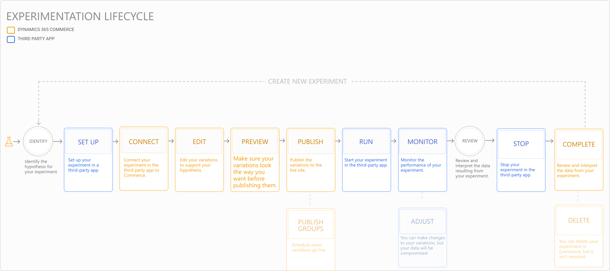

---
# required metadata

title: Experimentation in Dynamics 365 Commerce
description: Experimentation enables the creation, editing, and management of page layout and content treatments in site builder. End-to-end experimentation support is enabled for e-commerce pages and entities within a page.
author:  sushma-rao 
manager: AnnBe
ms.date: 10/01/2020
ms.topic: article
ms.prod: 
ms.service: dynamics-365-retail
ms.technology: 

# optional metadata

# ms.search.form: 
# ROBOTS: 
audience: Application User
# ms.devlang: 
ms.reviewer: josaw
ms.search.scope: Core, Operations, Retail
# ms.tgt_pltfrm: 
ms.custom: 
ms.assetid: 
ms.search.region: global
ms.search.industry: Retail
ms.author: sushmar
ms.search.validFrom: 2020-09-30
ms.dyn365.ops.version: AX 10.0.13
---

# Experimentation in Dynamics 365 Commerce

## Overview
You can use controlled experiments such as A/B tests in Dynamics 365 Commerce to validate hypotheses and make decisions with data-driven confidence. e-Commerce experimentation enables you to scientifically measure the impact of proposed changes to your website and drive higher conversion rates as a result.

Commerce supports the creation, editing, and management of page and content treatments also known as **variations** within site builder. Commerce integrates with third-party services which you use to enable the creation of experiments and treatment assignments. Real-time event streams are captured in Commerce and enable the analytics that define the experiment results in the third-party service. You then use the analytics help support or refute your hypothesis.

> [!NOTE]
> Commerce supports A/B testing on pages, modules, and fragments. Multi-variate and multi-page tests can currently only be accomplished using fragments.

## Set up prerequisites
1. **Get the correct version of Commerce** - Upgrade your module library, online channel extensibility SDK, and Commerce scale unit to Commerce version 10.0.13 or later.
1. **Set up an experimentation connector** - An experimentation connector allows Commerce to connect with third-party services to retrieve the list of experiments and determine when to show an experiment a user. You can purcahse a third-party connector from [AppSource](https://appsource.microsoft.com). Follow the setup instructions provided by the publisher. You can alternatively use the sample test connector from Commerce to test the experimentation workflow without needing to configure an external service. For more information, see the [Configure and enable connectors](e-commerce-extensibility/connectors.md) topic. 
1. **Turn on the experimentation feature flags** - You can enable experimentation at the tenant level by going to **Tenant Settings -> Features** or at the site level at **Site Settings -> Features**.
    - Enable the **Experimentation** flag to create experiment variations of modules within a page without affecting or copying other content that isn't part of the experiment. This ensures that ongoing content updates outside the experiment stay in sync during the experiment lifecycle. Disabling this flag stops all experiments from being shown to users and removes all editing functions within site builder.
    - Enable the **Experimentation on pages or fragments** flag is you want to run experiments on a page or fragment. This creates a full instance copy of the entire page or fragment for all modules within the page or fragment. Use this mode when you want to test comprehensive content changes, or where synchronizing ongoing content changes across instances isn't a concern. Disabling this flag prevents creation and editing of new experiments on pages and fragments.
    
## Experimentation journey
The image below shows the user's experimentation journey in Commerce and the third-party service - it is an iterative process that can take a few iterations to learn and get the desired results:

Click on the links below to learn more about the phases:
1. [Identify the goals for your experiment](experimentation-identify.md)
1. [Setup your experiment](experimentation-setup.md)
1. [Connect and edit your experiment](experimentation-connect-edit.md)
1. [Preview and publish your experiment](experimentation-preview-publish.md)
1. [Run and monitor your experiment](experimentation-run-monitor.md)
1. [Review and complete your experiment](experimentation-review-complete.md)

## Experiment statuses
The **Experiments** tab in site builder shows the following statuses in the **Commerce status** field to help you quickly see what state your experiment is in:
1. Draft - The experiment is connected to a page or fragment in Commerce and is being edited.
1. Published - The experiment is ready to go live, once it is started in the third-party service.
1. Unpublished - An experiment that is live isn't visible to users anymore, even if it is running in the third-party service.
1. Completed - The experiment has run its course and the right variation has been promoted to be shown to all users.

Similarly you can also use the **third-party status** field to understand the state of your experiment in the third-party service:
1. Draft - The experiment is setup in the third-party service but hasn't started yet.
1. Running - The experiment has started and is collecting data.
1. Paused - The experiment is paused and not collecting data. You will need to resume it so it starts collecting data again.
1. Archived - The experiment has run its course and has been cataloged for future reference.

Below is an image that shows both sets of statuses and how they relate to each other:

