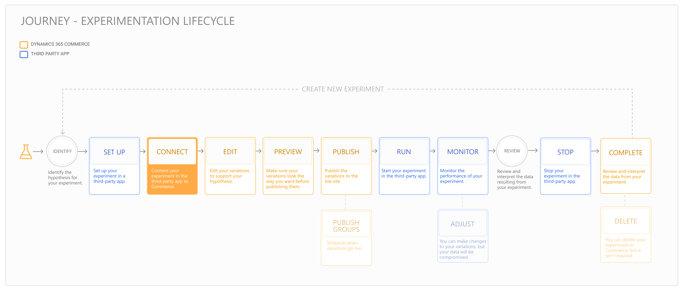

---
# required metadata

title: Experimentation in Dynamics 365 Commerce
description: Enable the creation, editing, and management of page layout and content treatments in site builder. End-to-end experimentation support will be enabled for e-commerce pages, as well as entities within a page.
author:  sushma-rao 
manager: AnnBe
ms.date: 09/15/2020
ms.topic: article
ms.prod: 
ms.service: dynamics-365-retail
ms.technology: 

# optional metadata

# ms.search.form: 
# ROBOTS: 
audience: Application User
# ms.devlang: 
ms.reviewer: josaw
ms.search.scope: Core, Operations, Retail
# ms.tgt_pltfrm: 
ms.custom: 
ms.assetid: 
ms.search.region: global
ms.search.industry: Retail
ms.author: sushmar
ms.search.validFrom: 2020-09-30
ms.dyn365.ops.version: AX 10.0.13
---

# E-commerce experimentation

## Overview
Experimentation is the process of using controlled experiments such as A/B tests to validate hypotheses and making decisions with data-driven confidence. Use e-commerce experimentation to scientifically measure the impact of proposed changes to your website and thereby drive higher conversion rates.

Dynamics 365 Commerce supports the creation, editing, and management of page and content treatments also known as **variations** within site builder. Integrations with third-party services enable the creation of experiments and treatment assignments. Real-time event streams from Commerce enable the analytics defining experiment results in the third-party service to help support or refute the hypothesis.

> [!NOTE]
> Commerce supports A/B testing on pages, modules and fragments. Multi-variate and multi-page tests can currently only be accomplished using fragments.

## Prerequisites
1. **Get the right Commerce version** - Upgrade your module library, online channel extensibility SDK and Commerce scale unit to version 10.0.13.
1. **Setup an experimentation connector** - An experimentation connector allows Commerce to connect with third-party services to retrieve the list of experiments and determine when to show an experiment to each user. You can setup a third-party connector purchased from [AppSource](https://appsource.microsoft.com), following directions provided by the publisher. You can also use the sample test connector from Commerce following instructions [here](https://docs.microsoft.com/en-us/dynamics365/commerce/e-commerce-extensibility/connectors), to test the experimentation workflow without needing to configure an external service.
1. **Turn on the experimentation feature flags** - You can enable experimentation at the tenant level (Tenant Settings -> Features) or at the site level (Site Settings -> Features).
    - Set the **Experimentation** flag to on to enable creating experiment variations of modules within a page, without affecting or copying other content that is not part of the experiment. This ensures that ongoing content updates outside the experiment stay in sync during the experiment lifecycle. Disabling this will stop all experiments from being shown to users, and remove all editing functions within site builder.
    - Set the **Experimentation on pages or fragments** flag to on to enable experiments to be run on a page or fragment. This mode creates a full instance copy of the entire page or fragment for all modules within it.  Use this mode when you want to test comprehensive content changes, or where synchronizing ongoing content changes across instances is not a concern. Disabling it will prevent creation and editing of new experiments on pages and fragments.
    
## Experimentation journey
The diagram below shows the user's experimentation journey in Commerce and the third-party service - it is a cyclical process that can take a few iterations to learn and get the desired results:

<<need updated diagram from Charla/Jo>>

Click on the links below to learn more about the phases:
1. [Identify](experimentation-identify.md)
1. [Setup](experimentation-setup.md)
1. [Connect and edit](experimentation-connect-edit.md)
1. [Preview and publish](experimentation-preview-publish.md)
1. [Run and monitor](experimentation-run-monitor.md)
1. [Review and complete](experimentation-review-complete.md)
