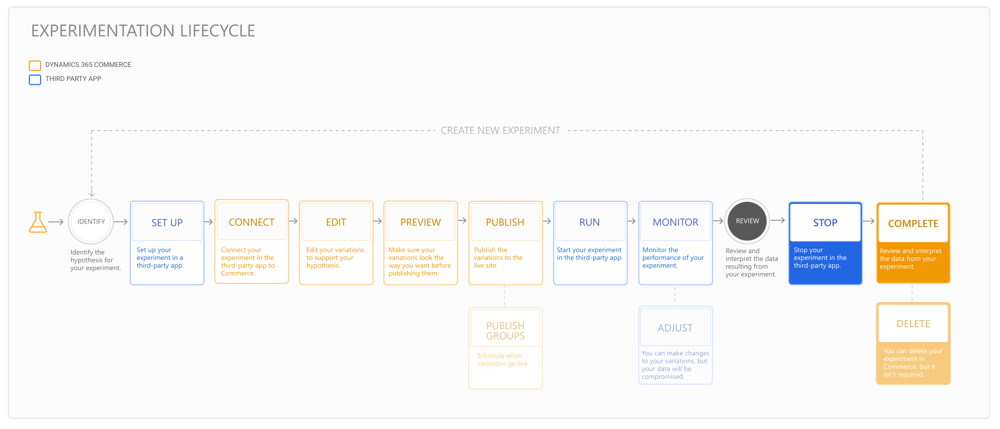

---
# required metadata

title: Promote a variation and complete an experiment
description: This topic describes how to promote a successful variation and complete an experiment in Dynamics 365 Commerce.
author:  sushma-rao 
ms.date: 10/21/2020
ms.topic: article
ms.prod: 
ms.technology: 

# optional metadata

# ms.search.form: 
# ROBOTS: 
audience: Application User
# ms.devlang: 
ms.reviewer: josaw
# ms.tgt_pltfrm: 
ms.custom: 
ms.assetid: 
ms.search.region: global
ms.search.industry: Retail
ms.author: sushmar
ms.search.validFrom: 2020-09-30
ms.dyn365.ops.version: AX 10.0.13
---

# Promote a variation and complete an experiment

This topic describes how to promote the variation that produced the best results in your experiment, and how to complete the experiment. The following diagram shows all of the steps involved in setting up and running an experiment on an e-Commerce website in Dynamics 365 Commerce. Additional steps are covered in separate topics.

After you've [run your experiment](experimentation-run-monitor.md) and collected sufficient data to determine which variation you want to use on your live site, you'll promote the variation and end the experiment.

## Promote a variation
Use the data and analytics related to the experiment in the third-party service to decide which variation produced the best results. You can then promote it by replacing the current content on the live site with the winning variation so that it's available to all users of your website.

To promote the winning variation, follow these steps. 

1. In Commerce site builder, select **Experiments** in the left navigation pane, and then select the experiment.
1. On the command bar, select **Complete experiment**.
1. In the **Complete the experiment** dialog box, select **Review the experiment data**. The third-party service opens where you can validate the metrics and determine which variation performed the best.
1. In the **Complete the experiment** dialog box, select the winning variation, and then select **Next**.
1. Open the third-party service and stop the experiment.
1. In site builder, select **Complete** to overwrite the original live page and publish the winning variation so that it's available to all users of your website. 

> [!NOTE]
> If you choose to keep the current live page and not publish a variation, select **Republish the original page**.

## Delete your experiment
While it's not required that you delete a completed experiment in Commerce, you may choose to delete it to save space or clean up your workspace. 

To delete an experiment in Commerce site builder, follow these steps.

1. Select **Experiments** in the left navigation pane, and then select the experiment. 
    > [!NOTE]
    > If the experiment is still active, stop the experiment in the third-party service before proceeding.
1. On the command bar, select **Unpublish**  to remove the variation content from the live site.
1. Select **Delete** to delete the experiment.

## Previous step
[Run and monitor an experiment](experimentation-run-monitor.md)

[!INCLUDE[footer-include](../includes/footer-banner.md)]