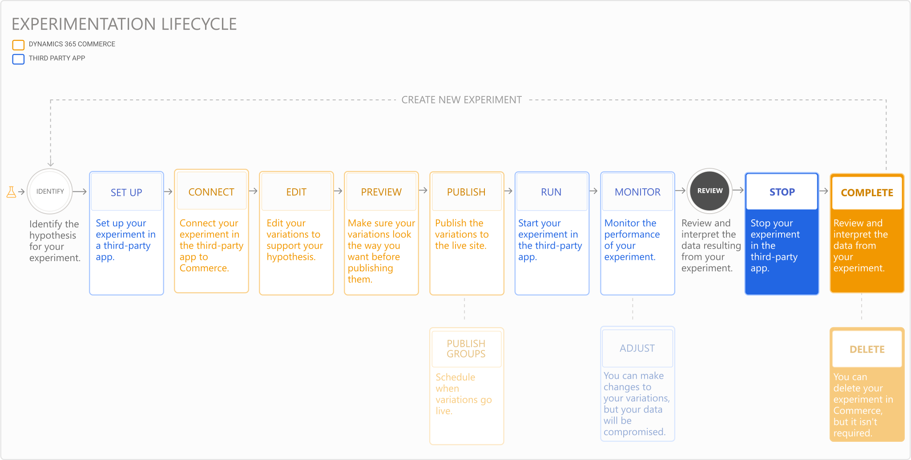

---
# required metadata

title: Experimentation in Dynamics 365 Commerce
description: Enable the creation, editing, and management of page layout and content treatments in site builder. End-to-end experimentation support will be enabled for e-commerce pages, as well as entities within a page.
author:  sushma-rao 
manager: AnnBe
ms.date: 09/15/2020
ms.topic: article
ms.prod: 
ms.service: dynamics-365-retail
ms.technology: 

# optional metadata

# ms.search.form: 
# ROBOTS: 
audience: Application User
# ms.devlang: 
ms.reviewer: josaw
ms.search.scope: Core, Operations, Retail
# ms.tgt_pltfrm: 
ms.custom: 
ms.assetid: 
ms.search.region: global
ms.search.industry: Retail
ms.author: sushmar
ms.search.validFrom: 2020-09-30
ms.dyn365.ops.version: AX 10.0.13
---

# Review and complete your experiment

After your experiment ends and has sufficient results to determine whether it was a success or not, the winning experience can be promoted to all users of the website as follows:
1. Go to the **Experiments** tab in site builder and click on the desired experiment.
1. Click the **Complete** button on the top bar once the experiment has run and gathered sufficient data.
1. Click the **Review the experiment data in your third-party app** link in the newly popped up *Complete the experiment* pane to view the experiment's results in the third-party service.
1. Use the analytics generated in the third-party service to pick the variation that performed the best and click **Next**.
1. Stop and/or archive the experiment in the third-party service.
1. Click **Complete** to overwrite the original page and publish the winning variation to all users of the website. If there is no clear winner, choose **Republish the original page**.

## Delete your experiment
Once your experiment is complete, you can optionally follow the steps below to delete it and cleanup in Commerce:
1. Go to the **Experiments** tab in site builder and select or click on the desired experiment. 
    > [!NOTE]
    > If the experiment is still active, stop the experiment in the third-party service before proceeding.
1. Click the **Unpublish** button in the command bar to take down the page from live site.
1. Click the **Delete** button in the command bar to delete the experiment.
