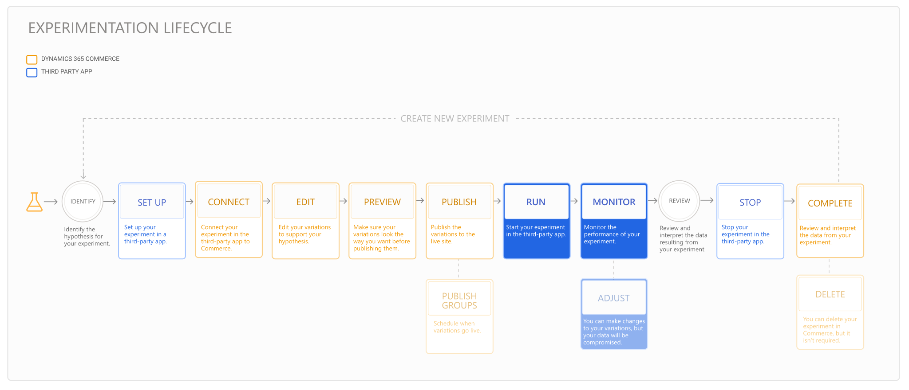

---
# required metadata

title: Run and monitor an experiment
description: This topic describes how to run and monitor an experiment in a third-party service. It also describes how to make changes to variations after the experiment started.
author:  sushma-rao 
ms.date: 10/21/2020
ms.topic: article
ms.prod: 
ms.technology: 

# optional metadata

# ms.search.form: 
# ROBOTS: 
audience: Application User
# ms.devlang: 
ms.reviewer: josaw
# ms.tgt_pltfrm: 
ms.custom: 
ms.assetid: 
ms.search.region: global
ms.search.industry: Retail
ms.author: sushmar
ms.search.validFrom: 2020-09-30
ms.dyn365.ops.version: AX 10.0.13
---

# Run and monitor an experiment

This topic describes how to run and monitor your experiment in a third-party app, and change variations if needed. Before you complete the steps in this topic, you'll first need to [publish](experimentation-preview-publish.md) your experiment in Commerce. 

The following diagram shows all of the steps involved in setting up and running an experiment on an e-Commerce website in Dynamics 365 Commerce. Additional steps are covered in separate topics.

After you publish your variations, all of the steps you need to do in Commerce to run your experiment are complete. The next step is determining which variation to show to each user when they request a page. The third-party service makes that determination, but first you have to activate the experiment within the service. Since the steps for activating an experiment vary from service to service, you'll need to follow the instructions included with your service or provider. If the experiment is not activated, users will only see the default version of the page (no variations will be displayed).

You'll need to keep the experiment running long enough to gather data for statistically valid results. Use the third-party service to monitor the experiment-related data and analytics while the experiment is running.

## Adjust your variations
If for any reason you need to modify your variations, follow the steps below.

> [!IMPORTANT]
> If you make changes to a live experiment in Commerce or the third-party service, your results may be significantly impacted. Consider letting the experiment run its course and then creating a new experiment for major changes.

1. In Commerce site builder, select **Experiments** in the left navigation pane, and then select the experiment. 
1. Select the variation you want to update from the drop-down menu.
1. Make any needed changes, and then preview and publish the variations. For more information, see [Preview and publish an experiment](experimentation-preview-publish.md).
1. Go to the third-party service to make any experiment setup-related changes.
    
## Previous step
[Preview and publish an experiment](experimentation-preview-publish.md)

## Next step
[Promote a variation and complete an experiment](experimentation-review-complete.md)

[!INCLUDE[footer-include](../includes/footer-banner.md)]