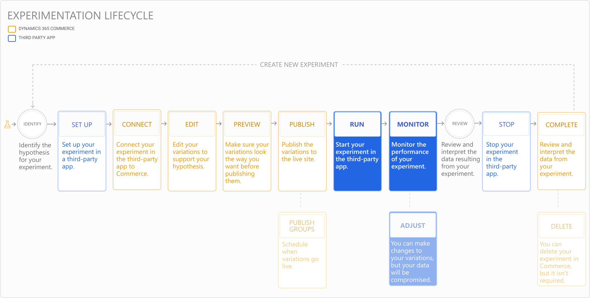

---
# required metadata

title: Run and monitor an experiment
description: This topic describes how to run and monitor an experiment in a third-party service. It also describes how to make changes to variations after the experiment started.
author:  sushma-rao 
manager: AnnBe
ms.date: 10/01/2020
ms.topic: article
ms.prod: 
ms.service: dynamics-365-retail
ms.technology: 

# optional metadata

# ms.search.form: 
# ROBOTS: 
audience: Application User
# ms.devlang: 
ms.reviewer: josaw
ms.search.scope: Core, Operations, Retail
# ms.tgt_pltfrm: 
ms.custom: 
ms.assetid: 
ms.search.region: global
ms.search.industry: Retail
ms.author: sushmar
ms.search.validFrom: 2020-09-30
ms.dyn365.ops.version: AX 10.0.13
---

# Run and monitor an experiment

There are many steps involved in setting up and running an experiment on an e-Commerce website in Dynamics 365 Commerce. This topic describes how to run and monitor your experiment in a third-party app, and change variations if needed.

After you've [previewed and published](experimentation-preview-publish.md) your experiment in Commerce, you need to run the experiment in the third-party service. Then, you can start monitoring the data that's returned.

Follow the instructions for how to activate or run your experiment in the third-party service. If your experiment is not running in the third-party service, the correct variations won't be displayed on your site and your site will continue to display the existing version of the page.

You need to do research to determine the optimal time you'll need to keep the experiment running to gather data for statistically valid results. Use the third-party service to monitor the experiment-related data and analytics while the experiment is running.

## Adjust your variations
While the experiment is running, you may decide to modify your variations based on the results that are coming in. 

> [!IMPORTANT]
> If you make changes to your variations when the experiment is still active, the data relating to your experiment will be compromised. , the data relating to your experiment will be compromised. Consider letting the experiment run it's course, then create a new experiment with your new variations.

If you decide to make changes to variations despite the impact on your data, follow the steps below.  
1. Go to the **Experiments** tab in site builder and select the experiment. 
1. Select the variation you want to update from the **Variations** drop-down.
1. Make the changes you want, then preview and publish the variations. See [Preview and publish an experiment](experimentation-preview-publish.md) for more information.
1. Go to the third-party service and make any setup-related changes required by the service.
    
