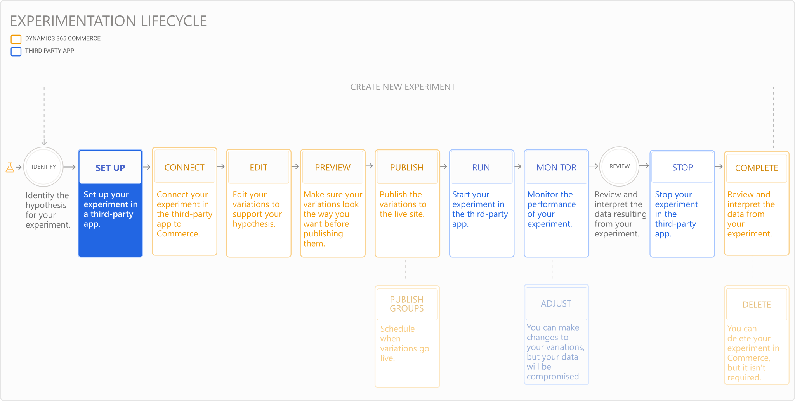

---
# required metadata

title: Set up an experiment
description: This topic describes how to set up an experiment in a third-party service.
author:  sushma-rao 
ms.date: 10/21/2020
ms.topic: article
ms.prod: 
ms.technology: 

# optional metadata

# ms.search.form: 
# ROBOTS: 
audience: Application User
# ms.devlang: 
ms.reviewer: josaw
# ms.tgt_pltfrm: 
ms.custom: 
ms.assetid: 
ms.search.region: global
ms.search.industry: Retail
ms.author: sushmar
ms.search.validFrom: 2020-09-30
ms.dyn365.ops.version: AX 10.0.13
---

# Set up an experiment

After you [define a hypothesis and determine what success metrics you want to use](experimentation-identify.md), you'll need to set up your experiment in the third-party service. The following diagram shows all of the steps involved in setting up and running an experiment on an e-Commerce website in Dynamics 365 Commerce. Additional steps are covered in separate topics.

## Set up your experiment in the third-party service
By now you should have chosen your third-party service to run and monitor your experiment, and set up the experimentation connector. These prerequisites are listed in  [Experimentation in Dynamics 365 Commerce](experimentation-overview.md).

Follow the steps required to create your experiment in the third-party service. If the connector is configured properly, the complete list of experiments you set up in the third-party service will appear in Commerce site builder within about 5 minutes.

## Set up your success metrics
Every experiment needs metrics to measure the impact of the variations and to validate the hypothesis. Follow the steps below to enable the computation of metrics in the third-party service using live telemetry events from Dynamics 365 Commerce.

To set up your success metrics for out-of-the-box modules, follow these steps.

1. In Commerce site builder, select **Pages** in the left navigation pane, and then select the page that you want to collect metrics for. 
1. Go to the **Event IDs to track** section in the right property pane of the page or module you want to track.
1. Select **View**. A list of all click event IDs is displayed. Copy the event you want to track, and paste the event key into the designated location in the third-party service. If you need more than one event, copy the keys one at a time. 
1. For page views, use a combination of the page name in site builder appended with “.PageView”. For example, Homepage.PageView or CheckoutPage.PageView.
1. Take any other steps for tracking metrics as required in the third-party service.

For custom module clicks, follow these steps to instrument the click events:

1. Prepare a TelemetryContent object for the modle using the function below. This takes the page name, module name and SDK provided default telemetry object.
- getTelemetryObject(pageName: string, moduleName: string, telemetry: ITelemetry): ITelemetryContent
- Example: private readonly telemetryContent: ITelemetryContent = getTelemetryObject(this.props.context.request.telemetryPageName!, this.props.friendlyName, this.props.telemetry);
1. Create the payload data that contains information on what needs to be captured. For buttons and other static controls, you can include etext such as “Shop now” or “Search”. And for components like clicking on a product card, you can send the recid which is the record ID of the product or the product ID.
- getPayloadObject(eventType: string, telemetryContent: ITelemetryContent, etext: string, recid?: string): IPayLoad
- Example: const payLoad = getPayloadObject('click', this.props.telemetryContent, 'Shop Now', '');  : For static button scenario pass the button text string Or const payLoad = getPayloadObject('click', telemetryContent!, '', product.RecordId.toString());  : For product clicks pass the product recordId.
1. Call the OnClick function to register the event.
- onTelemetryClick = (telemetryContent: ITelemetryContent, payLoad: IPayLoad, linkText: string) => () =>
- Example:  onClick: onTelemetryClick(this.props.telemetryContent, payLoad, linkText)

## Previous step
[Identify a hypothesis and determine metrics for an experiment](experimentation-identify.md) 

## Next step
[Connect and edit an experiment](experimentation-connect-edit.md)

[!INCLUDE[footer-include](../includes/footer-banner.md)]
