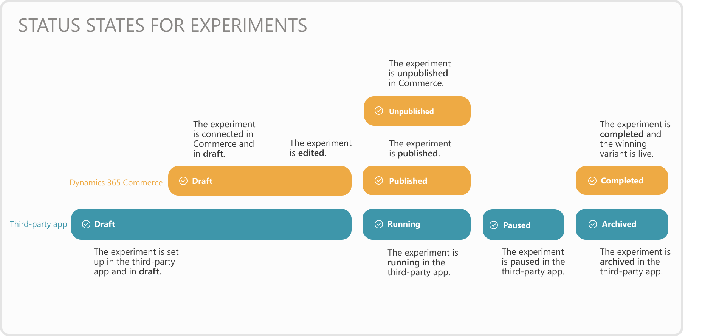

---
# required metadata

title: Review the status of an experiment
description: This topic explains what status an experiment has in the experimentation lifecycle in Dynamics 365 Commerce. 
author:  sushma-rao 
ms.date: 10/21/2020
ms.topic: article
ms.prod: 
ms.technology: 

# optional metadata

# ms.search.form: 
# ROBOTS: 
audience: Application User
# ms.devlang: 
ms.reviewer: josaw
# ms.tgt_pltfrm: 
ms.custom: 
ms.assetid: 
ms.search.region: global
ms.search.industry: Retail
ms.author: sushmar
ms.search.validFrom: 2020-09-30
ms.dyn365.ops.version: AX 10.0.13
---

# Review the status of an experiment
There are many steps involved in setting up and running an experiment in Dynamics 365 Commerce. For information about the experimentation lifecycle, see [Experimentation in Dynamics 365 Commerce](experimentation-overview.md).

To learn where an experiment is in the lifecycle, in Commerce site builder select **Experiments** in the left navigation pane. A list of experiments is displayed with the status of each experiment in both Commerce and the third-party service that is being used to enable the creation of experiments, assign variations, and analyze data.

In the **Commerce status** column, the following values may be displayed. 
- **Draft** - The experiment is connected to a page or fragment in Commerce and is being edited.
- **Published** - The experiment variations are ready to be displayed on your website. If the experiment is running in the third-party service, website users will see a variation of the page or fragment as selected by the third-party service.
- **Unpublished** - The experiment is no longer available on your website. Website users will only see the default version of the page or fragment even if the experiment is running in the third-party service.
- **Completed** - The experiment has run its course and a variation was promoted to live for all website users.

Similarly, in the **third-party status** column, the following values may be displayed to indicate what status the experiments are in the third-party service.
- **Draft** - The experiment is set up in the third-party service but hasn't been started.
- **Running** - The experiment was started in the third-party service and is collecting data.
- **Paused** - The experiment is paused and not collecting data. You must resume the experiment for it to collect data again.
- **Archived** - The experiment has run its course and has been cataloged in the third-party service for future reference.

The diagram below shows both sets of statuses and how they relate to each other.

[!INCLUDE[footer-include](../includes/footer-banner.md)]