# Move POS screen layouts to a new environment

[!include [banner](includes/banner.md)]

This article describes how to export point of sale screen layouts to a new environment in Microsoft Dynamics 365 Commerce.

The following document describes the procedure to export and import POS screen layouts to a new environment.

## Export layout data

In this example, we'll export layout data specific to self-checkout (SCO).

To export layout data from an environment, follow these steps.

1. In the Commerce headquarters environment from which you want to export data, go to **Data management \> Framework parameters**.
1. Select **Entity settings**.
1. Under **Advanced entity configuration settings**, select **Refresh entity list**. The message "The refresh entity list job is added to the queue" appears at the top of the screen.
1. Go to **Batch jobs \> System Administration \> Inquiries** and verify that the refresh entity list job has completed successfully.
  
    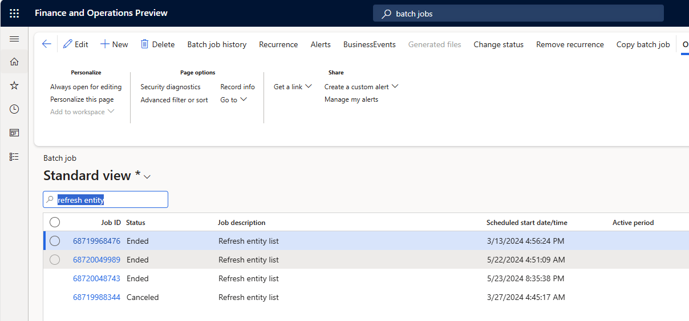
  
1. Go to **Data management \> Export** and under **Group name**, enter the name "Export POS layouts" for the new record.
1. Under **Selected entities** select **+Add multiple**.
  
    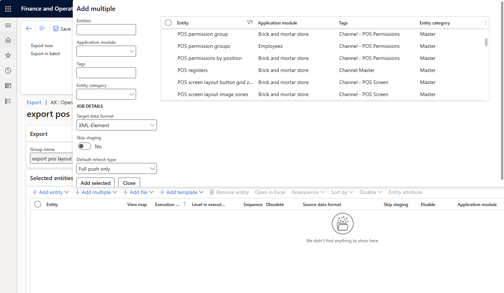
  
1. In the dialog, in the **Target data format** drop-down list, select **XML-Element**.
1. Set the **Skip staging** option to **No**.
1. For each of the following entities, filter for the entity under **Entities**, select the entity result in the **Entity** column, and select **Add selected**.
    - **Layout sizes** (Include this entity only when you're exporting new layout sizes that don't exist in the new environment.)
    - **RetailTillLayoutConfigurationEntity**
    - **POS button grid**
    - **POS button grid buttons**
    - **POS layout images**
    - **POS screen layouts**
    - **POS screen layout button grid zones**
    - **POS screen layout image zones**
    - **POS visual profiles**
1. Select **Close** to close the dialog.     
        
1. For the **RetailTillLayoutConfigurationEntity** entity, in the **Filter** column, select the funnel symbol.
1. In the **Inquiry** dialog, for the entity where the **Field** value is **Screen layout ID**, in the **Criteria** column, enter "SCO", and then select **OK**. 
1. For the **POS button grid** entity, in the **Filter** column, select the funnel symbol.
1. In the **Inquiry** dialog, for the entity where the **Field** value is **Button grid ID**, in the **Criteria** column, enter "SCO", and then select **OK**.
1. For the **POS button grid buttons** entity, in the **Filter** column, select the funnel symbol.
1. In the **Inquiry** dialog, for the entity where the **Field** value is **Button grid ID**, in the **Criteria** column, enter "SCO", and then select **OK**.
1. For the **POS screen layouts** entity, in the **Filter** column, select the funnel symbol.
1. In the **Inquiry** dialog, for the entity where the **Field** value is **Screen layout ID*, in the **Criteria** column, enter "SCO", and then select **OK**.
1. For the **POS visual profiles** entity, in the **Filter** column, select the funnel symbol.
1. In the **Inquiry** dialog, for the entity where the **Field** value is **Profile number**, in the **Criteria** column, enter "SCO", and then select **OK**.

    > [!NOTE]
    > Filtering by specific criteria mitigates the risk of accidental override in the import environment.

    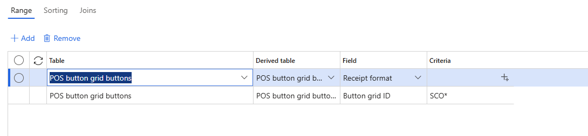
    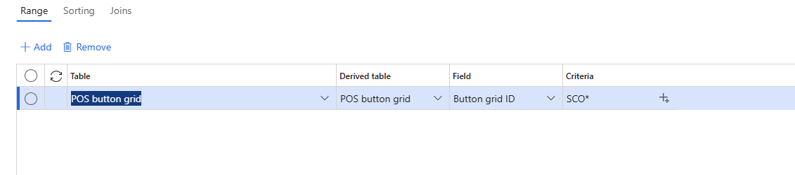
    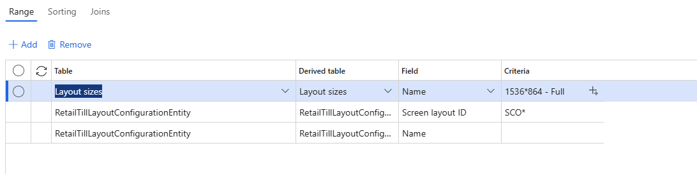
    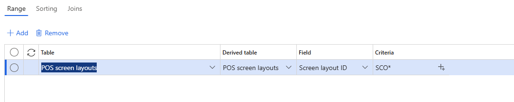
    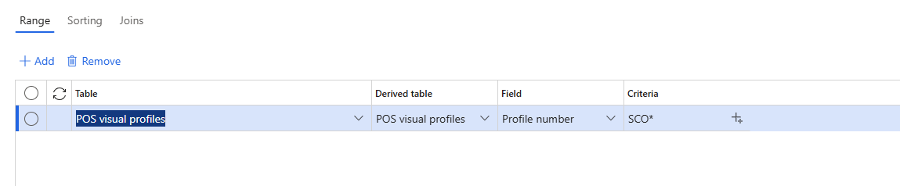

1. If you want to filter for a specific range of images, follow these steps:
    1. For the **POS layout images** entity, in the **Filter** column, select the funnel symbol.
    1. In the **Inquiry** dialog, for the entity where the **Field** value is **Image ID**, in the **Criteria** column, enter a number range for the image IDs in the format \<Image ID start\>..\<Image ID end\> (for example "60000..60026"), and then select **OK**. For this example, the selection exports all images with image IDs from 60000 to 600026.

    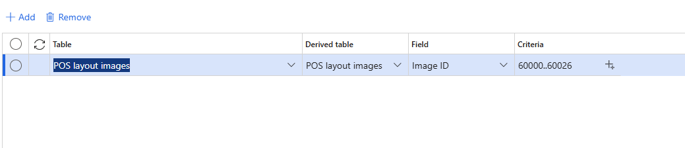

### Add related tables

If additional filters are needed you can also add related tables . Example Add layout sizes to export only a particular size or sizes from selected list of layouts.
To do this you would need to add Layout size in the entity through a table join.
- Select **POS screen layout button grid zones** , **POS screen layout image zones** and 
  **Retailtilllayoutconfigurationentity** one at a time.
- Select **filter** on the row and select **joins** tab
- Highlight the entity and select **+Add table join**
- Select **Layout sizes (Name)**
- Select **Select** to confirm and select **OK**
- Repeat this for the other 2 entities.
- Go to each of the three entities, select **filter**
- Then **+Add** and from the drop-down select **Layout sizes** on the table column.
- Select **Name** on the field column and input the layout size in the criteria (Example **1536*864-Full**). This will 
  only export this layout size.

  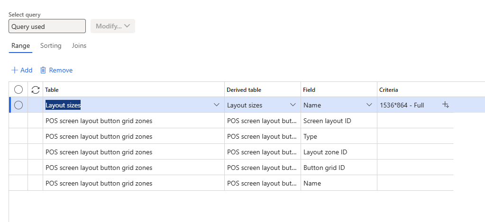

### Export and download package

  Once all of the entities are updated with right filters, you can select **export** from the top menu bar. This will 
  initiate a batch job.

  Once the batch job is complete, verify the status of all the entities which should be **successful**.
  Now select **download package** to download the xml package on to your machine. Verify the package contens from the 
  download location.
  
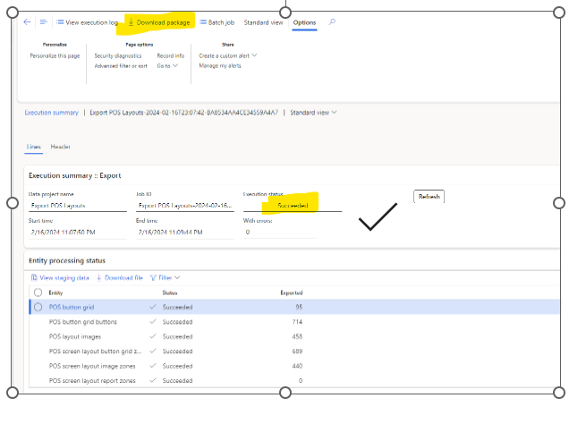

## Import screen layout data in a new environment

To import screen layout data from the export, follow the steps below.

 - In the new environment headquarters , go to **Data management** and select **Import**.
 - Provide a group name **Import POS layouts** and select **Add file** under selected entities.
 - Select **Package** on **source data format**.
 - Choose the package from where you downloaded and select **upload and add** and **close**.
   
  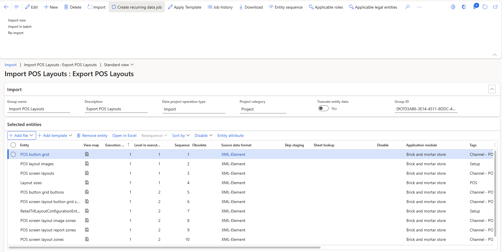
   
 - Once the entities are loaded select **entity sequence**.
 - Select **auto sequence** to sequence the entities considering the dependencies and select **OK**.

   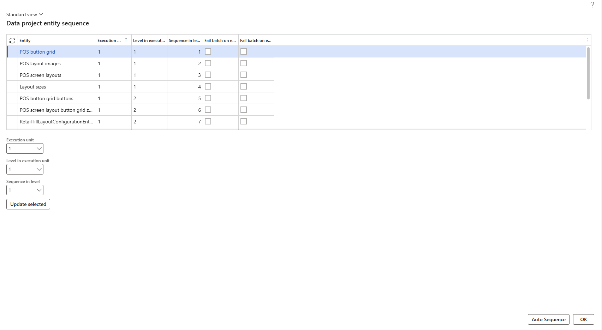
   
 - Select **Import** from the top menu bar.
 - Verify the **Execution summary** and ensure that the status for all entities is **Succeeded**.
 - Verify the screen layouts, button grids and visual profiles are now updated.
 - Run scheduler jobs after assigning the layouts to the store, register or user level.
 - Sign in to the point of sale and verify the layouts.

    

  

[!INCLUDE[footer-include](../includes/footer-banner.md)]

    

    
    
    
