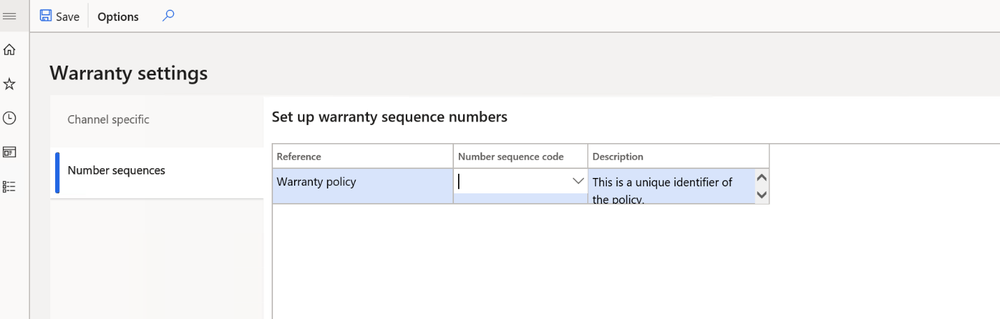
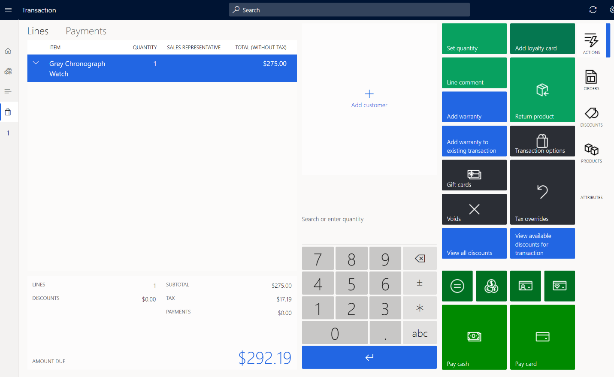

---
# required metadata

title: Create and configure extended warranties 
description: This topic covers extended warranties and describes how to create and configure them in Microsoft Dynamics 365 Commerce.
author:  sijoshi
manager: annbe
ms.date: 06/08/2020
ms.topic: article
ms.prod: 
ms.service: dynamics-365-commerce
ms.technology: 

# optional metadata

# ms.search.form: 
# ROBOTS: 
audience: Application User
# ms.devlang: 
ms.reviewer: v-chgri
ms.search.scope: Retail, Core, Operations
# ms.tgt_pltfrm: 
ms.custom: 
ms.assetid: 
ms.search.region: Global
ms.search.industry: 
ms.author: sijoshi
ms.search.validFrom: 2019-10-31
ms.dyn365.ops.version: 
---

# Create and configure extended warranties

This topic covers extended warranties and describes how to create and configure them in Microsoft Dynamics 365 Commerce.

## Overview

Customers are increasingly opting for extended support and services when they buy products, especially for consumer products that sell at a premium price point like phones and computers. For a retailer, providing extended warranties for purchase can help build customer loyalty. With extended warranties, customers know where to go for service and support and can have confidence that their issues will be handled effectively.

Extended warranties can be sold to customers in the retail channel during the initial product purchase, or for a limited time period after the initial purchase. 

### Warranty item setup

Dynamics 365 Commerce provides the functionality to create a warranty item and set attributes for it including the association between a product and warranty item, the price of the warranty, the warranty duration, and more. Once a warranty item is configured and released to the organizational unit, a retailer will then be able to sell warranties through Modern Point of Sale (MPOS), online stores, and other retail channels.

### Warranty item sales

Extended warranties are sold in a retail channel during the initial product purchase, or for a limited time after the initial purchase. At the point of sale (POS), a sales associate will be prompted to add an extended warranty when a related product is added to a customer's cart. This presents an upsell or cross-sell opportunity to the sales associate as part of the sales flow. A customer can also return at a later time and buy an extended warranty for a previously-purchased product. In this case, a sales associate can then look up the original transaction and sell the customer the related extended warranty item.

### Warranty terminology

The following table contains descriptions for warranty terms.

| TERM | DESCRIPTION |
|------------------------------|--------------|
| Extended warranty / Warranty | An *extended warranty* refers to a service agreement or contract that provides a prolonged *warranty* to customers. The extended warranty includes the additional service of replacing or repairing goods that fail within the extended warranty coverage time period.|                                                                                         
| Manufacturer's warranty | A *manufacturer's warranty* (often called a limited warranty) is the warranty a customer receives when they purchase a product. Some features of a manufacturer's warranty are:   <ul><li>The warranty cost is included in the cost of the product. Customers don't have to pay any additional amount for a manufacturer's warranty.</li><li>Depending on the product category, a manufacturer's warranty generally lasts for 30 days, 6 months, or 1 year. (For most consumer electronics, the warranty lasts for 1 year).</li><li>The warranty covers any defects caused by mechanical or electrical failures. Coverage is limited, and it does not include any accidental damage to the purchased product. If a customer wants to protect their purchased product from everyday damages, they should invest in an extended warranty, which lasts for 2-10 years depending on the product category. Extended warranties have wider coverage and cover everyday mishaps such as drops, spills, and stains.</li></ul> |
| Warranty item | A *warranty item* is an extended warranty item sold for a warrantable item, for example a 2-year accidental protection plan for laptops. | 
| Warrantable item | A *warrantable item* is a serialized product for which a warranty is being sold. For example, a laptop is a warrantable item for which 2-year and 3-year extended warranties are sold. |
| Warranty group | A *warranty group* is a relationship between warranty items and warrantable items. This association is used by POS to determine which warranty items should be prompted when a warrantable item is added to a customer's cart. |
| Warranty policy | A *warranty policy* is an entity created in Commerce when a warranty policy is sold. A warranty policy includes information such as the purchased warranty item's start and end dates, terms and conditions, and the serial number of the warranted product. The warranty policy number can be shared with the customer to give them a reference for the purchased extended warranty item. |

## Create a warranty item

To create a warranty item in Commerce, follow these steps.

1. Go to **Products and categories \> Products**.
1. Select **+New** to create a new warranty item.
1. For **Product type**, select **Service** from the drop down menu.
1. For **Product subtype**, select **Product**.
1. For **Product service type**, select **Service**.
1. For **Product name**, enter the product name.
1. For **Retail category**, select a value from the drop down menu, and then select **OK**.
1. For **Product number**, enter the product number.
1. Select **OK**.
1. On the **Warranty** FastTab, enter values for **Unit of time** and **Length of time**. (See the table below for descriptions of the time properties on the **Warranty** FastTab.)
1. On the Action Pane, select **Save** to save the warranty item.
1. Release the warranty product to the company to be able to sell it. For more information, see [Set up retail products](set-up-retail-products.md).
1. On the **Warranty** FastTab of the **Released product details** page, enter values for **Price range base**, **Lower limit**, and **Upper Limit**. (See the table below for descriptions of the time properties on the **Released product details** page.)
1. Assort the warranty item to the channel where it will be sold. For more information, see [Set up assortments](set-up-assortments.md).

The following table contains values and descriptions for the time properties on the **Warranty** FastTab.

| **Property name** | **Values** | **Description** |
|-------------------|------------|-----------------|
| Unit of time | Day(s), Week(s), Month(s), Year(s) | This value specifies the unit of time to be used for the warranty. |
| Length of time | Positive integer value | This value specifies the duration of the warranty (for example, the values for a 2-year warranty would be **Unit of time** = **Year(s)** and **Length of time** = **2**). |

The following image shows an example of the time properties on the **Warranty** FastTab.

The following table contains values and descriptions for the time properties on the **Released product details** page.

| **Property name** | **Values** | **Description** |
|-------------------|------------|-----------------|
| Price range base | None, Base price, Selling price | <ul><li>**None** – Price ranges "Lower Limit" and "Upper Limit" are not applicable.</li><li>**Base Price** - A particular warranty will be applicable if the base price (the price without discounts) of the warrantable item falls between upper and lower limits specified here based on price of the warrantable item.</li><li>**Selling price** - Reserved for future use.</li></ul> | 
| Lower limit, Upper limit | Positive integer value | These properties specify the upper and lower price limits of the warrantable item in company currency. These limits can be based on the warrantable item's base price (also known as the manufacturer's suggested retail price, or MSRP). |

The following image shows an example of the price range properties on the **Released product details** page. 

## Configure channel-specific settings

Configuring channel-specific settings enables the prompt to add a warranty item when a warrantable item is added to the cart at the POS.

To configure channel-specific setting in Commerce, follow these steps.

1. Go to **Products and categories \> Warranty \> Warranty settings\> Channel specific**.
1. In the **Prompt for warranty** column for your channel, do one of the following:
    - Select the check box to enable the warranty item prompt. When enabled, a prompt for the warranty item will be sent when the warrantable item is added to the cart.
    - Clear the check box to disable the warranty item prompt. When disabled, no prompt for the warranty item will be sent when the warrantable item is added to the cart.
1. Run the **1070** job to sync the data to the channel.

## Configure the warranty policy number sequence

The warranty policy number sequence is a unique identifier of the policy. For more information on number sequences, see [Number sequences overview](./fin-ops-core/fin-ops/organization-administration/number-sequence-overview.md).

To configure the warranty policy number sequence in Commerce, follow these steps.

1. Go to **Products and categories \> Warranty \> Warranty settings \> Number sequences**.
1. Under **Number sequence code**, select a value from the drop down menu. 

The following image shows the **Number sequence code** field under **Warranty settings**.

## Set up a warranty group

A warranty group is a relationship between warranty items and warrantable items that is used at the POS to determine which warranty items should be prompted when a warrantable item is added to a customer's cart.

To set up a warranty group in Commerce, follow these steps.

1. Go to **Retail and Commerce \> Products and categories \>Warranty \> Warranty groups**.
1. Select **+New** to create a new warranty group.
1. Under **Name**, enter a name for the new group.
1. Under **Description**, enter a description for the new group.
1. On the **Warranty products** FastTab, select **+Add line** to add a warranty item.
1. Under **Display order**, enter a number to rank the warrant group at the POS, which will display warranty products in ascending order at the warranty prompt.
1. On the **Warrantable products** FastTab, select **+Add line** to add warrantable products.
1. If the warranty item is to be applicable to an warrantable products entire category, under **Category** select a category from the drop down menu.
1. Under **Product**, select the warrantable product for which the warranty item is applicable.
1. On the **Applicable channels** FastTab, select **+Add line** to add the channel where you want to sell the warranty item.
1. Select **Save** to save the configuration.
1. Select **Publish** to publish the warranty group.
1. Run the **1040** job to sync the data to channel.

## Sell warranty items at the POS

Two POS features enable sales associates to sell warranty item during the customer purchase workflow.

- **Add warranty** - The **Add Warranty** feature triggers a prompt that displays applicable warranties for a warrantable item that is in the cart.

- **Add warranty to existing transaction** - The **Add Warranty to existing transaction** feature enables sales associates to sell warranties for warrantable items sold previously. The original transaction can be found by entering the receipt number of the original warrantable item transaction.

The following image shows an example of a POS terminal screen for a purchase.

The following image shows an example of a prompt to add a warranty item on a POS terminal screen for a current purchase.

The following image shows an example of the "add warranty to existing transaction" feature on a POS terminal screen for a warrantable item sold previously. 

## Process warranty transactions

For warranties added in cash and carry transactions, sales associates must proceed through statement posting so that the transactions are posted in Commerce headquarters. Then Commerce users can go to **Retail and Commerce \> Products and categories \> Warranty \> Process warranty transactions** to run the "Process warranty transactions" job that will process warranty transactions and create warranty policy.

## Warranty policies

Once an extended warranty is sold, a warranty policy entity will be created. The warranty policy number can be shared to the customer to give them a reference for the extended warranty purchased. The warranty policy will include the start date, end date, terms and conditions, serial number of the item, and more for the warranty sold.

Warranty Policy details

*PolicyNumber - string (20)*
*WarrantiedItemId - string (20)*
*WarrantiedInventoryLotId - string (20)*
*WarrantiedSerialNumber - string (20)*
*WarrantiedFulfilledDate - Date*
*WarrantyItemId - string (20)*
*WarrantyInventoryLotId - string (20)*
*WarrantySalesDate - Date*
*WarrantyEffectiveDate - Date*
*WarrantyExpirationDate - Date*
*CustAccount - string (20)*
*Status - enum (Created / Voided / Effective / Expired)*
*Notes - string (255)*-->

## Frequently asked questions (FAQs)

**Why don't I see warranty prompt in POS?**

Check if the warranty product is assorted to the channel. In Retail and Commerce, check if the warranty group is configured to include the relevant channel.

**When trying to add a warranty to existing transaction and entering the customer order receipt number, I don't see any lines**.

Run a pull job (P-Job) to upload the receipts to headquarters, which is required for the receipt to be found.

**Why is the warranty feature only applicable for serialized products?**

A warranty is a service provided for a specific, unique product. In Dynamics 365, a product can only be uniquely identified with a serial number.

## Additional resources

[Set up retail products](set-up-retail-products.md)

[Set up assortments](set-up-assortments.md)

[Number sequences overview](./fin-ops-core/fin-ops/organization-administration/number-sequence-overview.md)

