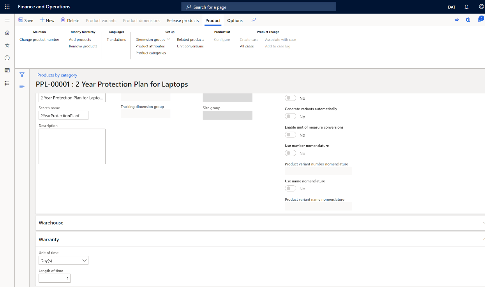
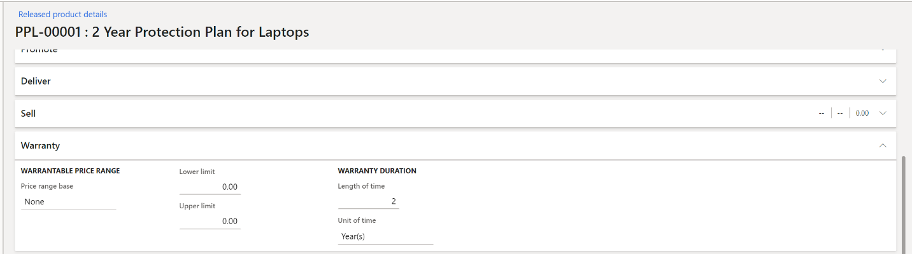
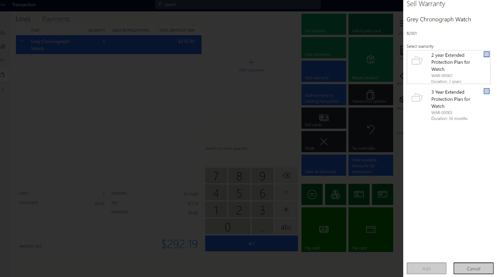
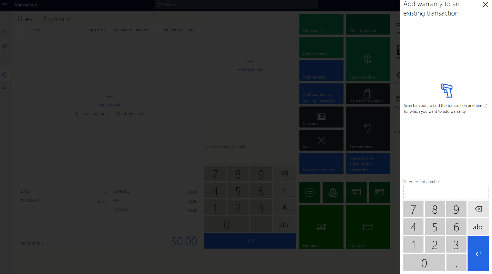

# Create and configure extended warranties

[!include [banner](includes/banner.md)]

This article covers extended warranties and describes how to create and configure them in Microsoft Dynamics 365 Commerce.

## Overview

Customers are increasingly choosing extended support and services when they buy products, especially consumer products that are sold at a premium price point, such as phones and computers. By providing extended warranties for purchase, retailers can help build customer loyalty. Extended warranties let customers know where they can go for service and support. Therefore, they can have confidence that their issues will be handled effectively.

Extended warranties can be sold to customers in a retail channel during the initial product purchase. They can also be sold for a limited time after the initial purchase.

### Warranty item setup

Dynamics 365 Commerce provides functionality that lets you create a warranty item and set attributes for it. These attributes include the association between a product and a warranty item, the price of the warranty, and the duration of the warranty. After a warranty item is configured and released to the organizational unit, a retailer can sell warranties through the Store Commerce point-of-sale, online stores, and other retail channels.

### Warranty item sales

Extended warranties are sold in a retail channel during the initial product purchase. They can also be sold for a limited time after the initial purchase.

At the point of sale (POS), sales associates are prompted to add an extended warranty when a related product is added to a customer's cart. Therefore, an upsell or cross-sell opportunity is presented to sales associates as part of the sales flow.

Customers can also return later and buy an extended warranty for a product that they previously purchased. In these cases, a sales associate can look up the original transaction and sell the customer the related extended warranty item.

### Warranty terminology

The following table defines some warranty-related terms.

| Term | Description |
|------------------------------|--------------|
| Extended warranty/Warranty | An *extended warranty* refers to a service agreement or contract that provides a prolonged warranty to customers. The extended warranty includes the additional service of replacing or repairing goods during the extended warranty's coverage period. |
| Manufacturer's warranty | A *manufacturer's warranty* (often referred to as a *limited warranty*) is the warranty that customers receive when they purchase a product. Here are some features of a manufacturer's warranty:<ul><li>The warranty cost is included in the cost of the product. Customers don't have to pay any additional amount for a manufacturer's warranty.</li><li>Depending on the product category, a manufacturer's warranty typically lasts 30 days, six months, or one year. (For most consumer electronics, the warranty lasts one year).</li><li>The warranty covers any defects that are caused by mechanical or electrical failures. Coverage is limited, and it doesn't include any accidental damage to the purchased product. Customers who want to protect the products that they purchase from everyday damages should invest in an extended warranty. Extended warranties last two to ten years, depending on the product category. They also have wider coverage and cover everyday mishaps such as drops, spills, and stains.</li></ul> |
| Warranty item | A *warranty item* is an extended warranty item that is sold for a warrantable item. An example is a two-year accidental protection plan for laptops. |
| Warrantable item | A *warrantable item* is a serialized product that a warranty is sold for. For example, a laptop is a warrantable item that two-year and three-year extended warranties are sold for. |
| Warranty group | A *warranty group* is a relationship between warranty items and warrantable items. The POS uses warranty groups to determine which warranty items sales associates should be prompted to add when a warrantable item is added to a customer's cart. |
| Warranty policy | A *warranty policy* is an entity that is created in Commerce when a warranty policy is sold. A warranty policy includes information such as the start and end dates of the purchased warranty item, terms and conditions, and the serial number of the warranted product. Warranty policy numbers can be shared with customers, so that they have a reference for the extended warranty item that they purchased. |

## Create a warranty item

To create a warranty item in Commerce, follow these steps.

1. Go to **Retail and Commerce \> Products and categories \> Products**.
1. Select **New** to create a warranty item.
1. In the **New product** dialog box, in the **Product type** field, select **Service**.
1. In the **Product subtype** field, select **Product**.
1. In the **Product service type** field, select **Warranty**.
1. In the **Product name** field, enter the product name.
1. In the **Retail category** field, select a value in the drop-down dialog box, and then select **OK**.
1. In the **Product number**, enter the product number.
1. Select **OK**.
1. On the **Product details** page, on the **Warranty** FastTab, set the **Unit of time** and **Length of time** fields.

    | Field name | Value | Description |
    |------------|-------|-------------|
    | Unit of time | **Day(s)**, **Week(s)**, **Month(s)**, or **Year(s)** | This field specifies the unit of time that is used for the warranty. |
    | Length of time | A positive integer value | This field specifies the duration of the warranty in the selected unit of time. |

    For example, for a two-year warranty, set the **Unit of time** field to **Year(s)** and the **Length of time** field to **2**. Alternatively, set the set the **Unit of time** field to **Month(s)** and the **Length of time** field to **24**, as shown in the following illustration.

    

1. Select **Save** to save the warranty item.
1. Release the warranty product to the company so that it can be sold. For more information, see [Set up retail products](set-up-retail-products.md).
1. On the **Released product details** page, on the **Warranty** FastTab, set the **Price range base**, **Lower limit**, and **Upper limit** fields.

    | Field name | Value | Description |
    |------------|-------|-------------|
    | Price range base | **None**, **Base price**, or **Selling price** | <ul><li>**None** – The **Lower limit** and **Upper limit** values of price ranges aren't applicable.</li><li>**Base price** – A given warranty will be applicable if the base price (that is, the price without discounts) of the warrantable item is between the **Lower limit** and **Upper limit** values that are specified here, based on the price of the warrantable item.</li><li>**Selling price** – This value is reserved for future use.</li></ul> |
    | Lower limit, Upper limit | A positive integer value | These fields define the upper and lower price limits of the warrantable item, and how the current warranty item is applicable to the warrantable item. These limits can be based on the warrantable item's base price (also known as the manufacturer's suggested retail price \[MSRP\]). If the **Price range base** field is set to **Base price**, only a warrantable item (product) that has a base price between the **Lower limit** and **Upper limit** values will trigger a prompt to add the warranty item at the POS. |

    For example, the following illustration shows the **Price range base** field set to **Base price**, the **Lower limit** field set to $500, and the **Upper limit** field set to $1000.
    
    

1. Assort the warranty item to the channel where it will be sold. For more information, see [Set up assortments](set-up-assortments.md).

### Example

A laptop warrantable item (product) has a base price $999, and there are two laptop warranty items:

- Warranty\_1 has a lower limit of $500 and an upper limit of $1,000, and the **Price range base** field is set to **Base price**.
- Warranty\_2 has a lower limit of $1,001 and upper limit of $2,000, and the **Price range base** field is set to **Base price**.

In this case, when the laptop warrantable item is added to a customer's cart, a prompt to add Warranty\_1 will be shown at the POS, because the price of the laptop is between the lower and upper limits for Warranty\_1.

> [!NOTE]
> For this example, if you want prompts to be shown for both Warranty\_1 and Warranty\_2, regardless of the price of the warrantable item, set the **Price range base** field to **None**.

## Configure channel-specific settings

Channel-specific settings let you specify whether a prompt to add a warranty item should be shown at the POS when a warrantable item is added to a customer's cart.

To configure channel-specific setting in Commerce, follow these steps.

1. Go to **Retail and Commerce \> Products and categories \> Warranty \> Warranty settings**.
1. On the **Channel specific** tab, in the **Prompt for warranty** column for your channel, follow one of these steps:

    - Select the check box if a prompt for the warranty item should be shown at the POS when the warrantable item is added to the cart.
    - Clear the check box if no prompt for the warranty item should be shown at the POS when the warrantable item is added to the cart.

1. Run the **1070** job to sync the data to the channel.

## Configure a number sequence for warranty policies

Each warranty policy is uniquely identified by a warranty policy number that is generated by a number sequence. For more information about number sequences, see [Number sequences overview](../fin-ops-core/fin-ops/organization-administration/number-sequence-overview.md).

To configure a number sequence for warranty policies in Commerce, follow these steps.

1. Go to **Retail and Commerce \> Products and categories \> Warranty \> Warranty settings**.
1. On the **Number sequences** tab, in the row for the **Warranty policy** reference, enter or select a value in the **Number sequence code** field.

## Set up a warranty group

A warranty group is a relationship between warranty items and warrantable items. The POS uses warranty groups to determine which warranty items sales associates should be prompted to add when a warrantable item is added to a customer's cart.

To set up a warranty group in Commerce, follow these steps.

1. Go to **Retail and Commerce \> Products and categories \> Warranty \> Warranty groups**.
1. Select **New** to create a warranty group.
1. In the **Name** field, enter a name for the new group.
1. On the **General** FastTab, in the **Description** field, enter a description of the group.
1. On the **Warranty products** FastTab, select **Add line** to add a warranty item.
1. In the **Display order** field, enter a number to rank the warranty group at the POS. The POS will show warranty items in order of ascending rank in the warranty prompt.
1. On the **Warrantable products** FastTab, select **Add line** to add warrantable products.
1. If the warranty item is applicable to a whole category of warrantable items (products), select the category in the **Category** field. If the warranty item is applicable to a specific warrantable item (product), select the product in the **Product** field.
1. On the **Applicable channels** FastTab, select **Add line** to add the channel where you want to sell the warranty item.
1. Select **Save** to save the configuration.
1. Select **Publish** to publish the warranty group.
1. Run the **1040** job to sync the data to channel.

## Sell warranty items at the POS

Two POS operations let sales associates sell warranty items during the workflow for customer purchases:

- **Add warranty** – This operation triggers a prompt that shows applicable warranties for a warrantable item that is selected in the cart.
- **Add warranty to existing transaction** – This operation lets sales associates sell warranties for warrantable items that were previously sold. Sales associates can find the original transaction for a warrantable item by entering the receipt number of the transaction.

The following illustration shows an example of a a POS terminal page with a prompt to add a warranty item for the current purchase of a warrantable item.

The following illustration shows an example of the feature for adding a warranty item for a warrantable item that was previously sold.

## Process warranty transactions

When warranties are sold in cash-and-carry transactions, after the transactions are posted in Commerce headquarters, Commerce users can run the **Process warranty transactions** job to process the warranty transactions and create warranty policies.

To process warranty transactions in Commerce headquarters, follow these steps.

1. Go to **Retail and Commerce \> Products and categories \> Warranty \> Process warranty transactions**.
1. In the **Choose organization nodes** dialog box, in the **Organizational hierarchy** field, select a value.
1. In the **Available organization nodes** list, select either an individual store or, if you want to create the batch job for a group of stores, a node.
1. Select the right arrow button to add your selection to the **Selected organization nodes** list.
1. Select the **Run in the background** tab.
1. Set the **Batch processing** option to **Yes**, and then select **Recurrence**.
1. In the **Define recurrence** dialog box, in the **Start date** field, select or enter a start date for the recurrence.
1. In the **Start time** field, select or enter a start time for the recurrence.
1. Follow one of these steps:

    - Select the **No end date** option if the recurrence should never end.
    - Select the **End after** option if the recurrence should end after a specific number of runs. If you select this option, enter the number of runs.
    - Select the **End by** option if the recurrence should end by a specific date. If you select this option, select or enter the date.

1. Select **OK**.
1. Select **OK**.

## Warranty policies

When an extended warranty is sold, a warranty policy entity is automatically created. Warranty policy numbers can be shared with customers, so that they have a reference for the warranty item that they purchased. The properties of warranty policies include the effective start date and expiration date of the warranty, terms and conditions, and the serial number of the warrantable item that the warranty was sold for.

> [!NOTE]
> Warranty policy properties are automatically generated when warranty policy entities are created. Currently, they can't be manually configured or edited.

The following table describes the warranty policy properties and their values. In Commerce headquarters, the database table is named WARRANTYPOLICY.

| Property name | Value | Description |
|---------------|-------|-------------|
| PolicyNumber | A character string (maximum of 20 characters) | The warranty policy number |
| WarrantiedItemId | A character string (maximum of 20 characters) | The ID of the warrantable item |
| WarrantiedInventoryLotId | A character string (maximum of 20 characters) | The inventory lot ID of the warrantable item |
| WarrantiedSerialNumber | A character string (maximum of 20 characters) | The serial number of the warrantable item |
| WarrantiedFulfilledDate | A date | The fulfillment date of the warrantable item |
| WarrantyItemId | A character string (maximum of 20 characters) | The ID of the warranty item |
| WarrantyInventoryLotId | A character string (maximum of 20 characters) | The inventory lot ID of the warranty item |
| WarrantySalesDate | A date | The sale date of the warranty item |
| WarrantyEffectiveDate | A date | The effective date of the warranty policy |
| WarrantyExpirationDate | A date | The expiration date of the warranty policy |
| CustAccount | A character string (maximum of 20 characters) | The customer account number |
| Status | **Created**, **Voided**, **Effective**, or **Expired** | The status of the warranty policy |
| Notes | A character string (a maximum of 255 characters) | Notes about the warranty policy, such as terms and conditions |

## Frequently asked questions (FAQ)

**Why don't I see a warranty prompt in the POS?**

Make sure that the warranty item is assorted to the channel. Also make sure that the warranty group is configured so that it includes the relevant channel.

**When I try to add a warranty to an existing transaction and enter the customer order receipt number, why don't I see any transaction line items?**

Receipts can be found only if a pull job (P-job) is run to upload the receipts to Commerce headquarters. To run the P-job, go to **Retail and Commerce \> Retail and Commerce IT \> Distribution schedule**, select the **P-0001** job, and then select **Run now**.

**Why is the warranty feature applicable only to serialized products?**

A warranty is a service that is provided for a specific, unique product. In Dynamics 365, a product can be uniquely identified only by a serial number.

## Additional resources

[Set up retail products](set-up-retail-products.md)

[Set up assortments](set-up-assortments.md)

[Number sequences overview](../fin-ops-core/fin-ops/organization-administration/number-sequence-overview.md)

[!INCLUDE[footer-include](../includes/footer-banner.md)]
