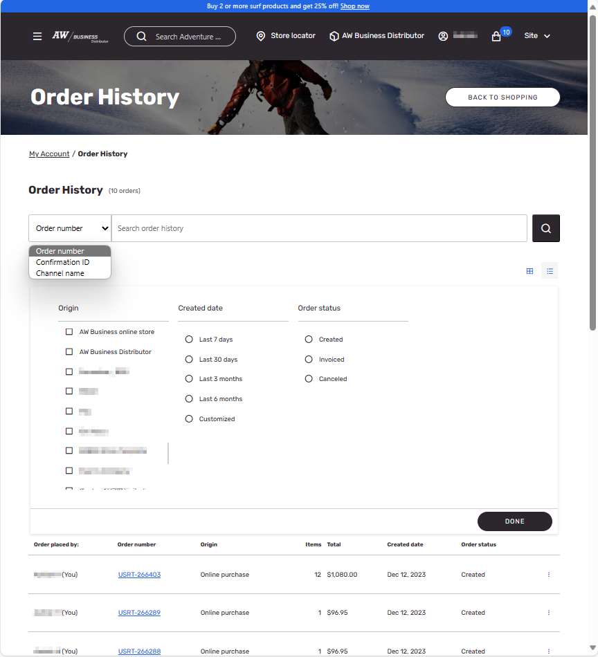
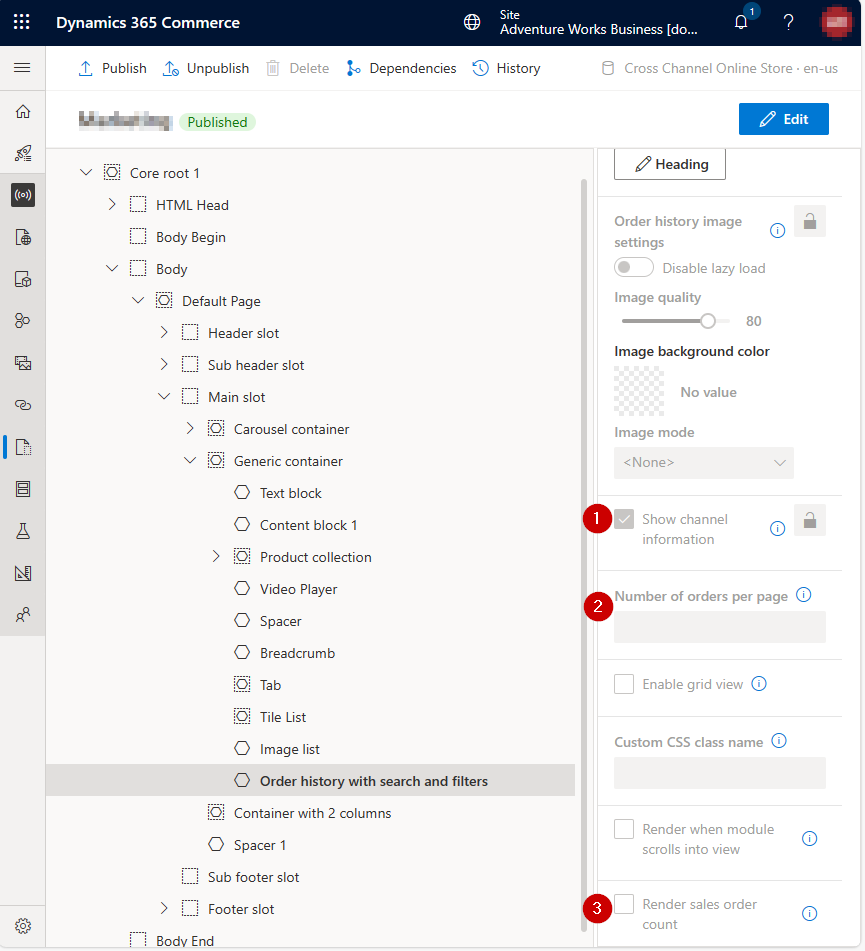
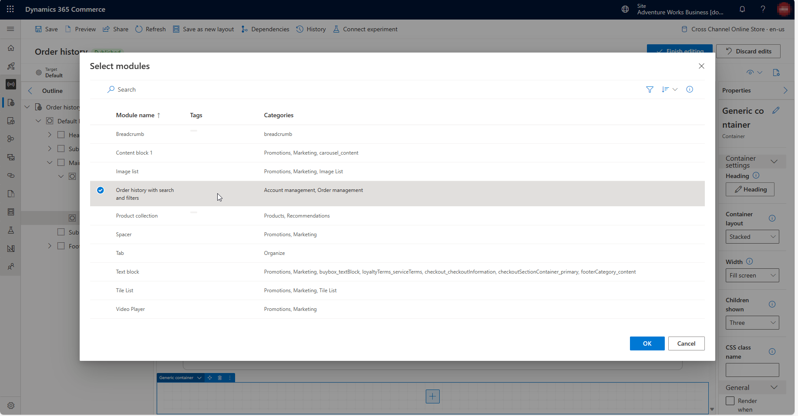

# Order history with search and filters module on your eCommerce site

## Overview
The ‘Order history with search and filters’ module is a feature that enhances the user experience of your ecommerce website by allowing your shoppers to quickly locate their orders using various search and filter options. This module also provides a clear and organized view of the order details, such as order number, order confirmation number, order date, channel origin, order status, order total, and a link to view order details.

## How it works
The ‘Order history with search and filters’ module works as follows:

- The module is displayed on the user’s account page, under the ‘Order history’ section
- The user can enter the order confirmation number, order number, or origin channel to search for orders in the search box
- The user can also apply filters by order date, channel origin, and order status in the filter panel
- The user can also sort the orders by order placed date or order confirmed date in the sort button
- The module displays the order details in a grid or list form, with one row per order
- The user can click on the link to view order details to see more information about the order, such as items, shipping, payment, and other details.

## How to add module of order history with search and filters to your page

To add the module of order history with search and filters to your page, you need to make sure that your webpage template has a ‘Generic Container’ element that can contain this module. 

Then, you can add the module of order history with search and filters into the ‘Generic Container’ element to your order history page DOM structure.

You can configure the following module properties either at a template level or at a page level - 

1. Show channel information - Allow you to show channel information associated with each order. 
2. Number of orders per page - Defines number of orders that will be shown on a single page of order history. 
3. Render sales order count - Enabling this property will show the total count of the orders. 
4. Enable grid view - Enabling this property will allow users to switch between the list or grid view when viewing order history. 

