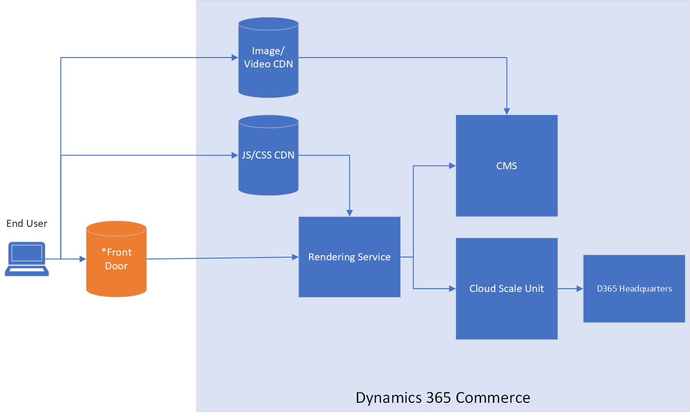

---
# required metadata

title: Content delivery network implementation options
description: This topic reviews the different content delivery network (CDN) implementations options that can be used with Dynamics 365 Commerce.
author: BrianShook
manager: AnnBe
ms.date: 12/08/2020
ms.topic: article
ms.prod: 
ms.service: dynamics-365-commerce
ms.technology: 

# optional metadata

# ms.search.form: 
audience: Application User
# ms.devlang: 
ms.reviewer: v-chgri
ms.search.scope: Core, Operations, Retail
# ms.tgt_pltfrm: 
ms.custom: 
ms.assetid:
ms.search.region: Global
# ms.search.industry:
ms.author: brshoo
ms.search.validFrom: 2020-11-01
ms.dyn365.ops.version: 10.0.14

---

# Content delivery network implementation options

[!include [banner](includes/banner.md)]

This topic presents the pros and cons of the different content delivery network (CDN) implementation options that can be used with Dynamics 365 Commerce environments, including both native Commerce and customer-owned instances of Azure Front Door.

Dynamics 365 Commerce customers have options when considering which CDN service to use with their Commerce environment. Commerce ships with basic Azure Front Door support that covers basic hosting and custom domain requirements. For companies looking for greater control and more specific security abilities such as web application firewall (WAF), using a customer-owned Azure Front Door instance or an external CDN may be the best options. 

The three CDN options that can be used with Dynamics 365 Commerce environments are:

- The Dynamics 365 Commerce Azure Front Door instance.
- A customer-owned Azure Front Door instance (for increased control and additional security features).
- An external CDN service.

Only custom domain dynamic HTML content is delivered using these CDN options. Commerce automatically handles all JavaScript, Cascading Style Sheets (CSS), images, video, and other static content through Microsoft-managed CDNs. The CDN option chosen determines the operational, control, and additional security capabilities.

The following illustration shows an overview of how Dynamics 365 Commerce interacts with a CDN. 

For more information on setting up an Azure Front Door instance for your Commerce site, see [Add CDN Support](add-cdn-support.md).

## Use a Dynamics 365 Commerce Azure Front Door instance

The Azure Front Door instance provided by Dynamics 365 Commerce, and is hosted by the Commerce team.

<!--
| Pros | Cons |
| ---- | ---- |
| - Built-in to Commerce cost
- Managed by Commerce team (lower touch, shared setup steps required)
- Azure hosted infrastructure is scalable, secure, reliable.
- Secure Sockets Layer (SSL) certificate is one-time setup and autorenewed.
- Monitored by the Commerce team for errors and anomalies. | - WAF not supported
- No specific customizations or setting adjustments
- Dependent upon Commerce Team for updates/changes
- Separate AFD needed for apex domain and need extra work for apex domain with Azure DNS integration
- No telemetry to customer (on RPS/Error rate) |
-->

### Pros of using a Dynamics 365 Commerce Azure Front Door instance

- Built-in to Commerce cost
- Managed by Commerce team (lower touch, shared setup steps required)
- Azure hosted infrastructure is scalable, secure, reliable.
- Secure Sockets Layer (SSL) certificate is one-time setup and autorenewed.
- Monitored by the Commerce team for errors and anomalies.

### Cons of using a Dynamics 365 Commerce Azure Front Door instance

- WAF not supported
- No specific customizations or setting adjustments
- Dependent upon Commerce Team for updates/changes
- Separate AFD needed for apex domain and need extra work for apex domain with Azure DNS integration
- No telemetry to customer (on RPS/Error rate)

<!--
<table>
 <tbody>
   <tr>
     <th>Description</th>
     <th>Pros</th>
     <th>Cons</th>
   </tr>
   <tr>
      <td>The Dynamics 365 Commerce provided Frontdoor. This is Azure Front Door hosted by Commerce Team.</td>
      <td>
       <ul>
        <li>Built-in to Commerce Cost</li>
        <li>Managed by Commerce Team (lower touch, shared setup steps required)</li>
        <li>Azure hosted infrastructure is scalable, secure, reliable</li>
        <li>SSL Cert is one-time setup and auto-renewed</li>
        <li>Monitored by Commerce Team for errors and anomalies</li>
       </ul>
      </td>
      <td>
        <ul>
         <li>WAF not supported</li>
         <li>No specific customizations or setting adjustments</li>
         <li>Dependent upon Commerce Team for updates/changes</li>
         <li>Separate AFD needed for apex domain and need extra work for apex domain with Azure DNS integration</li>
        <li>No telemetry to customer (on RPS/Error rate)</li>
       </ul>
     </td>
   </tr>
 </tbody>
</table>
-->
The following illustration shows the architecture of the Commerce-provided Azure Front Door instance.

 

## Use a customer-owned Azure Front Door instance

Subscribe to Azure Front Door within your Azure Subscription.

### Pros of using a customer-owned Azure Front Door instance

- Secure, easy to manage setup and secure
- Azure hosted infrastructure is scalable, secure, reliable
- Allows for WAF integration and granular rule controls for finer-grade security tuned specifically for your site
- Finer control of SSL Certificates (own cert and AFD managed cert) and domain linking
- Paired directly with AzureDNS offers Apex domain solution
- Telemetry/Alerting
- SSL Cert is one-time setup and auto renewed

### Cons of using a customer-owned Azure Front Door instance

- Self-managed
- Initial knowledge ramp-up needed

<!--
<table>
<tbody>
<tr>
<th>Description</th>
<th>Pros</th>
<th>Cons</th>
</tr>
<tr>
<td>Subscribe to Azure Front Door within your Azure Subscription.</td>
<td>
<ul>
<li>Secure, easy to manage setup and secure</li>
<li>Azure hosted infrastructure is scalable, secure, reliable</li>
<li>Allows for WAF integration and granular rule controls for finer-grade security tuned specifically for your site</li>
<li>Finer control of SSL Certificates (own cert and AFD managed cert) and domain linking</li>
<li>Paired directly with AzureDNS offers Apex domain solution</li>
<li>Telemetry/Alerting</li>
<li>SSL Cert is one-time setup and auto renewed</li>
</ul>
</td>
<td>
<ul>
<li>Self-managed</li>
<li>Initial knowledge ramp-up needed</li>
</ul>
</td>
</tr>
</tbody>
</table>
-->

The following illustration shows the architecture of the customer-owned Azure Front Door instance.

 

## Use an external content delivery network (CDN)

Use an external CDN provider instance to manage your content endpoints.

### Pros of using an external CDN

- This is useful when existing domain is already hosted on external Front Door
- Competitors (e.g. Akamai) might have more WAF capabilities

### Cons of using an external CDN

- Separate contract, additional costing
- SSL might be additional cost
- Separate from Azure cloud structure - an additional infrastructure to manage
- Potentially longer time investments in endpoint setup, security setup
- Self-managed
- Self-monitored

<!--
<table>
<tbody>
<tr>
<th>Description</th>
<th>Pros</th>
<th>Cons</th>
</tr>
<tr>
<td>Use an external CDN provider instance to manage your content endpoints.
(Akamai, cloudfare etc)</td>
<td>
<ul>
<li>This is useful when existing domain is already hosted on external Front Door</li>
<li>Competitors (e.g. Akamai) might have more WAF capabilities</li>
</ul>
</td>
<td>
<ul>
<li>Separate contract, additional costing</li>
<li>SSL might be additional cost</li>
<li>Separate from Azure cloud structure - an additional infrastructure to manage</li>
<li>Potentially longer time investments in endpoint setup, security setup</li>
<li>Self-managed</li>
<li>Self-monitored</li>
</ul>
</td>
</tbody>
</table>

-->

The following illustration shows 

 

## Additional resources

[Add CDN Support](add-cdn-support.md)
