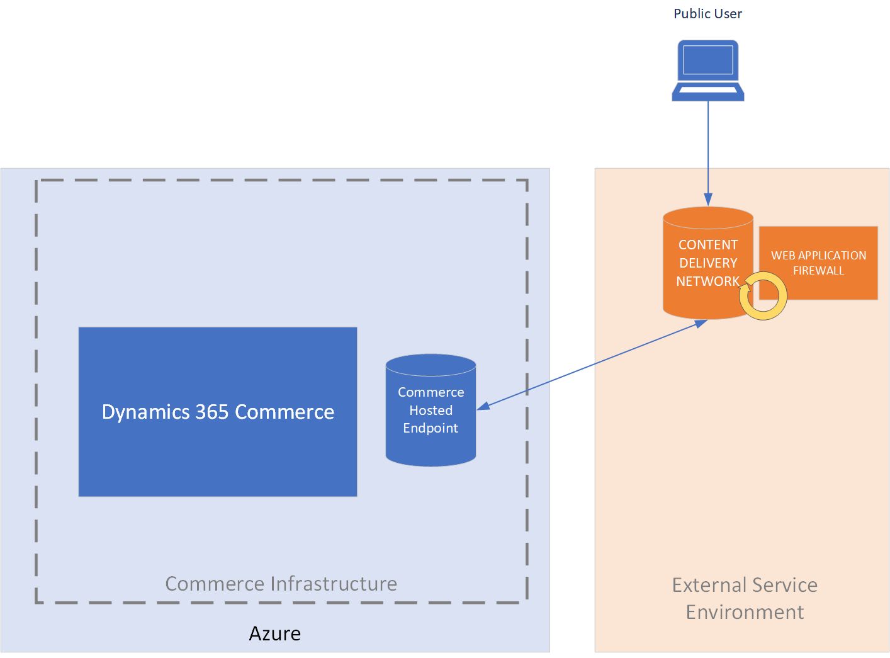

---
# required metadata

title: Dynamics 365 Commerce: Front Door Options Comparison
description: This topic the differences between Front Door options with Dynamics 365 Commerce.
author: BrianShook
manager: AnnBe
ms.date: 11/20/2020
ms.topic: article
ms.prod: 
ms.service: dynamics-365-commerce
ms.technology: 

# optional metadata

# ms.search.form: 
audience: Application User
# ms.devlang: 
ms.reviewer: v-chgri
ms.search.scope: Core, Operations, Retail
# ms.tgt_pltfrm: 
ms.custom: 
ms.assetid:
ms.search.region: Global
# ms.search.industry:
ms.author: brshoo
ms.search.validFrom: 2020-11-01
ms.dyn365.ops.version: 10.0.14

---

# Dynamics 365 Commerce: Front Door Options Comparison

This topic reviews the different options of Front Door set ups which can be used with Dynamics 365 Commerce. The article will review the pros and cons of different Front Door setup approaches.

## Overview

Dynamics 365 Commerce customers have options when considering which Front Door service to use with their Commerce environment. Commerce ships with basic Azure Front Door support which covers basic hosting and custom domain SSL needs. Companies looking for greater control and more specific security abilities like Web Application Firewall (WAF)- utilizing your own instance of Azure Front Door or an external Front Door might prove the best option. 

This document reviews these options and provides a summarized break down of each. It will review the following options:

- A.   Using the **Dynamics 365 Commerce Azure Front Door** instance

- B.   Using your own instance of **Azure Front Door** for increased control and additional security features

- C.    Using an **external Front Door** service

For these scenarios, only html content (which is dynamic content, with custom domain) is relevant to these options. Commerce will automatically handle all JS/CSS/Images/Video and other static content through Microsoft managed CDNs. Different options are provided for the orange box ‘Front Door’ as seen in the diagram above. The Front-End option chosen will affect the operations, control, and additional security capabilities.

For more information in setting up a Front Door for your Commerce site, review the [Add CDN Support](https://docs.microsoft.com/en-us/dynamics365/commerce/add-cdn-support) article.

## Option Comparisons

### Option A : Dynamics 365  Commerce Azure Front Door

<table>
 <tbody>
   <tr>
     <th>Description</th>
     <th>Pros</th>
     <th>Cons</th>
   </tr>
   <tr>
      <td>The Dynamics 365 Commerce provided Frontdoor. This is Azure Front Door hosted by Commerce Team.</td>
      <td>
       <ul>
        <li>Built-in to Commerce Cost</li>
        <li>Managed by Commerce Team (lower touch, shared setup steps required)</li>
        <li>Azure hosted infrastructure is scalable, secure, reliable</li>
        <li>SSL Cert is one-time setup and auto-renewed</li>
        <li>Monitored by Commerce Team for errors and anomalies</li>
       </ul>
      </td>
      <td>
        <ul>
         <li>WAF not supported</li>
         <li>No specific customizations or setting adjustments</li>
         <li>Dependent upon Commerce Team for updates/changes</li>
         <li>Separate AFD needed for apex domain and need extra work for apex domain with Azure DNS integration</li>
        <li>No telemetry to customer (on RPS/Error rate)</li>
       </ul>
     </td>
   </tr>
 </tbody>
</table>

 

### Option B: Customer Owned Azure Front Door

<table>
<tbody>
<tr>
<th>Description</th>
<th>Pros</th>
<th>Cons</th>
</tr>
<tr>
<td>Subscribe to Azure Front Door within your Azure Subscription.</td>
<td>
<ul>
<li>Secure, easy to manage setup and secure</li>
<li>Azure hosted infrastructure is scalable, secure, reliable</li>
<li>Allows for WAF integration and granular rule controls for finer-grade security tuned specifically for your site</li>
<li>Finer control of SSL Certificates (own cert and AFD managed cert) and domain linking</li>
<li>Paired directly with AzureDNS offers Apex domain solution</li>
<li>Telemetry/Alerting</li>
<li>SSL Cert is one-time setup and auto renewed</li>
</ul>
</td>
<td>
<ul>
<li>Self-managed</li>
<li>Initial knowledge ramp-up needed</li>
</ul>
</td>
</tr>
</tbody>
</table>

 

### Option C: External Front Door Option

<table>
<tbody>
<tr>
<th>Description</th>
<th>Pros</th>
<th>Cons</th>
</tr>
<tr>
<td>Use an external CDN provider instance to manage your content endpoints.
(Akamai, cloudfare etc)</td>
<td>
<ul>
<li>This is useful when existing domain is already hosted on external Front Door</li>
<li>Competitors (e.g. Akamai) might have more WAF capabilities</li>
</ul>
</td>
<td>
<ul>
<li>Separate contract, additional costing</li>
<li>SSL might be additional cost</li>
<li>Separate from Azure cloud structure - an additional infrastructure to manage</li>
<li>Potentially longer time investments in endpoint setup, security setup</li>
<li>Self-managed</li>
<li>Self-monitored</li>
</ul>
</td>
</tbody>
</table>

 

## Additional resources

