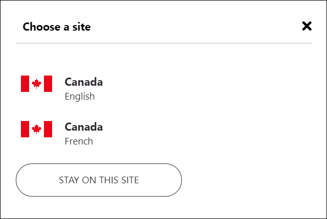
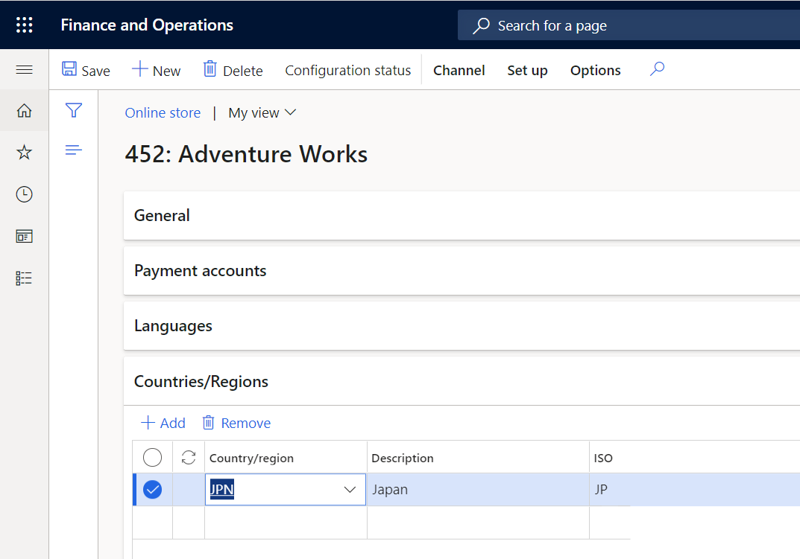
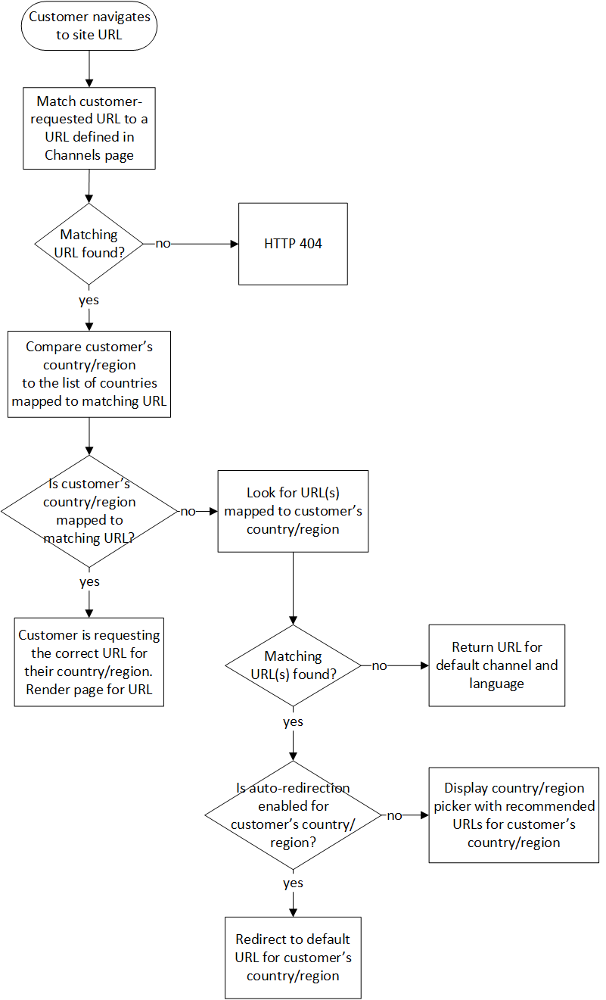

---
# required metadata

title: Set up geo detection and redirection
description: This topic explains how to set up geo detection and redirection for your e-commerce site in Microsoft Dynamics 365 Commerce.
author: stuharg
ms.date: 03/21/2022
ms.topic: article
ms.prod: 
ms.technology: 

# optional metadata

# ms.search.form: 
# ROBOTS: 
audience: IT Pro
# ms.devlang: 
ms.reviewer: v-chgri
# ms.tgt_pltfrm: 
ms.custom: 
ms.assetid: 
ms.search.region: Global
ms.search.industry: Retail
ms.author: shajain
ms.search.validFrom: 

---
# Set up geo detection and redirection

[!include [banner](../includes/banner.md)]

This topic explains how to set up geo detection and redirection for your e-commerce site in Microsoft Dynamics 365 Commerce.

Dynamics 365 Commerce gives you the ability to create shopping and purchasing experiences that are tailored to specific countries or regions. For example, you can define products, assortments, categories, pricing, fulfillment, and other aspects of the e-commerce experience for specific countries or regions. 

The geo detection and redirection feature in Dynamics 365 Commerce lets you detect your customers' geographic locations and then use that information to recommend the site that is most appropriate for the country or region they live in. 

You can choose one of two experiences for customers who request a site URL that isn't associated with the country or region where they are located:

- Use the [country/region picker](country-region-picker-module.md) to prompt customers to select a site or sites that are associated with their location, or give them the option to proceed to the site that they originally requested.
- Automatically redirect customers to the site that is associated with their country or region.

For example, a customer in Canada requests a site that isn't associated with Canada. In this case, the country/region picker module shows a dialog box that lists the sites that have been configured for Canada. In the example in the following illustration, the dialog box includes options for English and French sites for Canada.

When the customer selects an option, they are redirected to that site. Alternatively, if automatic geo-redirection is enabled, the customer will automatically be redirected to the locale that has been marked as the default locale for this online channel. 

The customer's site preference is also captured in a cookie so that the next time they visit the site they won't be prompted to select a site and will automatically be redirected to their preferred site.

## Enable geo redirection features in Commerce site builder

To enable geo redirection for your site in Commerce site builder, go to **Site settings \> General**, and turn on the **Enable geo redirection features** setting.

> [!IMPORTANT]
> Before you turn on the **Enable geo redirection features** setting, you must turn on the **Enable location based store detection** setting. For more information, see [Enable location-based store detection](enable-store-detection.md).

## Initialize the Commerce scheduler

To enable synchronization of the country/region data that you enter in Commerce headquarters, you must initialize the Commerce scheduler at **Retail and Commerce \> Headquarters setup \> Commerce scheduler \> Initialize Commerce scheduler**. For more information about the Commerce scheduler, see [Update configurations](dev-itpro/cdx-best-practices.md#update-configurations). 

> [!NOTE]
> As of the Commerce version 10.0.24 release, the Commerce scheduler can be set to run automatically after updates to Commerce headquarters. To enable this capability in Commerce headquarters, go to **Workspaces \> Feature management** and enable the **Run "Initialize commerce scheduler" after Headquarters is updated** feature. 

## Associate countries and regions with online stores in Commerce headquarters

Countries and regions are associated with online stores (also known as online channels) in Commerce headquarters. When you associate a country or region with an online store, you indicate that customers who reside in that country or region should view the site that is mapped to that online store. You can associate multiple countries and regions with an online store as you require.

To associate countries or regions with an online store, follow these steps.

1. Go to **Retail and Commerce \> Channels \> Online stores**, or search for "online stores" in the search box.
1. Open the online channel that you want to associate countries or regions with.
1. On the **Countries/Regions** FastTab, select **Add**, and then, in the **Country/region** field, select the country or region.
1. Repeat these steps for any other countries or regions that you want to associate with the online channel.

When you've finished associating countries and regions with the online store, go to **Retail and Commerce \> Retail and Commerce IT**, and then, in the **Distribution schedule** view, run job 1070 (**Channel configuration**). After that job is completed, the countries and regions that you associated with the online store will be available on the **Channels** page under **Site settings** in Commerce site builder.

## Configure geo redirection rules in Commerce site builder

After the channel configuration job has completed, countries/regions can be mapped to site URLs you have defined on the **Channels** page under **Site settings**. When you map a country/region to a site URL, you are declaring that customers who live in that country/region should be offered that site URL if they request a URL that is not mapped to the country/region they live in. 

Countries/regions can be mapped to URLs that are associated with different channels, or to URLs that are associated with the same channel. Products, assortments, pricing, discounts, payment methods, delivery modes, and other aspects of a retail e-commerce experience are customized at the channel level. But it is also possible to differentiate some aspects of an e-commerce site within the same channel by locale. <!--To learn more about options and the scenarios they enable, see [Channel mapping to e-commerce sites](channel-mapping-to-ecom-site.md).--> 

### Associate countries and regions with URLs

To associate countries and regions with site URLs, follow these steps.

1. In Commerce site builder, go to **Site settings \> Channels**.
1. Select the channel name, and then select a locale.
1. Select one or more countries or regions to associate with the URL that corresponds with that channel and locale combination.
1. Select **OK**.
1. Select **Save and publish** to save your changes and publish them.

### Enable automatic redirection

You can choose to have customers in specific countries or regions automatically redirected to a URL that you specify instead of prompting them to select a URL in the country/region picker dialog box, for example if you want to have customers who live in Japan automatically sent to the site that is mapped to the channel and language for Japan. In this case, you would turn on the **Automatic auto redirection** setting in the channel where that URL is configured. After you save and publish your change, customers in Japan will automatically be taken to that URL and won't be shown the country/region picker dialog box.

You can associate two or more URLs with a country or region. In this case, automatic redirection uses the URL for the locale that is specified as the default locale for the channel.

### Geo detection and redirection logic

Geo detection and redirection in Dynamics 365 Commerce works by comparing a customer's country or region to the list of countries and regions that are mapped to URLs on the **Channels** page in Commerce site builder.

When a customer requests a URL for your site, the system redirection logic determines whether the customer's country or region is mapped to the requested URL. If it is, the customer continues to that URL. If it isn't, redirection logic finds the URLs that are mapped to the customer's country or region and shows those URLs to the customer as recommended URLs. If automatic redirection is enabled for the customer's country or region, the customer is automatically redirected to the best URL for that country or region. For more information about how to define which URL is used for automatic redirection, see [Configure automatic redirection](#enable-automatic-redirection).

The following workflow illustration shows the steps and decision points in the redirection logic.

## Configure the country/region picker module

The country/region picker module that is included in the Commerce module library shows recommended URLs to customers who request a URL that isn't associated with their country or region. For information about how to configure the country/region picker module, see [Country/region picker module](country-region-picker-module.md).

## Save customer site preferences

When the **Enable geo redirection features** setting is turned on in Commerce site builder, geo redirection saves your customers' site preferences. Before a customer who selects a recommended URL in the country/region picker dialog box is taken to that site, the selected URL is written to the **\_msdyn365\_\_\_site\_** cookie for the domain that the customer is currently in. Then, the next time that the customer requests the URL that previously caused the country/region picker dialog box to appear, they are automatically redirected to their preferred site.

### Site selector module

After a customer has performed an action that results in the **\_msdyn365\_\_\_site\_** cookie being written to, they will be automatically redirected to the site that is written to that cookie. For most customers, this will result in the correct e-commerce experience for their country or region, but some customers may want or need to choose a different country or region-specific site. For this reason, it is recommended that you also use the [site selector module](site-selector.md) on your site so that customers can override automatic redirection. The site selector module can be configured to display the same countries/regions that your country/region picker displays, along with their associated site URLs. When a customer selects a different country/region-specific site with the site selector, the module also updates the **\_msdyn365\_\_\_site\_** cookie with the customer's site preference and the country/region picker will respect that setting the next time the customer visits. 

## Additional resources

[Site selector module](site-selector.md)

[Enable location-based store detection](enable-store-detection.md)

[!INCLUDE[footer-include](../includes/footer-banner.md)]
