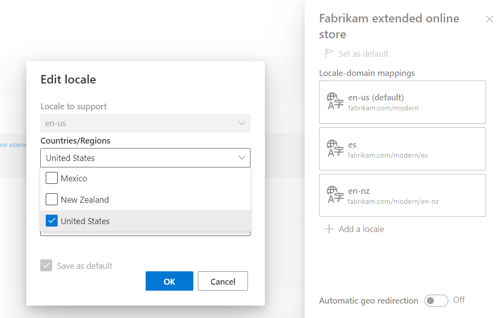

---
# required metadata

title: Set up geo detection and redirection
description: This topic explains how to set up geo detection and redirection in Microsoft Dynamics 365 Commerce for your e-commerce site.
author: stuharg
ms.date: 09/03/2021
ms.topic: article
ms.prod: 
ms.technology: 

# optional metadata

# ms.search.form: 
# ROBOTS: 
audience: IT Pro
# ms.devlang: 
ms.reviewer: v-chgri
# ms.tgt_pltfrm: 
ms.custom: 
ms.assetid: 
ms.search.region: Global
ms.search.industry: Retail
ms.author: shajain
ms.search.validFrom: 

---
# Set up geo detection and redirection

[!include [banner](../includes/banner.md)]
[!include [banner](../includes/preview-banner.md)]

This topic explains how to set up geo detection and redirection in Microsoft Dynamics 365 Commerce for your e-commerce site.

The geo detection and redirection feature in Dynamics 365 Commerce enables you to detect your customers' geographic locations, and uses that information to suggest or redirect to the marketized and localized site that's most appropriate for them. You can choose one of two experiences for your customers who are requesting a site URL that is not associated with the country/region where they are located:

- Ask customers to choose a site or sites associated with their location, or to proceed to the site they originally requested.
- Automatically redirect customers to the site associated with their country/region.

In the following example illustration, a customer in Canada is requesting a site that is not associated with Canada. The country/region picker module dialog box displays the sites that have been configured for Canada. When the customer selects an option, they're taken to that site and their site preference is captured in a cookie so that they are not prompted again to select the site the next time they visit. 

## Enable geo redirection features in Commerce site builder

To enable geo redirection for your site in Commerce site builder, go to **Site settings \> **General** and turn on the **Enable geo redirection features** setting. 

> [!NOTE] 
> The **Enable geo redirection features** setting requires that the **Enable location based store detection** setting is first enabled. For more information, see [Enable location based store detection](enable-store-detection.md). 

## Associate countries/regions with online stores(s) in Commerce headquarters

Countries and regions are associated with online stores (also know as online channels) in Commerce headquarters. When you associate a country with an online store, you are directing that customers that reside in that country or region should view the site that is mapped to that online store. 

To associate a country with an online store, follow these steps.

1. Go to **Modules \> Retail and Commerce \> Channels \> Online stores**, or search for "online stores" in the search box. 
1. Open the online channel to which you want to associate countries.
1. Select the **Countries/Regions** FastTab.
1. Select **+Add**, and then select the country/region from the dropdown list.

You can add multiple countries/regions to the online store as needed. 

When you're finished associating countries/regions to the online store, run job 1070 (Channel configuration) in the **Distribution schedule** view at **Modules \> Retail and Commerce \> Retail and Commerce IT**. Once that job completes, the countries/regions you associated will be available on the **Channels** page under **Site settings** in site builder. 

## Configure geo redirection rules in Commerce site builder

The countries/regions you make available to an online store in site builder can be mapped to the URLs defined on the **Channels** page. When you associate a country with a URL, geo redirection can verify that the URL requested by your customer is appropriate for the country/region they reside in, or recommend one or more URLs that you declare to be intended for their location. 

To associate countries/regions with site URLs, follow these steps.

1. Go to  **Site settings \> Channels**.
1. Select the channel name, and then select the locale.
1. Select one or more countries to associate with that URL. 
1. Select **OK**.
1. Select **Save and publish** to save your changes and publish them. 

### Geo detection and redirection logic

Geo detection and redirection in Dynamics 365 Commerce works by comparing a customer's country/region to the list of countries/regions that are mapped to URLs in the **Channels** page in site builder. 

When a customer requests a URL for your site, the system redirection logic determines whether the customer's country/region is mapped to the URL they are requesting. If it is, the customer continues on to the URL they requested. If not, redirection logic finds the URL or URLs that are mapped to their country/region and displays them to the customer as recommended URLs for their country/region. If automatic redirection is enabled for the customer's country/region, they will automatically be redirected to the best URL for their country/region. For more information about defining which URL is used for auto-redirection, see [Configure auto redirection](#configure-automatic-redirection) below. 

The workflow illustration below shows the steps and decision points in the redirection logic.

## Configure the country/region picker module

The country/region picker module included in the Commerce module library displays recommended URLs to customers who request a URL that is not associated with their country/region. For information on configuring the country/region picker module, see [Country/region picker module](country-region-picker-module.md).  

## Configure automatic redirection

You can choose to automatically redirect customers in certain countries to a specific URL you specify rather than prompting them to choose one from the list. For example, if you want to automatically send customers who live in Japan to the site that is mapped to the channel and language for Japan, you would enable **Automatic auto redirection** in the channel where that URL is configured. After you save and publish that setting, customers in Japan will automatically be sent to that URL and will not be shown the country/region picker dialog box. 

It is possible to associate two or more URLs with a country/region. When more than one URL is associated with a country/region, automatic redirection uses the URL for the locale that is specified as the default locale for that channel. 

## Save customer site preferences

When the **Enable geo redirection features** flag is turned on in site builder, geo redirection will save your customers' preferred sites. When a customer selects a recommended URL from the country/region picker dialog box, the URL will be written to the **\_msdyn365___site\_** cookie on the domain they're presently on before they are taken to their preferred site. The next time the customer requests the URL that previously displayed the country/region picker dialog box, they'll then be automatically redirected to their preferred site.

The [Site selector module](site-selector.md) also writes the customer's site selection to the **\_msdyn365___site\_** cookie. We recommend that you configure the site selector module so that customers can change their preferred site. The site that customers select in the site selector module will be respected by geo redirection. 

## Additional resources

[Site selector module](site-selector.md) 

[Enable location-based store detection](enable-store-detection.md)

[!INCLUDE[footer-include](../includes/footer-banner.md)]
