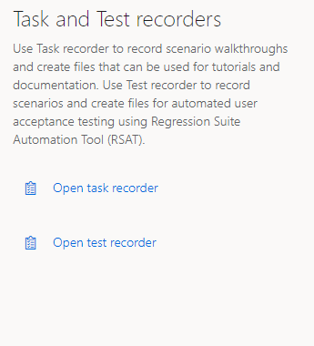
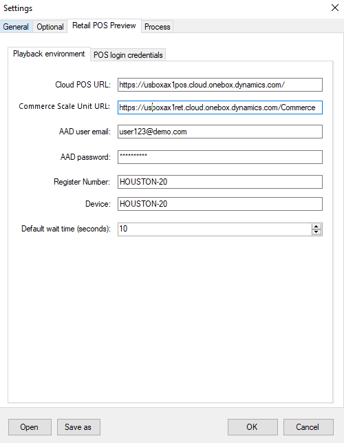

---
# required metadata

title: What's new or changed in Dynamics 365 for Retail version 10.0.5
description: This topic describes features that are in new or changed in Dynamics 365 for Retail. 
author: josaw1
ms.date: 09/16/2019
ms.topic: article
ms.prod: 
ms.technology: 

# optional metadata

# ms.search.form: 
# ROBOTS: 
audience: Developer, IT Pro
# ms.devlang: 
ms.reviewer: josaw
# ms.tgt_pltfrm: 
ms.custom: 
ms.assetid: 
ms.search.region: Global
# ms.search.industry: 
ms.author: josaw
ms.search.validFrom: 2019-08-02
ms.dyn365.ops.version: Release 10.0.5

---
# What's new or changed in Dynamics 365 for Retail version 10.0.5

[!include [banner](../../includes/banner.md)]

This topic describes features that are new or changed in Dynamics 365 Retail in 10.0.5. 

To learn about the features in Microsoft Dynamics 365 for Finance and Operations, see [What's new or changed in Finance and Operations version 10.0.5 (October 2019)](/dynamics365/unified-operations/fin-and-ops/get-started/whats-new-changed-10-0-5).

## Test recorder and Regression suite automation tool for Retail Cloud POS
  
### Test recorder
Test recorder is a new feature added in POS to significantly reduce the time and cost of user acceptance testing. User acceptance testing is typically required before taking a Microsoft application update or applying custom code and configurations to your Retail POS production environments. Test recorder can record user actions in the client with exact fidelity for all the controls and distributed order management (DOM) elements in POS. Test recorder captures when the event occurred and stores all pertinent information about the corresponding user action in real time. From this information, test recorder can capture the type of user action (such as a button click, value entry, or navigation) and any data that is related to the user action, such as the input data value and type, view context, or record context. (Password information is not recorded). Test recorder persists all the recorder information in memory during the recording and generates an output file at the end of the recording. This output file has enough detail to help playback later using the RSAT tool, using the exact actions that the user performed.

> [!NOTE]
> Test recorder is supported only in Cloud POS using Chrome browser, support for other browsers and device types will be added later.

### Regression suite Automation Tool
The Regression suite automation tool (RSAT) enables functional power users to execute the test case in Retail POS and update the test execution result back in Azure DevOps for reporting and investigation. RSAT provides options to investigate the test failures. RSAT decouples the test parameters from test steps and stores the parameters in Microsoft Excel files for easy editing of the test parameter values. The RSAT tool is now updated with a Retail POS tab to specify the Retail specific settings to play back Retail POS recordings and generate retail parameters and variable files.

For more information on POS and RSAT, see [Test recorder and Regression suite automation tool for Retail Cloud POS](../dev-itpro/pos-rsat.md).

## Additional resources

### Dynamics 365: 2019 release wave 2 plan

Wondering about upcoming and recently released capabilities in any of our business apps or platform?

Check out the [Dynamics 365: 2019 release wave 2 plan](/dynamics365-release-plan/2019wave2/index). We've captured all the details, end to end, top to bottom, in a single document that you can use for planning.

[!INCLUDE[footer-include](../../includes/footer-banner.md)]